# オブジェクト指向の基礎（C++版）— メモリの視点から徹底解説（初心者向け）

対象言語: **C++**

この文書は「クラス」「インスタンス」「コンストラクタ」「デストラクタ」「ライフサイクル」を、**実際にメモリで何が起きているか**に沿って、初心者がつまずくポイントを一つずつ潰しながら解説する。丸暗記ではなく「なぜそうなるか」で理解することを目指す。コード例はコメントを多めにして、1行ずつ何が起きているか追えるようにしている。

C++は Java や Python のような**ガベージコレクション（GC）を持たない**言語で、メモリの扱い方が根本的に違う。特に **①オブジェクトをスタックにもヒープにも置ける** ②**代入はコピー（値セマンティクス）** ③**破棄のタイミングが確定的（デストラクタが必ず呼ばれる）** の3点が、GC言語とは真逆になる。この文書はそこを一貫して強調する。

---

## もくじ

0. [そもそもオブジェクトとは何か](#0)
1. [前提: スタックとヒープ（ここが全ての土台）](#1)
2. [クラス — メモリレイアウトの設計図](#2)
3. [インスタンス — 設計図から実体を作る](#3)
4. [コンストラクタ徹底解説（引数・メソッド・種類）](#4)
5. [デストラクタ — C++の主役、解放時の後始末](#5)
6. [ライフサイクル — 確保から解放までの全経路](#6)
7. [完全な実例: 宣言 → インスタンス化 → 実行 → 終了](#7)
8. [C++ 早見表](#8)
9. [応用: コンストラクタインジェクション](#9)

---

<a id="0"></a>
## 0. そもそもオブジェクトとは何か

プログラムは突き詰めると「**データ**」と「そのデータを**操作する処理**」の2つでできている。

昔ながらの書き方（手続き型）では、この2つがバラバラに置かれていた。

```cpp
// データ:  name="山田", balance=1000
// 処理:    deposit(name, balance, 500);   // データを毎回引数で渡す
```

オブジェクト指向は、この**関連するデータと処理を1つの箱にまとめる**という考え方。その「箱」がオブジェクトだ。

```
口座オブジェクト
├─ データ:  name="山田", balance=1000
└─ 処理:    deposit(500)   ← 自分の中のデータを直接触れる
```

こうまとめると「口座に対して deposit する」という現実の考え方そのままにコードが書け、データと処理の対応関係が崩れにくくなる。これがオブジェクト指向の出発点。

そして、この「箱」を**どう作り（クラス）、いつメモリに現れ（インスタンス化）、どう初期化され（コンストラクタ）、いつ消えるか（デストラクタ／ライフサイクル）** ——これらは全て**メモリ上の出来事**として説明できる。C++ではとりわけ「箱がスタックにあるのかヒープにあるのか」「いつ確実に消えるのか」がプログラマの責任として前面に出る。だから次章のメモリの話から始める。

---

<a id="1"></a>
## 1. 前提: スタックとヒープ（ここが全ての土台）

オブジェクトの挙動は、メモリが役割の違う領域に分かれていることを知らないと絶対に理解できない。逆に、ここさえ押さえれば後は全部つながる。この章はいちばん丁寧に説明する。C++では **オブジェクトをスタックに置くのが基本** であり、ここが GC 言語との最大の分かれ道になる。

### 1-0. そもそもメモリとは

メモリ（RAM）は、プログラム実行中にデータを一時的に置いておく作業台のようなもの。中身は**巨大な1列の「マス目」**で、各マスには **アドレス（番地）** という通し番号が振られている。

| アドレス（番地） | 0x1000 | 0x1001 | 0x1002 | 0x1003 | … |
|---|---|---|---|---|---|
| 中身（1マス＝1バイト） | 72 | 84 | 00 | 00 | … |

「変数」とは、このどこかのマスに付けた名前にすぎない。`x = 5` は「あるアドレスのマスに 5 を書く」こと。この“番地の集まり”を、OSとプログラムは役割ごとに区画分けして使う。その代表が **スタック** と **ヒープ** だ。

### 1-1. プログラムのメモリ全体図

プログラムが動くとき、メモリはおおまかに次のように区画されている。

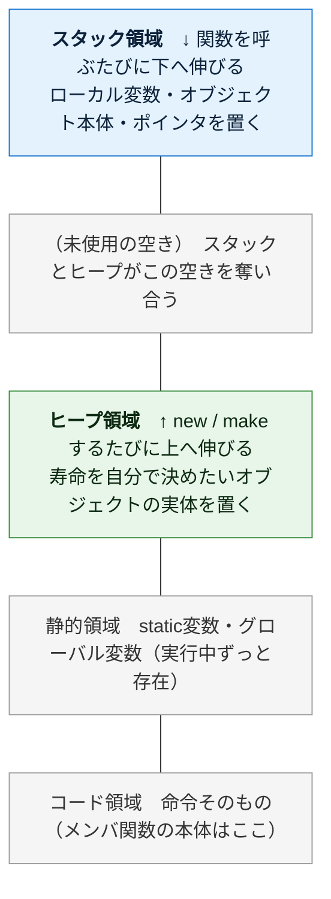

（上ほど高位アドレス。オブジェクト指向で重要なのは上2つ＝**スタック**と**ヒープ**）

このうち、オブジェクト指向を理解するのに重要なのが上の2つ、**スタック**と**ヒープ**。まず両者を一覧で比べ、その後1つずつ深掘りする。

| | **スタック** | **ヒープ** |
|---|---|---|
| 何を置く | ローカル変数、**オブジェクトの実体そのもの**、ポインタ | **new したオブジェクトの実体**、大きいデータ、寿命の長いデータ |
| 確保・解放 | **自動**（スコープの出入りに連動。デストラクタも自動で呼ばれる） | **手動**（`new` で確保・`delete` で解放）／スマートポインタで自動化 |
| 速度 | **速い**（番地を動かすだけ） | 遅い（空き場所を探す必要） |
| サイズ | 小さい（数MB程度） | 大きい（メモリの許す限り） |
| 寿命 | そのスコープ（`{ }`）の中だけ | `delete` されるまで／スマートポインタが管理する間 |
| 並び方 | きっちり積み重なる（LIFO） | あちこちに散らばる |

> ★ **C++の最重要ポイント**: Java や Python では「オブジェクトの実体は常にヒープ」だが、**C++はスタックにもヒープにもオブジェクトを置ける**。しかも**スタックに置くのが基本**であり、その方が速くて安全（後片付けが自動）。`new` してヒープに置くのは「寿命をスコープより長くしたい」等の理由があるときだけ。

### 1-2. スタック — スコープの出入りに連動する「積み重ね」

スタックは名前のとおり「積み重ね」。**関数を1つ呼ぶと、その関数専用の箱が1つ積まれる**。この箱を **スタックフレーム（stack frame）** と呼ぶ。

フレームの中には、その関数が使う次のものが入る：

| `deposit()` フレームの中身 | 例 | 説明 |
|---|---|---|
| 引数 | `amount = 500` | 呼び出し時に渡された値 |
| ローカル変数 | `temp = ...` | 関数の中で宣言した変数 |
| **スタックに置いたオブジェクト本体** | `BankAccount a;` | C++では実体がここに丸ごと乗る |
| 戻り先アドレス | `0x4a2c` | 終わったら「どこへ戻るか」の記録 |

そして**関数を呼ぶと上に積まれ、関数が終わると上から外れる**。この「後に積んだものから先に外す」順序を **LIFO（Last In, First Out）** という。下は `main()` が `notify()` を呼び、さらに `notify()` が `deposit()` を呼んだ、いちばん深い瞬間のスタック：

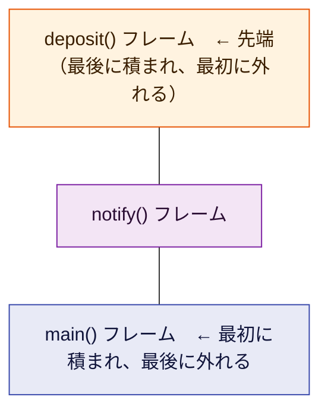

`deposit()` が終わると先端の箱だけ外れて `notify()` に戻り、`notify()` が終わるとまた外れて `main()` に戻る——というように、**上から順に1つずつ消えていく**。

**スタックの片付けが「自動でタダ同然」なのはなぜか。** スタックには「今どこまで積んだか」を指す**スタックポインタ**という目印が1つある。関数が終わるときは、この目印を**フレーム1個分だけ下に戻す**だけ。ポインタを動かすだけなので一瞬で終わる。だからスタックは速い。

> ★ **C++ならではの重要事実**: スタックフレームが外れるとき、その中に置かれたオブジェクトの**デストラクタ（5章）が自動的に・確実に呼ばれる**。これがC++の後始末の柱（RAII）で、GC言語にはない仕組み。ここは何度も出てくるので今は「スコープを抜けると片付けが走る」とだけ覚えればよい。

> ⚠️ **スタックオーバーフロー**: スタックは容量が小さい。関数が関数を呼び…と積みすぎると（例: 止まらない再帰）、スタックが天井に達してクラッシュする（segmentation fault など）。これがスタックが有限であることの証拠。

### 1-3. ヒープ — 自由に確保する「広い倉庫」

スタックは「スコープを抜けたら消える」ものしか置けない。だが実際には、**関数が終わっても生き残ってほしいデータ**や、**実行するまで大きさ・個数が分からないデータ**がある。それを置くのがヒープ。

C++では、**`new` を書いたときだけ**オブジェクトの実体がヒープに置かれる。スタックのようにきっちり積むのではなく、**空いている場所を探して確保する**ため、置き場所はバラバラに散らばる。


ヒープの弱点は2つ。**① 確保が遅い**（毎回「どこが空いてるか」を探す必要がある）。**② 自動では片付かない**。

ここがGC言語との決定的な違い。**Java も Python も、使われなくなったヒープをGCが自動で回収してくれる。だがC++にGCは無い。** `new` で確保したものは、プログラマが責任を持って `delete` で解放しなければならない。忘れれば**メモリリーク**、二回解放すれば**二重解放（クラッシュ・脆弱性の元）**になる。

```cpp
BankAccount* p = new BankAccount("山田", 1000);  // ヒープに確保
// ... p を使う ...
delete p;   // ← 自分で解放しないと、この実体は永遠に残り続ける（リーク）
```

この手動管理は危険なので、**現代のC++（C++11以降）では `std::unique_ptr` / `std::shared_ptr` などのスマートポインタを使い、`delete` を自動化するのが定石**。詳しくは5章で扱う。まずは「ヒープ＝new で借りて自分で返す領域、GCは無い」と押さえる。

### 1-4. 2つはこう連携する（最重要ポイント）

ここが初心者の関門。C++には大きく2つの置き方がある。

**(A) スタックに直接置く（C++の基本）** — 変数がオブジェクトの実体そのもの。

```cpp
BankAccount a("山田", 1000);   // a という箱の中に、口座の実体が丸ごと乗っている
```

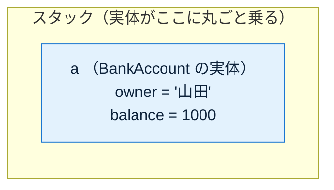

この場合、`a` は「番地」ではなく**口座そのもの**。スコープ（`{ }`）を抜けると `a` のデストラクタが走り、自動で片付く。

**(B) ヒープに置き、スタックの変数（ポインタ）が番地を持つ** — Java/Python の参照に近い形。

```cpp
BankAccount* p = new BankAccount("山田", 1000);   // 実体はヒープ、p は番地を持つ
```

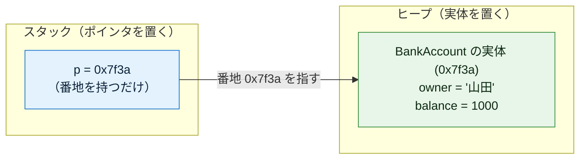

この場合、`p` は口座そのものではなく「口座がヒープのどこにあるか」を示す番地（`0x7f3a`）を持つ。この番地を持つ変数を **ポインタ（pointer）** と呼ぶ。そして `new` したからには、使い終わったら `delete p;` する責任がプログラマにある。

まずは次の2点を覚えれば十分。**C++では「スタックに実体を直接置く」のが基本**であり、**`new`（ヒープ）は寿命をスコープより延ばしたいときだけ使う特別な手段**だということ。

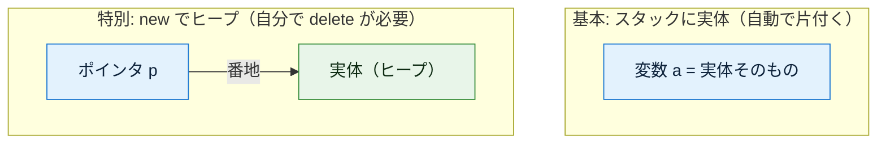

---

<a id="2"></a>
## 2. クラス — メモリレイアウトの設計図

**クラスとは「インスタンス1個がメモリ上でどんな形になるか」を定義したもの**。具体的には「どんなメンバ変数（データ）を持つか」を決める。

### まずは一番シンプルな例

```cpp
// class というキーワードで「BankAccount という設計図」を定義する
class BankAccount {
public:                     // public: ここから下は外から触れる
    std::string owner;      // メンバ変数1: 口座名義（std::string の実体を丸ごと持つ）
    int balance;            // メンバ変数2: 残高（4バイトの整数をそのまま格納）
};                          // ← クラス定義の末尾には必ずセミコロンが要る（C++特有）
// ↑ここまではあくまで「設計図の宣言」。
//   この時点ではメモリ上に口座は1つも存在しない（実体はまだ0個）。
```

C++で見落としやすい2つの文法上のポイント：

- **末尾のセミコロン `};`** — クラス定義の閉じ波かっこの後にセミコロンが必要。忘れるとコンパイルエラーになる（Java/Pythonには無い）。
- **アクセス指定子 `public:` / `private:`** — 何も書かないと `class` の既定は `private`（外から触れない）になる。

### public と private でデータを守る

C++は「どのメンバを外から触ってよいか」をアクセス指定子で分ける。データを直接いじられないよう `private:` に隠し、操作は `public:` のメソッド経由に限定するのが定石（カプセル化）。

```cpp
class BankAccount {
private:                    // ここから下は「クラスの中からしか触れない」
    std::string owner;      // 名義（外から勝手に書き換えさせない）
    int balance;            // 残高（外から直接マイナスにされたら困る）

public:                     // ここから下は「外から触れる」
    // メソッド（処理）: この口座にお金を入れる
    void deposit(int amount) {
        // this は「このメソッドが呼ばれた口座自身」を指すポインタ（4章で詳説）
        this->balance += amount;   // 自分の balance に amount を足す
    }
};
```

### クラスは「データ」と「処理」をまとめる

メンバ変数（データ）だけでなく、メソッド（処理）も一緒に定義できる。これがオブジェクトの本質。上の `deposit` のように、メソッドは自分自身のメンバ変数（`balance`）を直接触れる。

ここで重要な事実：

> **メソッドはインスタンスごとに複製されない。** メモリ上（コード領域）にはメソッドの本体が1つだけ存在し、全インスタンスがそれを共有する。インスタンスが個別に持つのは**メンバ変数のデータだけ**。

口座を1000個作っても `deposit` の処理本体は1つ。各口座が個別に持つのは owner と balance の値だけ。

### sizeof — 1インスタンスの大きさはメンバ変数で決まる

C++では `sizeof` で「1インスタンスが何バイトか」を実際に調べられる。これはメンバ変数の合計（＋アライメント調整）で決まり、メソッドの数は関係しない。

```cpp
class BankAccount {
    std::string owner;   // 実装により約32バイト
    int balance;         // 4バイト
};
// sizeof(BankAccount) はメンバ変数のレイアウトで決まる（メソッドを何個足しても変わらない）
std::cout << sizeof(BankAccount) << " バイト" << std::endl;
```

これは「クラスが決めるのは1インスタンス分のメモリの形（レイアウト）」ということの、目に見える証拠になっている。

### 覚え方

- **クラス = 設計図**。書いてもまだメモリに実体はできない。
- クラスが決めるのは「どんなメンバ変数を持つか」＝ **1インスタンス分のメモリの形**（`sizeof` で測れる）。
- メソッドは全インスタンスで共有、メンバ変数はインスタンスごとに個別。
- C++は **末尾セミコロン `};`** と **`public:`/`private:`** が必要。既定は `private`。

---

<a id="3"></a>
## 3. インスタンス — 設計図から実体を作る

**インスタンス化とは、クラス（設計図）に従って実際にメモリを確保し、実体を1つ作ること**。この瞬間に初めて、口座がメモリ上に姿を現す。C++には確保の場所が2通りある。

```cpp
// ===== (A) スタックに作る（C++の基本。new は書かない）=====
BankAccount a("山田", 1000);
//          ↑ この宣言だけで、スタック上に実体が1つできる
// a は「番地」ではなく、口座の実体そのもの
```

```cpp
// ===== (B) ヒープに作る（new を使う。寿命を延ばしたいとき）=====
BankAccount* p = new BankAccount("山田", 1000);
//               ↑ new が「ヒープに実体を1つ作る」命令
// p には、作られた実体の「番地」が入る（実体そのものではない）
// 使い終わったら delete p; が必要
```

`new` が行うことを分解すると：

1. **ヒープに、BankAccount 1個分のメモリを確保**する（owner と balance が入る領域）
2. その領域を初期化する（次章のコンストラクタが走る）
3. **確保した領域の番地を返す**。それがポインタ `p` に入る

スタック確保（A）の場合も ②のコンストラクタは走るが、①はスタック上で行われ、番地ではなく実体そのものが `a` になる。

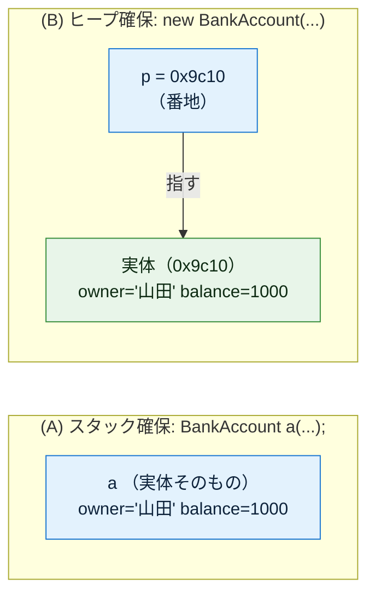

### 1つのクラスから複数のインスタンス

設計図は1枚でも、そこから作る実体は何個でも作れる。各インスタンスは**独立したメモリ領域**を持つ。

```cpp
BankAccount a("山田", 1000);  // スタック上に実体① を作る
BankAccount b("田中", 5000);  // スタック上に実体② を作る（①とは完全に別物）

a.balance = 1000;   // 実体① の balance を書き換え（public の場合）
b.balance = 5000;   // 実体② の balance を書き換え（① には一切影響しない。別メモリだから）
```

### 「代入」は実体をコピーする（GC言語と真逆の最重要ポイント）

ここが **C++と Java/Python の最大の違い**。初心者が必ず混乱するので、じっくり説明する。

Java/Python では `b = a` は「番地のコピー」で、`a` と `b` は**同じ実体**を指した（片方を変えると両方変わった）。**C++は真逆**。値型（普通のオブジェクト）の `=` は**実体まるごとのコピー**を作る。これを **値セマンティクス（value semantics）** と呼ぶ。

```cpp
// ===== C++: 代入はコピー =====
BankAccount a("山田", 1000);   // 実体① を作る

BankAccount b = a;   // ← a の中身がまるごとコピーされ、別の実体② が作られる。
                     //   （このとき「コピーコンストラクタ」が働く。4章で触れる）
                     //   a と b は完全に独立した別物

b.balance = 9999;    // b（＝実体②）の balance だけを書き換える

std::cout << a.balance << std::endl;   // → 1000！（a は一切変わらない）
// a と b は別の実体なので、b をいくら変えても a には影響しない
```

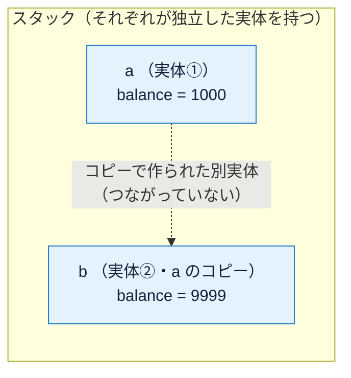

> ★ **ここを絶対に混同しないこと。** Java/Python の `b = a` は「同じ箱に別名を付ける（エイリアス）」だが、**C++の `b = a` は「箱ごと複製する（コピー）」**。C++でエイリアス（同じ実体を2つの名前で指す）が欲しいときは、後述のポインタか参照を使う。

### エイリアスが欲しいなら「ポインタ」か「参照」

同じ実体を複数の名前から触りたい（Java/Python の代入と同じ挙動が欲しい）場合、C++では明示的に**ポインタ**か**参照**を使う。

```cpp
// ===== ポインタ: 番地を持つ変数 =====
BankAccount a("山田", 1000);
BankAccount* p = &a;   // &a は「a の番地」。p は a と同じ実体を指す
p->balance = 9999;     // p 経由で実体を書き換え（-> はポインタ越しのメンバアクセス）
std::cout << a.balance << std::endl;   // → 9999（p と a は同じ実体だから変わる）

// ===== 参照: 既存の実体に付ける別名 =====
BankAccount& r = a;    // r は a の別名（エイリアス）。新しい実体は作られない
r.balance = 7777;      // r 経由で書き換え（. でアクセス。中身は a そのもの）
std::cout << a.balance << std::endl;   // → 7777（r は a そのものだから変わる）
```

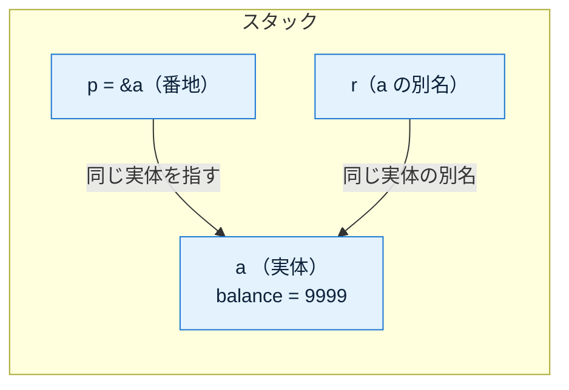

3つの挙動を整理する。ここがC++のインスタンスの肝。

| 書き方 | 何が起きるか | 元の `a` への影響 |
|--------|------------|-----------------|
| `BankAccount b = a;` | **コピー**。中身が複製され別実体になる | なし（完全に独立） |
| `BankAccount* p = &a;` | **ポインタ**。同じ実体を番地で指す | あり（`p` 経由で `a` が変わる） |
| `BankAccount& r = a;` | **参照**。同じ実体に別名を付ける | あり（`r` は `a` そのもの） |

Java/Python の「普通の代入」に相当するのは、C++では**ポインタ／参照**の方。C++の「普通の代入（`=`）」は**コピー**であり、GC言語の感覚のままだと必ず間違える。ここを本文の柱として覚えておくこと。

---

<a id="4"></a>
## 4. コンストラクタ徹底解説（引数・メソッド・種類）

ここが今回の中心。コンストラクタは初心者がモヤっとしやすいので、用語を1つずつ分解する。

### 4-1. コンストラクタとは何か

**コンストラクタ = インスタンスが生成された「直後」に自動的に呼ばれる、初期化専用の処理**。

なぜ必要か？ 確保したばかりのメモリは**中身が未定（ゴミ値）**の状態。特にC++では、初期化しないと本当に「前に使われたゴミ値」がそのまま残る（Javaのように自動でゼロ初期化されない場合がある）ので、コンストラクタで正しい状態に整えることが一層重要になる。

```
BankAccount a("山田", 1000); の内部で起きること:

  ① メモリ確保      →  owner=(未定) balance=(ゴミ値)   （まだ中身が不定）
  ② コンストラクタ実行 →  owner="山田"  balance=1000    （正しい初期状態に設定）
  ③ 使える実体が完成
```

コンストラクタを書かなければ、口座名義が空、残高がゴミ値のまま、といった中途半端なインスタンスができてしまう。それを防ぐ「初期化の入口」がコンストラクタ。

### 4-2. コンストラクタメソッドという呼び方について

「コンストラクタメソッド」という言葉を聞くことがあるが、これは**コンストラクタが実質的にメソッド（処理のかたまり）の一種**だから。ただし普通のメソッドと違う特別なルールがある：

| 項目 | 普通のメソッド | コンストラクタ |
|------|--------------|--------------|
| 呼び出しタイミング | 好きな時に何度でも | 生成時に自動で1回だけ |
| 呼び出し方 | `a.deposit(500)` と自分で呼ぶ | 自分で呼ばない（生成時に自動で呼ばれる） |
| 戻り値 | ある（`void` 含む） | なし（型すら書かない） |
| 名前 | 自由に付けられる | **クラス名と完全に同じ**でなければならない |

C++の「コンストラクタの名前（書き方）」：

| 言語 | コンストラクタの名前 | 例 |
|------|-------------------|-----|
| C++ | **クラス名と同じ**名前の関数（戻り値の型を書かない） | `BankAccount(...) { }` |

Java と同じく、C++のコンストラクタは**クラス名と同じ名前**で、戻り値の型を書かない、というルール。

### 4-3. コンストラクタ引数とは

**コンストラクタ引数 = インスタンスを作るときに「外から渡す初期値」**。

口座を作るなら「誰の口座か」「最初いくら入れるか」を外から指定したい。それを受け取る窓口がコンストラクタ引数。

```cpp
class BankAccount {
public:
    std::string owner;
    int balance;

    // ↓ ( ) の中がコンストラクタ引数。owner と balance を外から受け取る
    BankAccount(std::string owner, int balance) {
        // 受け取った引数を、この実体のメンバ変数に保存する
        this->owner = owner;       // this->owner(メンバ) ← owner(引数)
        this->balance = balance;   // this->balance(メンバ) ← balance(引数)
    }
};

// --- 使う側: 生成時に引数を渡す ---
BankAccount a("山田", 1000);  // owner="山田", balance=1000 で初期化
BankAccount b("田中", 5000);  // 別の初期値 → 中身の違う別の実体になる
```

引数がなぜ便利かというと、**同じクラスから中身の違うインスタンスを作れる**から。引数がなければ全部同じ初期値の口座しか作れない。

### 4-4. this — 「自分自身」を指すポインタ

コンストラクタやメソッドの中に出てくる `this` は、

> **今まさに操作している、その実体自身を指すポインタ**

を指す。「どの口座の balance か」を区別するために必要。C++では `this` は**ポインタ**なので、メンバへは `this->owner` のように矢印 `->` でアクセスする（`this.owner` ではない）。

```cpp
BankAccount(std::string owner) {
    this->owner = owner;
    // ↑            ↑
    // │            └─ 引数として受け取った値
    // └─ 「この実体の」owner メンバ（this はこの実体を指すポインタ）
    //
    // this->owner(メンバ) と owner(引数) は名前が同じでも別物。
    // this-> を付けることで「引数ではなくメンバの方」だと明示している。
}
```

### 4-5. デフォルトコンストラクタ

コンストラクタを1つも書かないと、C++は「引数なしの空のコンストラクタ」を勝手に用意する。これを**デフォルトコンストラクタ**という。

```cpp
class Dog {
public:
    std::string name;
    // コンストラクタを1つも書いていない
};

Dog d;   // それでも作れる（C++が暗黙のデフォルトコンストラクタを用意）
         // このとき name は std::string の既定（空文字）に初期化される
         // ※ int などの基本型メンバはゼロ初期化されず「ゴミ値」になる点に注意
```

ただし**自分でコンストラクタを1つでも定義すると、デフォルトは消える**。これは初心者がハマるポイント。

```cpp
class Dog {
public:
    std::string name;
    Dog(std::string name) {       // 引数ありコンストラクタを自分で定義した
        this->name = name;
    }
};

Dog d1("ポチ");   // OK（自分で定義した引数あり版）
Dog d2;           // ← コンパイルエラー！
                  //   引数なし版はもう自動生成されないので存在しない
```

引数なし版も残したいときは、`Dog() = default;` と明示的に書けば復活させられる（C++11以降）。

### 4-6. コンストラクタ引数のバリエーション

同じクラスでも「作り方」を複数用意したいことがある。C++には2つの手段があり、しかも**両方使える**。

**(a) オーバーロード** — 引数の型・数が違う同名コンストラクタを複数定義できる（Javaと同じ）

```cpp
class BankAccount {
public:
    std::string owner;
    int balance;

    // 引数1つ版: 名義だけ指定（残高は0スタート）
    BankAccount(std::string owner) {
        this->owner = owner;
        this->balance = 0;      // 残高は0で初期化
    }

    // 引数2つ版: 名義と初期残高を指定
    BankAccount(std::string owner, int balance) {
        this->owner = owner;
        this->balance = balance;
    }
};

BankAccount a("山田");        // → 引数1つ版が呼ばれる（残高0）
BankAccount b("田中", 5000);  // → 引数2つ版が呼ばれる（残高5000）
// C++は「引数の数・型」を見て、どのコンストラクタを使うか自動で選ぶ
```

**(b) デフォルト引数** — 引数に既定値を持たせると、上のオーバーロード2つを1つにまとめられる

```cpp
class BankAccount {
public:
    std::string owner;
    int balance;

    // balance = 0 と書くと「balance を省略したら 0 を使う」という意味になる
    BankAccount(std::string owner, int balance = 0) {
        this->owner = owner;
        this->balance = balance;
    }
};

BankAccount a("山田");         // balance を省略 → 0 になる
BankAccount b("田中", 5000);   // balance を指定 → 5000 になる
```

デフォルト引数を使うと、少ない記述で複数の「作り方」を提供できる。ただしオーバーロードと併用すると「どちらが呼ばれるか曖昧」になることがあるので、片方に寄せるのが無難。

### 4-7. コンストラクタに書ける処理（代入だけではない）

ここまでの例はコンストラクタで「引数をメンバに代入するだけ」だったが、**コンストラクタは普通のメソッドと同じで、中に自由に処理を書ける**。代表的なパターンを挙げる。C++固有の話として、まず**初期化リスト**を説明する。

**⓪ 初期化リスト（`: member(value)`）— C++で最も重要な作法**

C++には、コンストラクタ本体 `{ }` に入る**前に**メンバを初期化する専用の構文がある。それが**初期化リスト（メンバ初期化子リスト）**。コンストラクタ引数リストの後に `:` を書き、`メンバ(初期値)` を並べる。

```cpp
class BankAccount {
public:
    std::string owner;
    int balance;

    // ↓ : owner(owner), balance(balance) の部分が初期化リスト
    BankAccount(std::string owner, int balance)
        : owner(owner), balance(balance)   // メンバを「最初から」この値で初期化する
    {
        // 本体はもう空でよい（初期化はリストで済んでいる）
    }
};
```

初期化リストと「本体での代入」は似て見えるが**別物**で、初期化リストの方が本筋。違いは次の通り。

```cpp
// (A) 本体で代入 — 一度デフォルト初期化してから、代入で上書きする（二度手間）
BankAccount(std::string o, int b) {
    owner = o;      // owner はまず空文字で作られ、そのあと o を代入（2ステップ）
    balance = b;
}

// (B) 初期化リスト — 最初から正しい値で作る（1ステップ・効率的）
BankAccount(std::string o, int b) : owner(o), balance(b) { }
```

さらに重要なのは、**`const` メンバや参照メンバは初期化リストでしか初期化できない**という点。これらは「作られた後に代入で変える」ことが文法上できないため、初期化リスト必須になる。

```cpp
class Config {
public:
    const int id;        // const メンバ（後から代入不可）
    std::string& logRef; // 参照メンバ（後から代入不可）

    // ↓ この2つは初期化リストでしか初期化できない。本体で id = ... はコンパイルエラー
    Config(int id, std::string& log) : id(id), logRef(log) { }
};
```

> ★ 初心者はまず「メンバの初期化は本体の代入ではなく初期化リストで書く」と覚えるとよい。効率がよく、const/参照メンバにも対応でき、C++らしい書き方になる。

**① バリデーション（引数チェック）** — 不正な値でインスタンスが作られるのを、生成の入口で防ぐ。

```cpp
BankAccount(std::string owner, int balance) : owner(owner), balance(balance) {
    // 生成のこの瞬間におかしな値を弾く（＝壊れた口座をそもそも存在させない）
    if (owner.empty()) {
        throw std::invalid_argument("名義は必須です");  // 例外を投げると生成は失敗する
    }
    if (balance < 0) {
        throw std::invalid_argument("残高をマイナスで開設できません");
    }
}
```

バリデーションをコンストラクタでやる利点は、**「存在するインスタンスは必ず正しい状態」だと保証できる**こと。あとで使うたびにチェックする必要がなくなる。（なお、コンストラクタが例外を投げて途中で失敗した場合、**すでに構築済みのメンバのデストラクタは自動で呼ばれる**ので、その部分のリークは起きない。）

**② 引数から計算して別のメンバを埋める** — 渡された値をそのまま入れるだけでなく、加工結果を持たせる。

```cpp
class Rectangle {
public:
    int width, height, area;
    Rectangle(int width, int height)
        : width(width), height(height), area(width * height)  // 面積を初期化時に確定
    { }
};
```

**③ 引数に無い値を自動生成する** — IDや作成日時など、外から渡さず内部で作るもの。

```cpp
BankAccount(std::string owner) : owner(owner), balance(0) {
    this->id = generateId();                  // 口座番号を自動発番（引数では受け取らない）
    this->createdAt = std::time(nullptr);     // 開設日時を記録
}
```

**④ 他のメソッド呼び出し・副作用のある処理** — ログ出力・接続・登録など。

```cpp
BankAccount(std::string owner, int balance) : owner(owner), balance(balance) {
    std::cout << owner << "の口座を開設。残高" << balance << std::endl;  // ログ出力（副作用）
}
```

#### ⚠️ ただし「何でも書いていい」わけではない

処理を書けるからといって詰め込みすぎると問題になる。実務では次が定石。

| 種類 | 例 | 方針 |
|------|-----|------|
| ✅ 推奨 | バリデーション、メンバの計算、ID・日時の自動生成 | **「使える正しい状態を作る」ための処理**なので積極的に書く |
| ⚠️ 慎重に | ファイルを開く、DB接続、外部APIを叩く、重い計算 | **副作用の強い処理**。コンストラクタに詰めると下記の問題が出る |

副作用の強い処理をコンストラクタに入れると:

- **テストしにくい** — インスタンスを作るだけで本物の接続や通信が走ってしまう。
- **生成の途中で例外が出ると扱いが難しい** — 一部だけ確保した状態での失敗は、後始末の設計が面倒になる。
- **生成コストが重くなる** — 「ただ作っただけ」で重い処理が走る。

この対策が、次章で厚く扱う **コンストラクタインジェクション**（依存は自分で作らず外から受け取る）や、資源は RAII（コンストラクタで取得・デストラクタで解放）で管理する、という設計につながる。

### 4-8. コンストラクタのまとめ

- **コンストラクタ** = 生成直後に自動で1回走る初期化処理。中身の不定なメモリを正しい初期状態にする。
- **クラス名と同名**・戻り値の型を書かない。
- **初期化リスト `: member(value)`** で書くのがC++の基本。本体での代入より効率的で、const/参照メンバには必須。
- **コンストラクタ引数** = 生成時に外から渡す初期値の窓口。中身の違うインスタンスを作れる。
- **this** = 操作中の実体を指す**ポインタ**（`this->member` でアクセス）。
- **デフォルトコンストラクタ** = 何も書かないとき自動で用意される引数なし版（自分で書くと消える。`= default;` で復活可）。
- 作り方を複数持たせるには、オーバーロードやデフォルト引数を使う。
- **コピーコンストラクタ**（`BankAccount(const BankAccount&)`）という特別なコンストラクタもあり、`BankAccount b = a;` のコピー時に自動で働く（3章参照）。

---

<a id="5"></a>
## 5. デストラクタ — C++の主役、解放時の後始末

GC言語ではデストラクタは脇役だったが、**C++ではデストラクタが主役**。インスタンスが破棄される瞬間に走る処理で、役割は「使っていたヒープ・ファイル・接続などの資源を返す」こと。コンストラクタのちょうど逆。

### デストラクタの書き方と、確定的に呼ばれること

デストラクタは **`~クラス名()`**（チルダ＋クラス名）で書く。引数も戻り値もない。

```cpp
class BankAccount {
public:
    std::string owner;

    BankAccount(std::string owner) : owner(owner) {
        std::cout << owner << "の口座を開設" << std::endl;
    }

    // デストラクタ: この実体が破棄される瞬間に自動で呼ばれる
    ~BankAccount() {
        std::cout << owner << "の口座を閉鎖" << std::endl;
    }
};

void demo() {
    BankAccount a("山田");   // ここでコンストラクタ → 「山田の口座を開設」
    // ... a を使う ...
}   // ← この } でスコープを抜けた瞬間、a のデストラクタが確定的に呼ばれる → 「山田の口座を閉鎖」
```

> ★ **C++の核心**: スタックに置いたオブジェクトは、**スコープ（`{ }`）を抜けた瞬間に、デストラクタが必ず・確定的に呼ばれる**。「いつ呼ばれるか分からない」GC言語とは決定的に違う。呼ばれる順序も決まっていて、**後に作ったものから先に**破棄される（LIFO、コンストラクタと逆順）。

### RAII — C++の資源管理の背骨

この「コンストラクタで資源を確保し、デストラクタで確実に解放する」設計を **RAII（Resource Acquisition Is Initialization、資源取得は初期化なり）** と呼ぶ。C++の最重要イディオムで、GC言語の `try-with-resources` / `with` に相当する後始末を、**言語の仕組みそのもの**でやってのける。

```cpp
class FileHandle {
    std::FILE* fp;
public:
    FileHandle(const char* path) {       // 確保 = コンストラクタ
        fp = std::fopen(path, "r");
    }
    ~FileHandle() {                      // 解放 = デストラクタ
        if (fp) std::fclose(fp);         // スコープを抜ければ必ず閉じる（例外時も！）
    }
};

void read() {
    FileHandle f("a.txt");   // ここで開く
    // ... f を使う。途中で例外が飛んでも ...
}   // ← スコープを抜ければ ~FileHandle() が必ず走り、ファイルは確実に閉じる
```

RAII のおかげで、C++では「閉じ忘れ」を防ぐために特別な構文（`with` 等）を書く必要がない。**スコープを抜ければデストラクタが必ず走る**という保証だけで、資源解放が自動化される。

### new したものは delete が必要（手動管理の危険）

スタックのオブジェクトはスコープで自動的に消えるが、**`new` でヒープに作ったものは自動では消えない**。GCが無いので、プログラマが `delete` で明示的に解放する。

```cpp
BankAccount* p = new BankAccount("山田");   // ヒープに確保（コンストラクタが走る）
// ... p を使う ...
delete p;   // ← ここで初めてデストラクタが呼ばれ、ヒープが解放される
```

手動管理には典型的な危険が2つある。

- **メモリリーク**: `delete` を忘れると、その実体は永遠に残り続ける。デストラクタも呼ばれない。
- **二重解放（ダブルフリー）**: 同じ番地を2回 `delete` すると、未定義動作でクラッシュしたり、深刻な脆弱性になったりする。

```cpp
BankAccount* p = new BankAccount("山田");
delete p;    // 1回目: OK
delete p;    // 2回目: 二重解放！ 未定義動作（クラッシュ・脆弱性の元）
```

### 現代C++の答え: スマートポインタで delete を自動化

これらの危険を避けるため、**現代のC++（C++11以降）では生の `new`/`delete` を直接書かず、スマートポインタを使う**のが定石。スマートポインタは「デストラクタで自動的に `delete` を呼んでくれる」RAII の応用で、GCが無いC++に「所有権に基づく確定的な自動解放」をもたらす。

```cpp
#include <memory>

// std::unique_ptr: 「1つの所有者」が持ち、スコープを抜けたら自動で delete
{
    std::unique_ptr<BankAccount> p = std::make_unique<BankAccount>("山田");
    p->deposit(500);
}   // ← ここで p が壊れる瞬間、自動で delete され ~BankAccount() が呼ばれる。delete 不要

// std::shared_ptr: 「複数で共有」し、最後の1人が離れたら自動で delete（参照カウント方式）
{
    std::shared_ptr<BankAccount> a = std::make_shared<BankAccount>("田中");
    std::shared_ptr<BankAccount> b = a;   // 同じ実体を2人で共有（カウント=2）
    // b が離れ、a も離れ、カウントが0になった瞬間に自動で delete される
}
```

`shared_ptr` の参照カウントは、Python の参照カウントに考え方が近い。ただし C++ では**言語標準のGCは存在せず**、あくまでスマートポインタという**ライブラリの仕組み**で、確定的なタイミング（最後の所有者が消えた瞬間）に解放される点が特徴。

### デストラクタ・解放方式のまとめ（C++）

| 置き場所 | 解放の方法 | 解放のタイミング | デストラクタ |
|---------|-----------|----------------|------------|
| スタック（`BankAccount a;`） | **自動**（スコープ終端） | `{ }` を抜けた瞬間（確定的） | 自動で呼ばれる |
| ヒープ・生ポインタ（`new`） | **手動**（`delete`） | `delete` した瞬間 | `delete` 時に呼ばれる |
| ヒープ・`unique_ptr` | 自動（所有者が消えたら） | スコープ終端（確定的） | 自動で呼ばれる |
| ヒープ・`shared_ptr` | 自動（参照カウント0で） | 最後の所有者が消えた瞬間 | 自動で呼ばれる |

要点：**C++にGCは無い。スタックオブジェクトはスコープ終端でデストラクタが確定的に呼ばれる。ヒープは `delete` が必要だが、現代C++はスマートポインタ（RAII）で `delete` を自動化する。**「確保はコンストラクタ・解放はデストラクタ」という RAII が全ての背骨。

---

<a id="6"></a>
## 6. ライフサイクル — 確保から解放までの全経路

インスタンスの一生は、メモリの観点では次の4段階。

```
①割り当て          ②初期化              ③使用               ④解放
メモリ確保     →    コンストラクタ    →   メソッド呼び出し   →   デストラクタ → 解放
(スタック/ヒープ)    (メンバ設定)                          (スコープ終端 / delete)
```

| 段階 | C++（スタック） | C++（ヒープ） |
|------|----------------|--------------|
| ①割り当て | `BankAccount a(...);` でスタックに確保 | `new` / `make_unique` でヒープに確保 |
| ②初期化 | コンストラクタ（クラス名と同名） | コンストラクタ（同じ） |
| ③使用 | `a.method()` で直接呼ぶ | `p->method()` でポインタ経由に呼ぶ |
| ④解放 | **スコープ終端でデストラクタが自動・確定的に** | `delete`（生ポインタ）／所有者が消えた瞬間（スマートポインタ） |

### 「いつ消えるか」の確定性の違い（GC言語との対比）

ここがC++の性格を最もよく表す。

- **Java**: 参照を切っても、実際に回収されるのは**不定のタイミング**（GC次第）。デストラクタ相当（`finalize`）はいつ呼ばれるか保証されない。
- **Python**: 参照カウントが0になった瞬間に回収されるが、これも言語ランタイムの都合であり、循環参照では不定。
- **C++**: **スタックオブジェクトはスコープを抜けた瞬間に、デストラクタが必ず・確定的に呼ばれる**。GCという「後で回収する係」は存在しない。プログラマがスコープとスマートポインタで寿命を設計する。

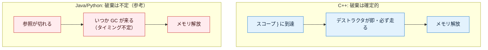

この確定性こそがC++の強みで、資源（ファイル・ロック・接続）を「必ず・すぐに」解放できる理由。逆に言えば、寿命の設計を誤ると即座にバグ（リーク・ダングリングポインタ）になるので、**スタック優先＋スマートポインタ**で寿命を明確にするのが現代C++の作法。

---

<a id="7"></a>
## 7. 完全な実例: 宣言 → インスタンス化 → 実行 → 終了

ここまでの全概念を、1本のプログラムの流れとして通しで見る。銀行口座クラスの一生をメモリの動きとともに追う。特に、**スタックに作った口座が、`{ }` ブロックを抜けた瞬間にデストラクタで確定的に破棄される様子**に注目してほしい。

```cpp
#include <iostream>
#include <string>

// ============================================================
// ① クラス宣言（設計図を定義。この時点ではまだ実体は0個）
// ============================================================
class BankAccount {
public:
    std::string owner;    // メンバ変数: 口座名義
    int balance;          // メンバ変数: 残高

    // --- コンストラクタ（生成直後の初期化。初期化リストで受け取る）---
    BankAccount(std::string owner, int balance)
        : owner(owner), balance(balance)   // メンバを最初からこの値で初期化
    {
        std::cout << owner << "の口座を開設。残高" << balance << std::endl;
    }

    // --- デストラクタ（破棄の瞬間に確定的に呼ばれる）---
    ~BankAccount() {
        std::cout << owner << "の口座を閉鎖" << std::endl;
    }

    // --- メソッド（処理）: 入金する ---
    void deposit(int amount) {
        this->balance += amount;   // 自分の残高に amount を加算
        std::cout << amount << "円入金 → 残高" << this->balance << std::endl;
    }
};

int main() {
    std::cout << "--- ブロックに入る前 ---" << std::endl;

    {   // ← ここからブロック（スコープ）開始
        // ====================================================
        // ② インスタンス化（スタックに実体を作り、コンストラクタが走る）
        // ====================================================
        BankAccount a("山田", 1000);
        // この行で:
        //   1. スタックに BankAccount 1個分の領域を確保
        //   2. コンストラクタが走り owner="山田", balance=1000 に初期化
        //   3. a は口座の実体そのもの（番地ではない）

        // ====================================================
        // ③ 実行（メソッドを呼んで使う）
        // ====================================================
        a.deposit(500);    // 残高 1000 → 1500
        a.deposit(2000);   // 残高 1500 → 3500

    }   // ← ★ここでブロックを抜けた瞬間、a のデストラクタが確定的に呼ばれる
        //    （「山田の口座を閉鎖」が、まさにこの } のタイミングで出力される）

    std::cout << "--- ブロックを抜けた後（口座はもう存在しない）---" << std::endl;
    return 0;
}
```

**実行結果:**

```
--- ブロックに入る前 ---
山田の口座を開設。残高1000
500円入金 → 残高1500
2000円入金 → 残高3500
山田の口座を閉鎖                    ← } でスコープを抜けた「その瞬間」にデストラクタが走った
--- ブロックを抜けた後（口座はもう存在しない）---
```

注目点は「山田の口座を閉鎖」の出力位置。**プログラム終了時ではなく、内側の `}` を抜けた正確なその瞬間**に出ている。Java だとこの後始末がいつ走るか分からず、Python でも状況次第だが、**C++はスコープ終端で確定的**にデストラクタが走る。これがC++の後始末（RAII）の本質。

**メモリの動きを段階ごとに追う:**

**② `BankAccount a("山田", 1000)` の直後** — スタックに実体ができる（番地ではなく実体そのもの）

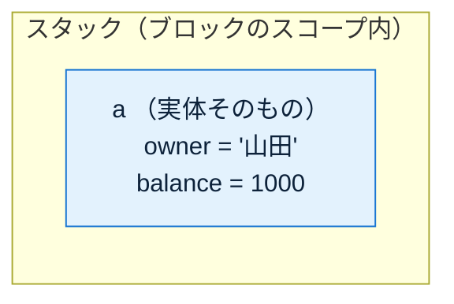

**③ `a.deposit(500)` → `a.deposit(2000)` の後** — 同じ実体の `balance` が更新される

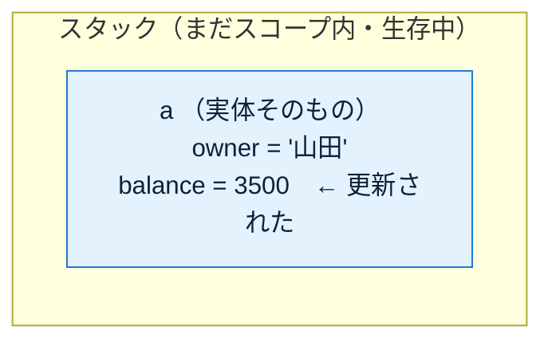

**④ 内側の `}` に到達した瞬間** — スコープ終端でデストラクタが確定的に呼ばれ、実体が破棄される

```mermaid
flowchart LR
    subgraph SK["スタック（スコープ終端）"]
        A["a のフレームが外れる"]
    end
    subgraph GONE["破棄（この瞬間に確定的に起きる）"]
        D["~BankAccount() が走る<br/>「山田の口座を閉鎖」を出力<br/>そのままメモリ解放"]
    end
    A -->|} に到達した瞬間| D
    classDef stk fill:#e3f2fd,stroke:#1976d2,color:#0d223a;
    classDef gone fill:#ffebee,stroke:#c62828,color:#3a0d0d;
    class A stk;
    class D gone;
```

C++では ④ の「破棄の瞬間」が**スコープ終端に固定されていて完全に予測できる**。プログラマは `{ }` の範囲を設計するだけで、後始末のタイミングを正確にコントロールできる。GC任せの「不定タイミング」とはここが根本的に違う。

---

<a id="8"></a>
## 8. C++ 早見表

| 項目 | C++ |
|------|-----|
| クラス定義 | `class BankAccount { ... };`（**末尾セミコロン必須**） |
| アクセス指定子 | `public:` / `private:`（既定は `private`） |
| メンバ変数の宣言 | クラス直下に型付きで宣言 |
| インスタンス化（スタック） | `BankAccount a(...);`（**基本はこちら**、自動で片付く） |
| インスタンス化（ヒープ） | `new BankAccount(...)` / `std::make_unique<...>(...)` |
| 実体の置き場所 | **スタックにもヒープにも置ける**（Java/Pythonは常にヒープ） |
| 代入 `b = a` の意味 | **コピー（値セマンティクス）**。別実体になる ← GC言語と真逆 |
| エイリアス（同じ実体を指す） | ポインタ `BankAccount* p = &a;` / 参照 `BankAccount& r = a;` |
| コンストラクタ | クラス名と同名の関数（戻り値の型なし） |
| メンバ初期化の作法 | **初期化リスト `: member(value)`**（const/参照メンバは必須） |
| コンストラクタ引数 | あり（デフォルト引数を持てる） |
| 「作り方」を複数用意 | オーバーロード / デフォルト引数 |
| 自分自身 | `this`（**ポインタ**。`this->member` でアクセス） |
| デストラクタ | **`~BankAccount()`**（破棄時に確定的に呼ばれる） |
| メモリ解放方式 | **GCなし**。スタック=自動 / ヒープ=`delete` or スマートポインタ |
| 解放タイミング | **確定的**（スコープ終端 or `delete` or 所有者消滅の瞬間） |
| 資源の確実な後始末 | **RAII**（コンストラクタで取得・デストラクタで解放） |
| ヒープの自動解放 | `std::unique_ptr`（単独所有）/ `std::shared_ptr`（共有・参照カウント） |

---

<a id="9"></a>
## 9. 応用: コンストラクタインジェクション

コンストラクタ引数の実践的な使い方の代表例が **コンストラクタインジェクション（依存性の注入 / DI）**。

**考え方: あるクラスが別のオブジェクトを必要とするとき、それをクラス内部で `new`（生成）せず、コンストラクタ引数として外から受け取る。**

まず「依存」という言葉を整理する。あるクラス A が、処理のために別のクラス B のインスタンスを使うとき、「**A は B に依存している**」という。例えば「通知サービスがメール送信機を使う」なら、通知サービスはメール送信機に依存している。この**依存する相手を、誰が・どこで生成し、誰が寿命を持つか**が今回のテーマ。C++では特に「所有権（誰が delete する責任を持つか）」が明確になるという利点が大きい。

### なぜ内部で `new` するとダメか（問題点を厚く）

まず「やってしまいがちな悪い例」を見る。依存する `EmailSender` を、クラスの内部で自分で `new` している。

```cpp
// ===== C++: 悪い例（内部で new）=====
class NotificationService {
    EmailSender* sender;   // 具体的なクラスへのポインタを内部で抱える
public:
    NotificationService() {
        sender = new EmailSender();   // ← 内部で直接 new して自分で生成・所有してしまう
    }
    ~NotificationService() {
        delete sender;                // ← 解放責任まで自分で抱える（忘れればリーク）
    }
    void notify(const std::string& m) {
        sender->send(m);
    }
};
```

一見動くが、次の問題を抱えている。

**問題① テストが著しく困難になる**
`NotificationService` を作るだけで、内部で本物の `EmailSender` が生成される。テストのたびに**本物のメールが飛ぶ**、あるいはメールサーバへの接続が必要になる。テスト用に「送ったフリだけする偽物」に差し替える手段がない。

**問題② 実装を差し替えられない（密結合）**
`EmailSender` という**具体的なクラス名がコードに直接埋め込まれている**。後から「SMSでも送りたい」「開発中はコンソールに出したい」となっても、`NotificationService` の中身を書き換えるしかない。

**問題③ 依存が外から見えない（隠れた依存）**
`NotificationService()` という呼び出しだけを見ても、「このクラスが裏で `EmailSender` を必要としている」ことが分からない。依存がコンストラクタのシグネチャに現れず、クラスの内部に隠れてしまう。

**問題④ 生成の責任とタイミングを制御できない**
`EmailSender` の生成コスト（接続確立など）が、`NotificationService` を作った瞬間に**強制的に**発生する。1つだけ作って使い回したいと思っても、`NotificationService` ごとに新しい `EmailSender` が作られてしまい、共有できない。

**問題⑤ 所有権と寿命が絡まる（C++で特に深刻）**
内部で `new` すると、`NotificationService` が `EmailSender` の **delete 責任（所有権）** まで抱え込む。デストラクタでの `delete` 忘れはリーク、コピーすれば同じポインタを2つが持って**二重解放**の危険が生じる。「誰がこのオブジェクトを解放するのか」が不明瞭になり、C++で最も事故が起きやすい状況になる。

これらはすべて「**依存する相手を自分で生成・所有してしまっている**」ことが根本原因。

### 抽象クラス（純粋仮想関数）を挟んで、コンストラクタで注入する

依存を「抽象（インターフェース相当）」として受け取り、実体は外から渡す。C++では**純粋仮想関数だけを持つ抽象クラス**をインターフェースの代わりに使う。

```cpp
// ===== C++: 良い例 =====
// 「メッセージを送れる」という抽象だけを定義（＝インターフェース相当の抽象クラス）
class MessageSender {
public:
    virtual ~MessageSender() = default;              // 基底クラスには仮想デストラクタが必須
    virtual void send(const std::string& m) = 0;     // = 0 が純粋仮想関数（中身は派生で実装）
};

// 具体実装その1: 本番用のメール送信
class EmailSender : public MessageSender {
public:
    void send(const std::string& m) override {
        std::cout << "メール送信: " << m << std::endl;
    }
};

// 具体実装その2: テスト用の偽物（メールは飛ばない）
class MockSender : public MessageSender {
public:
    void send(const std::string& m) override {
        std::cout << "（送ったフリ）: " << m << std::endl;
    }
};

class NotificationService {
    MessageSender& sender;   // 具体実装ではなく「抽象への参照」だけを持つ（所有はしない）
public:
    // ↓ コンストラクタ引数で、外から実装を受け取る（＝注入）
    NotificationService(MessageSender& sender) : sender(sender) {
        // 受け取った参照を保存するだけ。自分では new しない → 所有権を持たない
    }
    void notify(const std::string& m) {
        sender.send(m);      // 中身が何であれ send() を呼ぶだけ
    }
};
```

依存の渡し方は、**所有権をどうするか**で選ぶ。ここがC++らしい設計判断になる。

| 渡し方 | 所有権 | 使いどころ |
|--------|-------|-----------|
| 参照 `MessageSender&` | 持たない（呼び出し側が寿命を管理） | 依存が呼び出し側で確実に生きている場合。最も軽い |
| `std::unique_ptr<MessageSender>` | **単独で所有**（受け取った側が delete 責任を持つ） | 依存の寿命をこのクラスに委ねたい場合 |
| `std::shared_ptr<MessageSender>` | **共有所有**（最後の1人が delete） | 依存を複数のクラスで共有したい場合 |

```cpp
// ===== unique_ptr で「所有権ごと」注入する例 =====
class NotificationService {
    std::unique_ptr<MessageSender> sender;   // 所有権を持つ（スコープを抜ければ自動 delete）
public:
    // std::move で所有権を受け取る（＝このクラスが以後の解放責任を持つ）
    NotificationService(std::unique_ptr<MessageSender> sender)
        : sender(std::move(sender)) { }
    void notify(const std::string& m) {
        sender->send(m);
    }
};
```

### 先ほどの問題がどう解決されるか

内部 `new` の問題①〜⑤が、コンストラクタ注入でそれぞれ解消される。

| 内部 new の問題 | コンストラクタ注入での解決 |
|----------------|--------------------------|
| ① テストが困難 | テスト時は `MockSender` を渡せる。本物のメールは飛ばない |
| ② 差し替え不可（密結合） | 具体クラス名がコードから消え、`MessageSender`（抽象）にだけ依存。実装は外から自由に選べる |
| ③ 依存が隠れる | 依存が**コンストラクタ引数として表に出る**。シグネチャを見れば必要なものが一目で分かる |
| ④ 生成タイミング不制御 | 生成は呼び出し側の責任になり、1つを使い回す（共有）ことも自由 |
| ⑤ 所有権が絡まる | **誰が所有するかが型（参照 / unique_ptr / shared_ptr）で明示される**。二重解放やリークの温床が消える |

### 利点（まとめ）

| 利点 | 中身 |
|------|------|
| 差し替え可能 | 本番=メール / 開発=コンソール出力 / テスト=モック を、渡す実装を変えるだけで切替 |
| テスト容易 | 副作用のある依存をモック（偽物）に置換でき、外部I/Oなしで検証できる |
| 疎結合 | 具体実装でなく抽象（純粋仮想関数を持つクラス）に依存するので、実装を変えても利用側を書き換えずに済む |
| 依存が可視化 | コンストラクタ引数を見れば「このクラスが何を必要とするか」が一目で分かる |
| **所有権が明確** | 参照/unique_ptr/shared_ptr の選択で「誰がこの依存を所有し、いつ解放するか」がコード上に明示される（C++固有の大きな利点） |

### 「じゃあ new は誰が書くの？」

依存を注入する形にすると、「結局どこかで生成するのでは？」という疑問が出る。答えは **「アプリの一番外側（エントリポイント）でまとめて生成し、必要なクラスに配って回る」**。この「組み立て場所」を **Composition Root（合成の根）** と呼ぶ。

```cpp
// ===== C++: アプリ起動時（一番外側）でまとめて組み立てる =====
int main() {
    // 依存の生成は、この一番外側の1か所に集約する
    EmailSender sender;                          // ここで具体実装を生成（スタックに置く）
    NotificationService service(sender);         // 生成した依存を参照で注入

    service.notify("こんにちは");
    return 0;
}   // ← スコープ終端で sender も service もデストラクタが確定的に走り、後始末は自動
```

こうすると「何をどう組み立てるか」がアプリの入口1か所に集まり、各クラスは自分の仕事だけに集中できる。テスト時はこの組み立て部分だけ別に書けばよい。所有権が絡む場合は `unique_ptr` を Composition Root で作って `std::move` で渡す、といった形になる。

```cpp
// ===== 所有権も含めて組み立てる版 =====
int main() {
    // 実装を unique_ptr で作り、所有権ごと NotificationService に渡す
    auto sender = std::make_unique<EmailSender>();
    NotificationService service(std::move(sender));  // 所有権を move で注入

    service.notify("こんにちは");
    return 0;
}   // service が壊れる瞬間、抱えた sender も自動 delete される（リークなし）
```

Java の Spring や各種DIコンテナのような「注入を自動化する仕組み」もC++にライブラリとして存在するが、まず**手動注入（生成責任を外に出し、コンストラクタで受け取る／所有権を型で明示する）**の形を理解すれば、フレームワークが裏で何をやっているかもそのまま読める。C++ではとりわけ「所有権を誰が持つか」を自分で設計する訓練になるので、手動注入の理解価値が高い。

---

作成: 2026-07-22 / C++
