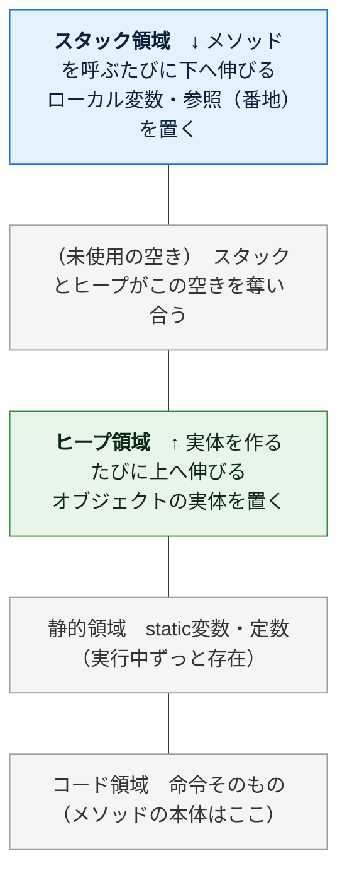
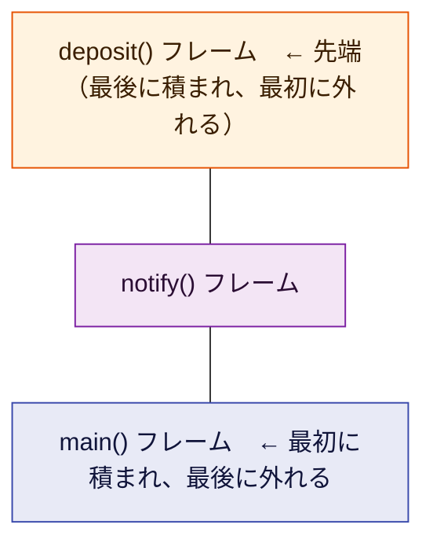
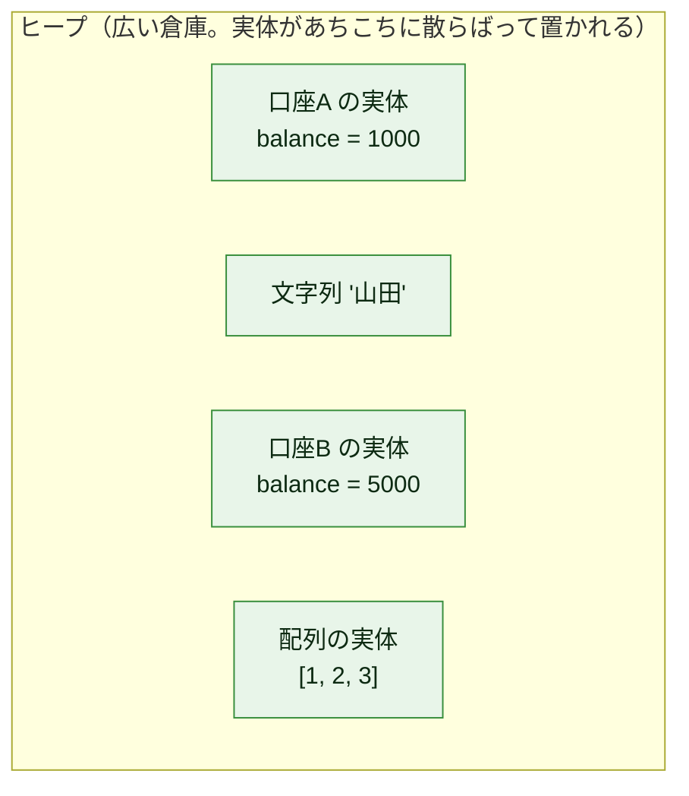
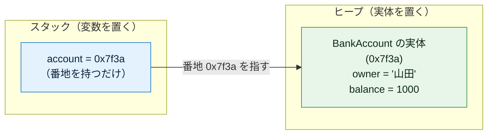
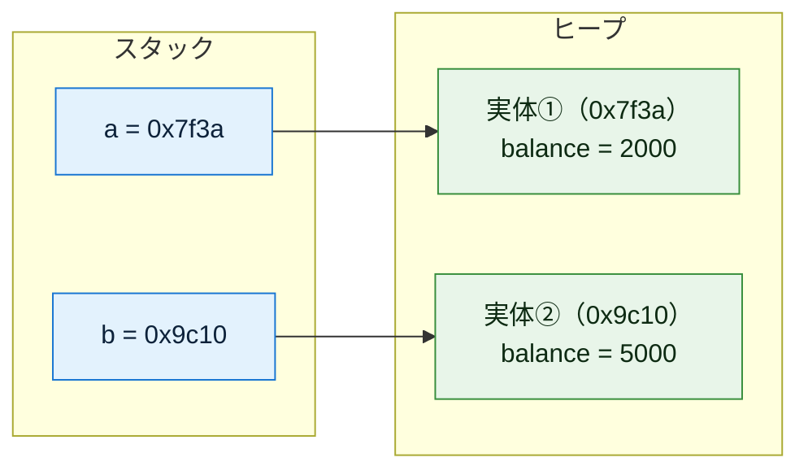
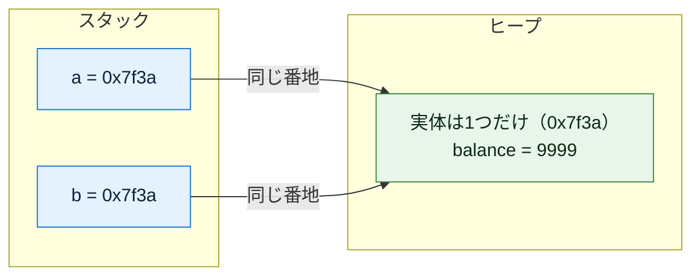
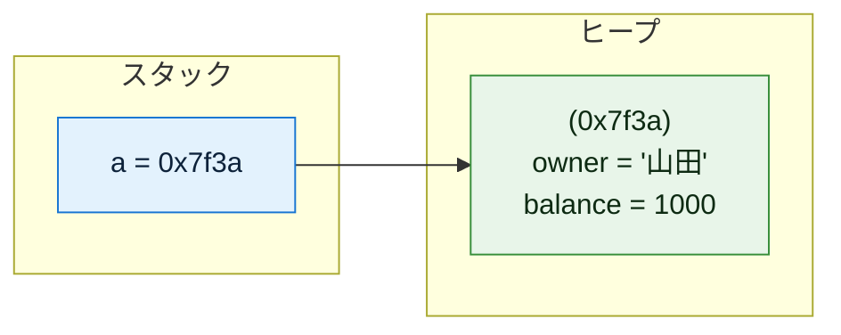
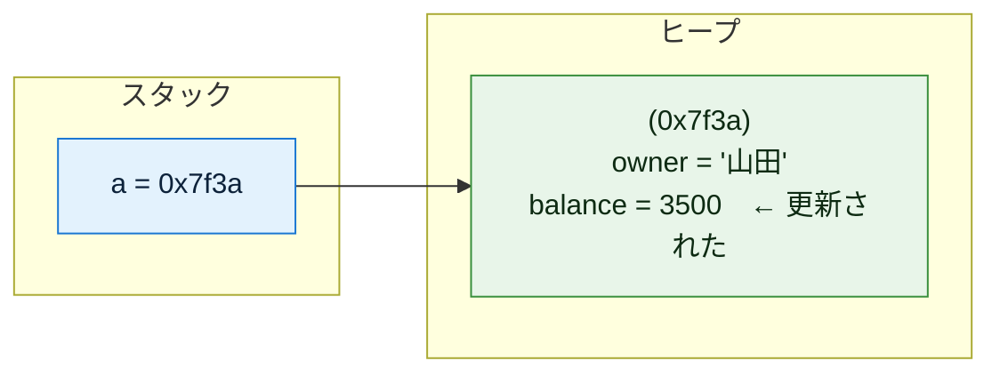
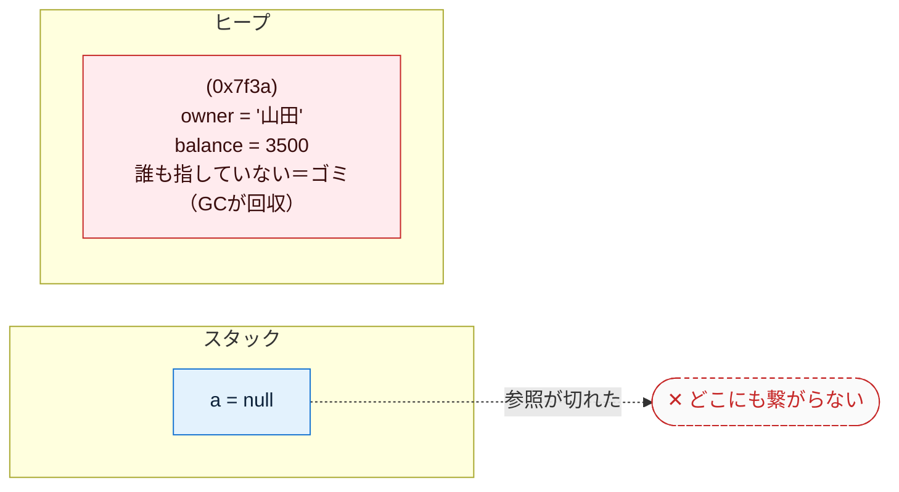

# オブジェクト指向の基礎（Java版）— メモリの視点から徹底解説

対象言語: **Java**

この文書は「クラス」「インスタンス」「コンストラクタ」「デストラクタ」「ライフサイクル」を、**実際にメモリで何が起きているか**に沿って、初心者がつまずくポイントを一つずつ潰しながら解説する。丸暗記ではなく「なぜそうなるか」で理解することを目指す。コード例はコメントを多めにして、1行ずつ何が起きているか追えるようにしている。

---

## もくじ

0. [そもそもオブジェクトとは何か](#0)
1. [前提: スタックとヒープ（ここが全ての土台）](#1)
2. [クラス — メモリレイアウトの設計図](#2)
3. [インスタンス — 設計図から実体を作る](#3)
4. [コンストラクタ徹底解説（引数・メソッド・種類）](#4)
5. [デストラクタ — 解放時の後始末](#5)
6. [ライフサイクル — 確保から解放までの全経路](#6)
7. [完全な実例: 宣言 → インスタンス化 → 実行 → 終了](#7)
8. [Java 早見表](#8)
9. [応用: コンストラクタインジェクション](#9)

---

<a id="0"></a>
## 0. そもそもオブジェクトとは何か

プログラムは突き詰めると「**データ**」と「そのデータを**操作する処理**」の2つでできている。

昔ながらの書き方（手続き型）では、この2つがバラバラに置かれていた。

```
データ:  name="山田", balance=1000
処理:    deposit(name, balance, 500)   // データを毎回引数で渡す
```

オブジェクト指向は、この**関連するデータと処理を1つの箱にまとめる**という考え方。その「箱」がオブジェクトだ。

```
口座オブジェクト
├─ データ:  name="山田", balance=1000
└─ 処理:    deposit(500)   ← 自分の中のデータを直接触れる
```

こうまとめると「口座に対して deposit する」という現実の考え方そのままにコードが書け、データと処理の対応関係が崩れにくくなる。これがオブジェクト指向の出発点。

そして、この「箱」を**どう作り（クラス）、いつメモリに現れ（インスタンス化）、どう初期化され（コンストラクタ）、いつ消えるか（デストラクタ／ライフサイクル）** ——これらは全て**メモリ上の出来事**として説明できる。だから次章のメモリの話から始める。

---

<a id="1"></a>
## 1. 前提: スタックとヒープ（ここが全ての土台）

オブジェクトの挙動は、メモリが役割の違う領域に分かれていることを知らないと絶対に理解できない。逆に、ここさえ押さえれば後は全部つながる。この章はいちばん丁寧に説明する。

### 1-0. そもそもメモリとは

メモリ（RAM）は、プログラム実行中にデータを一時的に置いておく作業台のようなもの。中身は**巨大な1列の「マス目」**で、各マスには **アドレス（番地）** という通し番号が振られている。

| アドレス（番地） | 0x1000 | 0x1001 | 0x1002 | 0x1003 | … |
|---|---|---|---|---|---|
| 中身（1マス＝1バイト） | 72 | 84 | 00 | 00 | … |

「変数」とは、このどこかのマスに付けた名前にすぎない。`x = 5` は「あるアドレスのマスに 5 を書く」こと。この“番地の集まり”を、OSとプログラムは役割ごとに区画分けして使う。その代表が **スタック** と **ヒープ** だ。

### 1-1. プログラムのメモリ全体図

プログラムが動くとき、メモリはおおまかに次のように区画されている。



（上ほど高位アドレス。オブジェクト指向で重要なのは上2つ＝**スタック**と**ヒープ**）

このうち、オブジェクト指向を理解するのに重要なのが上の2つ、**スタック**と**ヒープ**。まず両者を一覧で比べ、その後1つずつ深掘りする。

| | **スタック** | **ヒープ** |
|---|---|---|
| 何を置く | ローカル変数、メソッド呼び出しの記録、番地(参照)そのもの | **オブジェクトの実体**、大きいデータ、寿命の長いデータ |
| 確保・解放 | **自動**（メソッドの出入りに連動） | GC（後述）が管理 |
| 速度 | **速い**（番地を動かすだけ） | 遅い（空き場所を探す必要） |
| サイズ | 小さい（数MB程度） | 大きい（メモリの許す限り） |
| 寿命 | そのメソッドの実行中だけ | 参照され続ける限りずっと |
| 並び方 | きっちり積み重なる（LIFO） | あちこちに散らばる |

### 1-2. スタック — メソッドの出入りに連動する「積み重ね」

スタックは名前のとおり「積み重ね」。**メソッドを1つ呼ぶと、そのメソッド専用の箱が1つ積まれる**。この箱を **スタックフレーム（stack frame）** と呼ぶ。

フレームの中には、そのメソッドが使う次のものが入る：

| `deposit()` フレームの中身 | 例 | 説明 |
|---|---|---|
| 引数 | `amount = 500` | 呼び出し時に渡された値 |
| ローカル変数 | `temp = ...` | メソッドの中で宣言した変数 |
| 戻り先アドレス | `0x4a2c` | 終わったら「どこへ戻るか」の記録 |

そして**メソッドを呼ぶと上に積まれ、メソッドが終わると上から外れる**。この「後に積んだものから先に外す」順序を **LIFO（Last In, First Out）** という。下は `main()` が `notify()` を呼び、さらに `notify()` が `deposit()` を呼んだ、いちばん深い瞬間のスタック：



`deposit()` が終わると先端の箱だけ外れて `notify()` に戻り、`notify()` が終わるとまた外れて `main()` に戻る——というように、**上から順に1つずつ消えていく**。

**スタックの片付けが「自動でタダ同然」なのはなぜか。** スタックには「今どこまで積んだか」を指す**スタックポインタ**という目印が1つある。メソッドが終わるときは、この目印を**フレーム1個分だけ下に戻す**だけ。中身を消して回るのではなく、ポインタを動かすだけなので一瞬で終わる。だからスタックは速い。

> ⚠️ **スタックオーバーフロー**: スタックは容量が小さい。メソッドがメソッドを呼び…と積みすぎると（例: 止まらない再帰）、スタックが天井に達して `StackOverflowError` で落ちる。これがスタックが有限であることの証拠。

### 1-3. ヒープ — 自由に確保する「広い倉庫」

スタックは「メソッドが終わったら消える」ものしか置けない。だが実際には、**メソッドが終わっても生き残ってほしいデータ**や、**実行するまで大きさが分からないデータ**がある。それを置くのがヒープ。

**オブジェクト（インスタンス）の実体は、原則すべてこのヒープに置かれる。** 理由は「いつまで使われるか・どれだけの大きさか」が作る時点で決まらないから。スタックのようにきっちり積むのではなく、**空いている場所を探して確保する**ため、置き場所はバラバラに散らばる。



ヒープの弱点は2つ。**① 確保が遅い**（毎回「どこが空いてるか」を探す必要がある）。**② 自動では片付かない**。スタックのように「メソッドが終わったら消える」という自然な合図がないので、片付ける係を決めないと、使い終わったゴミがずっと残り続ける＝**メモリリーク**になる。

この「ヒープの片付け」を、**Java は GC（ガベージコレクション）という仕組みが自動でやってくれる**（詳しくは5章）。「もう誰からも使われていない実体」をGCが見つけて回収するので、プログラマが手で「解放」を書くことは基本ない。ここがC言語などとの大きな違い。

### 1-4. 2つはこう連携する（最重要ポイント）

ここが初心者の最大の関門。スタックとヒープは**セット**で使われる。典型的にはこうなる：

> **オブジェクトの実体はヒープに置かれ、スタック上の変数はその「番地」だけを持つ。**

```java
account = new BankAccount("山田", 1000);
```

この1行の実行後、メモリはこうなっている：



つまり **変数 `account` は口座そのものではなく、「口座がヒープのどこにあるか」を示す番地（`0x7f3a`）を持っているだけ**。この番地を持つ値を **参照（reference）** と呼ぶ。

なぜこうする？ オブジェクトは大きくなりうるので、変数に実体を丸ごと入れると、代入や引数渡しのたびに全部コピーすることになり重い。**番地（小さな固定サイズの値）だけをやり取りすれば軽い**からだ。

> 💡 **プリミティブ型は例外**: `int` `double` `boolean` などの**プリミティブ型**だけは、参照ではなく**値そのもの**をスタック（ローカル変数の場合）に直接持つ。実体をヒープに作って参照するのは、`new` で作る**オブジェクト（参照型）**の話。だから `int x = 5;` は 5 がそのまま変数の場所に入り、`BankAccount a = new BankAccount(...)` は番地が入る、という違いがある。

この仕組みを理解すると、後で出てくる **「代入したのに元まで変わる」** という現象（3章）が「番地をコピーしただけで実体は1つだから」とスッと理解できる。まずは次の1点だけ覚えれば十分：


---

<a id="2"></a>
## 2. クラス — メモリレイアウトの設計図

**クラスとは「インスタンス1個がメモリ上でどんな形になるか」を定義したもの**。具体的には「どんなフィールド（データ）を持つか」を決める。

### まずは一番シンプルな例

```java
// class というキーワードで「BankAccount という設計図」を定義する
class BankAccount {
    String owner;    // フィールド1: 口座名義（文字列オブジェクトへの参照を格納）
    int balance;     // フィールド2: 残高（4バイトの整数をそのまま格納）
}
// ↑ここまではあくまで「設計図の宣言」。
//   この時点ではメモリ上に口座は1つも存在しない（実体はまだ0個）。
```

Java の特徴は、**フィールドをクラス直下に「型付きで」宣言する**こと。`String owner;` `int balance;` のように「どんな名前のフィールドが、どんな型で存在するか」を最初に並べる。これが「1インスタンス分のメモリの形」をコンパイル時に確定させる。

### クラスは「データ」と「処理」をまとめる

フィールド（データ）だけでなく、処理（メソッド）も一緒に定義できる。これがオブジェクトの本質。

```java
class BankAccount {
    String owner;    // データ
    int balance;     // データ

    // メソッド（処理）: この口座にお金を入れる
    void deposit(int amount) {
        // this は「このメソッドが呼ばれた口座自身」を指す（4章で詳説）
        this.balance += amount;   // 自分の balance に amount を足す
    }
}
```

ここで重要な事実：

> **メソッドはインスタンスごとに複製されない。** メモリ上にはメソッドの本体が1つだけ存在し（コード領域に置かれる）、全インスタンスがそれを共有する。インスタンスが個別に持つのは**フィールドのデータだけ**。

口座を1000個作っても `deposit` の処理本体は1つ。各口座が個別に持つのは owner と balance の値だけ。

### 覚え方

- **クラス = 設計図**。書いてもまだメモリに実体はできない。
- クラスが決めるのは「どんなフィールドを持つか」＝ **1インスタンス分のメモリの形**。
- メソッドは全インスタンスで共有、フィールドはインスタンスごとに個別。
- Java はフィールドをクラス直下に**型付きで宣言**する。

---

<a id="3"></a>
## 3. インスタンス — 設計図から実体を作る

**インスタンス化とは、クラス（設計図）に従って実際にメモリを確保し、実体を1つ作ること**。この瞬間に初めて、口座がメモリ上に姿を現す。

```java
// new でインスタンス化
BankAccount a = new BankAccount("山田", 1000);
//              ↑ new が「ヒープに実体を1つ作る」命令
// a には、作られた実体の「番地」が入る（実体そのものではない）
```

`new` が行うことを分解すると：

1. **ヒープに、BankAccount 1個分のメモリを確保**する（owner と balance が入る領域）
2. その領域を初期化する（次章のコンストラクタが走る）
3. **確保した領域の番地を返す**。それが変数 `a` に入る

### 1つのクラスから複数のインスタンス

設計図は1枚でも、そこから作る実体は何個でも作れる。各インスタンスは**独立したメモリ領域**を持つ。

```java
BankAccount a = new BankAccount("山田", 1000);  // ヒープ上に実体① を作る（番地 0x7f3a とする）
BankAccount b = new BankAccount("田中", 5000);  // ヒープ上に実体② を作る（番地 0x9c10、①とは別物）

a.balance = 2000;   // 実体① の balance を書き換え
b.balance = 5000;   // 実体② の balance を書き換え（① には一切影響しない。別メモリだから）
```



### 「代入」は実体をコピーしない（超重要な落とし穴）

初心者が必ず引っかかる点。参照型では、変数の代入は**番地のコピー**であって**実体のコピーではない**。

```java
BankAccount a = new BankAccount("山田", 1000);  // 実体を1つ作る（番地 0x7f3a）
a.balance = 1000;

BankAccount b = a;    // ← a が持つ「番地(0x7f3a)」だけがコピーされる。
                      //   新しい実体は作られない。a と b は同じ実体を指す

b.balance = 9999;     // b 経由で実体の balance を書き換える

System.out.println(a.balance);   // → 9999！
// a と b は同じ実体を指しているので、b で変えた値が a からも見える
```



`a` と `b` は別々の変数（スタック上の別の場所）だが、**中に入っている番地が同じ**なので、指している実体はたった1つ。これを **エイリアス（別名）** という。片方を通して実体を書き換えると、もう片方から見ても変わって見えるのはこのためだ。

> **もし本当に「中身をコピーした別物」が欲しいなら**、新しく `new` して各フィールドを移し替える／コピー用のメソッドを用意する（あるいは `clone()` を適切に実装する）。ただの `=` は番地のコピーにすぎない、と覚える。

---

<a id="4"></a>
## 4. コンストラクタ徹底解説（引数・メソッド・種類）

ここが今回の中心。コンストラクタは初心者がモヤっとしやすいので、用語を1つずつ分解する。

### 4-1. コンストラクタとは何か

**コンストラクタ = インスタンスが生成された「直後」に自動的に呼ばれる、初期化専用の処理**。

なぜ必要か？ 確保したばかりのメモリは**中身が既定値**の状態（オブジェクト型なら `null`、数値型なら `0`）。これを「使える正しい状態」に整えるのがコンストラクタの仕事。

```
new BankAccount("山田", 1000) の内部で起きること:

  ① ヒープに領域確保 →  owner=null balance=0      （まだ中身が既定値）
  ② コンストラクタ実行 →  owner="山田"  balance=1000  （正しい初期状態に上書き）
  ③ 番地を返す
```

コンストラクタを書かなければ、口座名義が `null`、残高が0のまま、といった中途半端なインスタンスができてしまう。それを防ぐ「初期化の入口」がコンストラクタ。

### 4-2. コンストラクタメソッドという呼び方について

「コンストラクタメソッド」という言葉を聞くことがあるが、これは**コンストラクタが実質的にメソッド（処理のかたまり）の一種**だから。ただし普通のメソッドと違う特別なルールがある：

| 項目 | 普通のメソッド | コンストラクタ |
|------|--------------|--------------|
| 呼び出しタイミング | 好きな時に何度でも | 生成時に自動で1回だけ |
| 呼び出し方 | `a.deposit(500)` と自分で呼ぶ | 自分で呼ばない（`new` が自動で呼ぶ） |
| 戻り値 | ある（`void` 含む） | なし（そもそも戻り値の型を書かない） |
| 名前 | 自由に付けられる | **クラス名と同じ**に固定される |

Java のコンストラクタの「名前」は必ず**クラス名と同じ**にする。そして**戻り値の型を書かない**（`void` すら書かない）。これが「普通のメソッドではなくコンストラクタだ」という目印になる。

| 項目 | Java での書き方 | 例 |
|------|-------------------|-----|
| 名前 | **クラス名と同じ**名前のメソッド | `BankAccount(...) { }` |
| 戻り値 | 書かない（`void` も書かない） | `BankAccount(String owner) { ... }` |

### 4-3. コンストラクタ引数とは

**コンストラクタ引数 = インスタンスを作るときに「外から渡す初期値」**。

口座を作るなら「誰の口座か」「最初いくら入れるか」を外から指定したい。それを受け取る窓口がコンストラクタ引数。

```java
class BankAccount {
    String owner;
    int balance;

    // ↓ ( ) の中がコンストラクタ引数。owner と balance を外から受け取る
    BankAccount(String owner, int balance) {
        // 受け取った引数を、この実体のフィールドに保存する
        this.owner = owner;       // this.owner(フィールド) ← owner(引数)
        this.balance = balance;   // this.balance(フィールド) ← balance(引数)
    }
}

// --- 使う側: 生成時に引数を渡す ---
BankAccount a = new BankAccount("山田", 1000);  // owner="山田", balance=1000 で初期化
BankAccount b = new BankAccount("田中", 5000);  // 別の初期値 → 中身の違う別の実体になる
```

引数がなぜ便利かというと、**同じクラスから中身の違うインスタンスを作れる**から。引数がなければ全部同じ初期値の口座しか作れない。

### 4-4. this — 「自分自身」を指す

コンストラクタやメソッドの中に出てくる `this` は、

> **今まさに操作している、その実体自身**

を指す。「どの口座の balance か」を区別するために必要。

```java
BankAccount(String owner) {
    this.owner = owner;
    // ↑             ↑
    // │             └─ 引数として受け取った値
    // └─ 「この実体の」owner フィールド
    //
    // this.owner(フィールド) と owner(引数) は名前が同じでも別物。
    // this. を付けることで「引数ではなくフィールドの方」だと明示している。
}
```

`this.owner`（フィールド）と `owner`（引数）は、名前は同じでもまったくの別物。引数はスタック上のローカルな値、`this.owner` はヒープ上の実体の中のフィールドだ。`this.` を付けることで「引数ではなくフィールドの方に代入する」と明示している。もし引数とフィールドの名前が違えば（例: 引数を `o` にする）`this.` は省略できるが、同名にして `this.` で区別するのが Java の定番スタイル。

### 4-5. デフォルトコンストラクタ

コンストラクタを1つも書かないと、Java は「引数なしの空のコンストラクタ」を勝手に用意する。これを**デフォルトコンストラクタ**という。

```java
class Dog {
    String name;
    // コンストラクタを1つも書いていない
}

Dog d = new Dog();   // それでも new できる（Javaが暗黙のデフォルトコンストラクタを用意）
                     // このとき name は null（オブジェクト型の既定値）に初期化される
```

ただし**自分でコンストラクタを1つでも定義すると、デフォルトは消える**。これは初心者がハマるポイント。

```java
class Dog {
    String name;
    Dog(String name) {        // 引数ありコンストラクタを自分で定義した
        this.name = name;
    }
}

Dog d1 = new Dog("ポチ");     // OK（自分で定義した引数あり版）
Dog d2 = new Dog();           // ← コンパイルエラー！
                              //   引数なし版はもう自動生成されないので存在しない
```

もし引数あり版と引数なし版の両方を使いたいなら、**引数なしのコンストラクタも自分で明示的に書く**必要がある（次の 4-6 のオーバーロード）。

### 4-6. コンストラクタ引数のバリエーション — オーバーロード

同じクラスでも「作り方」を複数用意したいことがある。Java では**オーバーロード**を使う。

**オーバーロード** — 引数の型・数が違う同名コンストラクタを複数定義できる仕組み。

```java
class BankAccount {
    String owner;
    int balance;

    // 引数なし版: 名義もなし・残高0（デフォルトコンストラクタを自分で書き直したもの）
    BankAccount() {
        this.owner = "(未設定)";
        this.balance = 0;
    }

    // 引数1つ版: 名義だけ指定（残高は0スタート）
    BankAccount(String owner) {
        this.owner = owner;
        this.balance = 0;      // 残高は0で初期化
    }

    // 引数2つ版: 名義と初期残高を指定
    BankAccount(String owner, int balance) {
        this.owner = owner;
        this.balance = balance;
    }
}

BankAccount a = new BankAccount();               // → 引数なし版が呼ばれる
BankAccount b = new BankAccount("山田");         // → 引数1つ版が呼ばれる（残高0）
BankAccount c = new BankAccount("田中", 5000);   // → 引数2つ版が呼ばれる（残高5000）
// Javaは「引数の数・型」を見て、どのコンストラクタを使うか自動で選ぶ
```

Java は呼び出し時の**引数の数・型**を見て、どのコンストラクタを使うかコンパイル時に自動で選ぶ。これがオーバーロード解決だ。

> 💡 **コンストラクタから別のコンストラクタを呼ぶ（`this(...)`）**: 初期化のロジックが重複するときは、`this(...)` で同じクラスの別コンストラクタを呼び出せる。例えば引数1つ版の中で `this(owner, 0);` と書けば、引数2つ版に処理を集約できる。

```java
class BankAccount {
    String owner;
    int balance;

    BankAccount(String owner) {
        this(owner, 0);          // ← 同じクラスの「引数2つ版」に処理を委譲する
    }
    BankAccount(String owner, int balance) {
        this.owner = owner;
        this.balance = balance;
    }
}
```

### 4-7. コンストラクタに書ける処理（代入だけではない）

ここまでの例はコンストラクタで「引数をフィールドに代入するだけ」だったが、**コンストラクタは普通のメソッドと同じで、中に自由に処理を書ける**。代表的なパターンを挙げる。

**① バリデーション（引数チェック）** — 不正な値でインスタンスが作られるのを、生成の入口で防ぐ。

```java
BankAccount(String owner, int balance) {
    // 生成のこの瞬間におかしな値を弾く（＝壊れた口座をそもそも存在させない）
    if (owner == null || owner.isEmpty()) {
        throw new IllegalArgumentException("名義は必須です");  // 例外を投げると生成は失敗し、実体は作られない
    }
    if (balance < 0) {
        throw new IllegalArgumentException("残高をマイナスで開設できません");
    }
    // チェックを通ったときだけフィールドに保存する
    this.owner = owner;
    this.balance = balance;
}
```

バリデーションをコンストラクタでやる利点は、**「存在するインスタンスは必ず正しい状態」だと保証できる**こと。あとで使うたびにチェックする必要がなくなる。

**② 引数から計算して別のフィールドを埋める** — 渡された値をそのまま入れるだけでなく、加工結果を持たせる。

```java
Rectangle(int width, int height) {
    this.width = width;
    this.height = height;
    this.area = width * height;    // 引数から計算した面積を、初期化時に確定させておく
}
```

**③ 引数に無い値を自動生成する** — IDや作成日時など、外から渡さず内部で作るもの。

```java
BankAccount(String owner) {
    this.owner = owner;
    this.id = UUID.randomUUID().toString();   // 口座番号を自動発番（引数では受け取らない）
    this.createdAt = LocalDateTime.now();     // 開設日時を記録
    this.balance = 0;                         // 残高は0スタート
}
```

**④ 他のメソッド呼び出し・副作用のある処理** — ログ出力・接続・登録など。

```java
FileLogger(String path) {
    this.path = path;
    this.writer = new FileWriter(path);       // 生成と同時にファイルを開く（＝副作用）
    System.out.println(path + " を開きました");  // ログ出力
}
```

#### ⚠️ ただし「何でも書いていい」わけではない

処理を書けるからといって詰め込みすぎると問題になる。実務では次が定石。

| 種類 | 例 | 方針 |
|------|-----|------|
| ✅ 推奨 | バリデーション、フィールドの計算、ID・日時の自動生成 | **「使える正しい状態を作る」ための処理**なので積極的に書く |
| ⚠️ 慎重に | ファイルを開く、DB接続、外部APIを叩く、重い計算 | **副作用の強い処理**。コンストラクタに詰めると下記の問題が出る |

副作用の強い処理をコンストラクタに入れると:

- **テストしにくい** — インスタンスを作るだけで本物の接続や通信が走ってしまう。
- **中途半端な実体が残りやすい** — 生成の途中（一部のフィールドだけ埋めた状態）で例外が出ると、壊れかけのオブジェクトが生じうる。
- **生成コストが重くなる** — 「ただ作っただけ」で重い処理が走る。

この対策が、次章で厚く扱う **コンストラクタインジェクション**（依存は自分で作らず外から受け取る）や、④の資源は `try-with-resources` で閉じる、という設計につながる。

### 4-8. コンストラクタのまとめ

- **コンストラクタ** = 生成直後に自動で1回走る初期化処理。既定値のメモリを正しい初期状態にする。
- **コンストラクタ引数** = 生成時に外から渡す初期値の窓口。中身の違うインスタンスを作れる。
- **this** = 操作中の実体自身。フィールドと引数を区別するのに使う。
- **デフォルトコンストラクタ** = 何も書かないとき自動で用意される引数なし版（自分で書くと消える）。
- 作り方を複数持たせるには**オーバーロード**（同名で引数違いを複数定義）を使う。`this(...)` で別コンストラクタに委譲もできる。
- コンストラクタには代入以外の**処理（バリデーション・計算・自動生成）も書ける**。ただし副作用の強い処理は詰め込みすぎない。

---

<a id="5"></a>
## 5. デストラクタ — 解放時の後始末

インスタンスが不要になり**破棄される瞬間に走る処理**。役割は「使っていたヒープや、ファイル・接続などの資源を返す」こと。コンストラクタの逆。

Java は **GC（ガベージコレクション）** でメモリを自動回収するため、C++ のような「手動で解放を書く」処理は基本不要。ただし仕組みとタイミングには Java 固有のクセがある。

### Java: 世代別GC（回収タイミングは不定）

```
・「もうどこからも参照されていない（GCルートから辿れない）オブジェクト」を
  ゴミと判定し、GCが後でまとめて回収する。
・多くのオブジェクトはすぐ捨てられ、一部だけ長生きする——という統計的な傾向を
  利用して、ヒープを「新しい世代／古い世代」に分けて効率よく回収する。
  これを「世代別GC」と呼ぶ。
・「いつ回収されるか」はGC任せで不定。プログラマは「参照を切る」ことしかできない。
・finalize() という破棄時メソッドが昔あったが、いつ呼ばれるか保証されず、
  現在は非推奨・廃止方向。使ってはいけない。
```

```java
BankAccount a = new BankAccount("山田", 1000);  // 実体を作る
// ... a を使う ...
a = null;   // a が持っていた番地を捨てる → この実体はどこからも辿れなくなる
            // → 「ゴミ」になり、いつか(不定のタイミングで)GCが回収する
```

### なぜ `finalize()` を使ってはいけないか

かつては「破棄の瞬間に呼ばれるメソッド」として `finalize()` があったが、次の理由から**使ってはいけない**（Java 9 以降は非推奨、廃止方向）。

- **いつ呼ばれるか保証されない** — GC次第なので、すぐ呼ばれるとは限らない。永遠に呼ばれないことすらある。
- **呼ばれる順序も保証されない** — 複数オブジェクトの後始末の順序が読めない。
- **性能が悪化する** — finalize を持つオブジェクトはGCの負担が増える。

だから「ファイルを閉じる」「接続を切る」といった**確実に走ってほしい後始末を `finalize()` に書くのは誤り**。次の `try-with-resources` を使う。

### GC言語共通の落とし穴: メモリ以外の資源

GC はメモリは片付けてくれるが、**ファイルハンドル・ソケット・DB接続・ロック**などメモリ以外の資源は「いつ解放されるか不定」だと枯渇して困る。そこで「使い終わったら確実に閉じる」専用構文を使う。

```java
// try-with-resources
// ( ) の中で開いた資源は、try ブロックを抜けるときに必ず close() される
try (var fr = new FileReader("a.txt")) {
    // ここでファイルを使う
}   // ← ブロックを抜けた瞬間、fr.close() が自動で呼ばれる（例外が出ても必ず閉じる）
```

`try (...)` の丸カッコの中で開けるのは、`AutoCloseable`（`close()` を持つ）を実装したクラスだけ。ブロックを正常に抜けても、途中で例外が飛んでも、**必ず `close()` が呼ばれる**。GC任せの `finalize()` と違い、後始末のタイミングがコード上で確定するのがポイント。

### デストラクタのまとめ

| 項目 | Java |
|------|------|
| メモリ解放方式 | 世代別GC |
| 解放タイミング | 不定（GCの都合） |
| 破棄時メソッド | `finalize()`（非推奨・使わない） |
| 資源の確実な後始末 | `try-with-resources`（`AutoCloseable`） |

要点：**メモリはGC任せでよい。ファイルや接続などの資源は、`finalize()` に頼らず `try-with-resources` で確実に閉じる。**

---

<a id="6"></a>
## 6. ライフサイクル — 確保から解放までの全経路

インスタンスの一生は、メモリの観点では次の4段階。

```
①割り当て          ②初期化              ③使用               ④解放
メモリ確保     →    コンストラクタ    →   メソッド呼び出し   →   参照が消えGCが回収
(ヒープ)            (フィールド設定)                          (不定タイミング)
```

| 段階 | Java |
|------|------|
| ①割り当て | `new BankAccount(...)` でヒープに確保 |
| ②初期化 | コンストラクタ（クラス名と同名）が走る |
| ③使用 | 参照経由でメソッドを呼ぶ |
| ④解放 | 参照が切れる → GCが不定タイミングで回収 |
| 資源の解放 | `try-with-resources` |

### 「いつ消えるか」の確定性

- **Java**: 参照を切っても（`a = null` やスコープを抜ける）、実際に回収されるのは**不定のタイミング**（GC次第）。プログラマにできるのは「参照を切る」ところまで。
- だから、メモリ以外の資源（ファイル・接続）は「GCがいつか片付ける」に頼らず、必ず `try-with-resources` で**その場で確実に閉じる**。ここが Java のメモリ管理を扱ううえで一番大事な心構え。

---

<a id="7"></a>
## 7. 完全な実例: 宣言 → インスタンス化 → 実行 → 終了

ここまでの全概念を、1本のプログラムの流れとして通しで見る。銀行口座クラスの一生をメモリの動きとともに追う。

```java
// ============================================================
// ① クラス宣言（設計図を定義。この時点ではまだ実体は0個）
// ============================================================
class BankAccount {
    String owner;     // フィールド: 口座名義
    int balance;      // フィールド: 残高

    // --- コンストラクタ（生成直後の初期化。引数で初期値を受け取る）---
    BankAccount(String owner, int balance) {
        this.owner = owner;       // 引数 owner を、この実体のフィールドに保存
        this.balance = balance;   // 引数 balance を保存
        System.out.println(owner + "の口座を開設。残高" + balance);
    }

    // --- メソッド（処理）: 入金する ---
    void deposit(int amount) {
        this.balance += amount;   // 自分の残高に amount を加算
        System.out.println(amount + "円入金 → 残高" + this.balance);
    }
}

public class Main {
    public static void main(String[] args) {
        // ========================================================
        // ② インスタンス化（ヒープに実体を作り、コンストラクタが走る）
        // ========================================================
        BankAccount a = new BankAccount("山田", 1000);
        // この行で:
        //   1. ヒープに BankAccount 1個分の領域を確保
        //   2. コンストラクタが走り owner="山田", balance=1000 に初期化
        //   3. 実体の番地が a に入る

        // ========================================================
        // ③ 実行（メソッドを呼んで使う）
        // ========================================================
        a.deposit(500);    // 残高 1000 → 1500
        a.deposit(2000);   // 残高 1500 → 3500

        // ========================================================
        // ④ ライフサイクル終了
        // ========================================================
        a = null;   // a が持っていた番地を捨てる。実体はどこからも辿れなくなる
                    // → ゴミになり、いつか(不定のタイミングで)GCが回収する
    }   // main を抜けるとスタック上の変数 a 自体も消える
}
```

**実行結果:**

```
山田の口座を開設。残高1000
500円入金 → 残高1500
2000円入金 → 残高3500
```

**メモリの動きを段階ごとに追う:**

**② `new BankAccount("山田", 1000)` の直後** — ヒープに実体ができ、`a` がその番地を指す



**③ `a.deposit(500)` → `a.deposit(2000)` の後** — 同じ実体の `balance` が更新される（新しい実体は作られない）



**④ `a = null` の後** — 参照が切れ、実体はどこからも指されない“ゴミ”になり、いずれGCが回収する



Java では ④ の「実際に回収される瞬間」はGC任せで不定。プログラマにできるのは「参照を切る（`null` を入れる、あるいはスコープを抜ける）」ところまで。「口座を閉鎖しました」のような後始末処理を確実に走らせたいなら、`finalize()` に頼らず、資源は `try-with-resources` で閉じる——という設計にする。

---

<a id="8"></a>
## 8. Java 早見表

| 項目 | Java |
|------|------|
| クラス定義 | `class BankAccount { }` |
| フィールドの宣言 | クラス直下に型付きで宣言（`int balance;`） |
| インスタンス化 | `new BankAccount(...)` |
| 実体の置き場所 | 常にヒープ（プリミティブのローカル変数だけ値をスタックに持つ） |
| 変数が持つもの | 参照（番地）。プリミティブは値そのもの |
| コンストラクタ | クラス名と同名メソッド（戻り値の型を書かない） |
| コンストラクタ引数 | あり |
| 「作り方」を複数用意 | オーバーロード（同名で引数違いを複数定義） |
| コンストラクタ間の委譲 | `this(...)` |
| 自分自身 | `this` |
| メモリ解放方式 | 世代別GC |
| 解放タイミング | 不定（GC次第） |
| 破棄時メソッド | `finalize()`（非推奨・使わない） |
| 資源の確実な後始末 | `try-with-resources`（`AutoCloseable`） |

---

<a id="9"></a>
## 9. 応用: コンストラクタインジェクション

コンストラクタ引数の実践的な使い方の代表例が **コンストラクタインジェクション（依存性の注入 / DI）**。

**考え方: あるクラスが別のオブジェクトを必要とするとき、それをクラス内部で `new`（生成）せず、コンストラクタ引数として外から受け取る。**

まず「依存」という言葉を整理する。あるクラス A が、処理のために別のクラス B のインスタンスを使うとき、「**A は B に依存している**」という。例えば「通知サービスがメール送信機を使う」なら、通知サービスはメール送信機に依存している。この**依存する相手を、誰が・どこで生成するか**が今回のテーマ。

### なぜ内部で `new` するとダメか（問題点を厚く）

まず「やってしまいがちな悪い例」を見る。依存する `EmailSender` を、クラスの内部で自分で `new` している。

```java
// 悪い例（内部で new）
class NotificationService {
    // ↓ 内部で直接 new して、EmailSender を自分で生成・所有してしまっている
    private EmailSender sender = new EmailSender();

    public void notify(String m) {
        sender.send(m);
    }
}
```

一見動くが、次の問題を抱えている。

**問題① テストが著しく困難になる**
`NotificationService` を作るだけで、内部で本物の `EmailSender` が生成される。テストのたびに**本物のメールが飛ぶ**、あるいはメールサーバへの接続が必要になる。テスト用に「送ったフリだけする偽物」に差し替える手段がない。

**問題② 実装を差し替えられない（密結合）**
`EmailSender` という**具体的なクラス名がコードに直接埋め込まれている**。後から「SMSでも送りたい」「開発中はコンソールに出したい」となっても、`NotificationService` の中身を書き換えるしかない。利用側の都合で送信方法を選べない。

**問題③ 依存が外から見えない（隠れた依存）**
`new NotificationService()` という呼び出しだけを見ても、「このクラスが裏で `EmailSender` を必要としている」ことが分からない。依存がコンストラクタのシグネチャに現れず、クラスの内部に隠れてしまう。使う側は中を読まないと依存関係を把握できない。

**問題④ 生成の責任とタイミングを制御できない**
`EmailSender` の生成コスト（接続確立や設定読み込みなど）が、`NotificationService` を作った瞬間に**強制的に**発生する。1つだけ作って使い回したい（シングルトンにしたい）と思っても、`NotificationService` ごとに新しい `EmailSender` が作られてしまい、共有できない。

**問題⑤ 設定済みのオブジェクトを渡せない**
実際の `EmailSender` は「送信元アドレス」「認証情報」などを設定して使うことが多い。内部で `new EmailSender()` すると、**設定する隙がない**。設定済みのインスタンスを外から渡したくてもできない。

これらはすべて「**依存する相手を自分で生成・所有してしまっている**」ことが根本原因。メモリの観点で言えば、`NotificationService` が `EmailSender` の**生成・寿命・設定のすべてを抱え込んでいる**状態。

### コンストラクタで注入する

依存を「抽象（インターフェース）」として受け取り、実体は外から渡す。**生成の責任を呼び出し側に移す**のがポイント。

```java
// 良い例
// 「メッセージを送れる」という抽象だけを定義（具体的な送り方は決めない）
interface MessageSender {
    void send(String m);
}

class NotificationService {
    // 具体実装ではなく「抽象(MessageSender)」への参照だけを持つ
    private final MessageSender sender;

    // ↓ コンストラクタ引数で、外から実装を受け取る（＝注入）
    public NotificationService(MessageSender sender) {
        this.sender = sender;   // 受け取った実装を保存するだけ。自分では new しない
    }

    public void notify(String m) {
        sender.send(m);         // 中身が何であれ send() を呼ぶだけ
    }
}

// --- 呼び出し側が「どの実装を使うか」を決めて渡す ---
var svc  = new NotificationService(new EmailSender());  // 本番: メール送信を注入
var test = new NotificationService(new MockSender());   // テスト: 偽物を注入（メールは飛ばない）
```

ここで `EmailSender` も `MockSender` も、どちらも `MessageSender` インターフェースを実装している（`implements MessageSender`）。`NotificationService` は「`send()` を持つ何か」としか知らないので、渡す実装を差し替えるだけで振る舞いを変えられる。`private final` にしておくと「一度注入したら差し替えない」ことも保証でき、より安全になる。

### 先ほどの問題がどう解決されるか

内部 `new` の問題①〜⑤が、コンストラクタ注入でそれぞれ解消される。

| 内部 new の問題 | コンストラクタ注入での解決 |
|----------------|--------------------------|
| ① テストが困難 | テスト時は `new NotificationService(new MockSender())` で偽物を渡せる。本物のメールは飛ばない |
| ② 差し替え不可（密結合） | 具体クラス名がコードから消え、`MessageSender`（抽象）にだけ依存。実装は外から自由に選べる |
| ③ 依存が隠れる | 依存が**コンストラクタ引数として表に出る**。シグネチャを見れば必要なものが一目で分かる |
| ④ 生成タイミング不制御 | 生成は呼び出し側の責任になり、1つを使い回す（共有）ことも自由 |
| ⑤ 設定済みを渡せない | 呼び出し側で設定した `EmailSender` をそのまま渡せる |

### 利点（まとめ）

| 利点 | 中身 |
|------|------|
| 差し替え可能 | 本番=メール / 開発=コンソール出力 / テスト=モック を、渡す実装を変えるだけで切替 |
| テスト容易 | 副作用のある依存をモック（偽物）に置換でき、外部I/Oなしで検証できる |
| 疎結合 | 具体実装でなく抽象に依存するので、実装を変えても利用側を書き換えずに済む |
| 依存が可視化 | コンストラクタ引数を見れば「このクラスが何を必要とするか」が一目で分かる |
| 生成・寿命を外で管理 | 依存の生成タイミングや使い回し（共有）を呼び出し側で制御できる |

### 「じゃあ new は誰が書くの？」

依存を注入する形にすると、「結局どこかで `new EmailSender()` するのでは？」という疑問が出る。答えは **「アプリの一番外側（エントリポイント）でまとめて生成し、必要なクラスに配って回る」**。この「組み立て場所」を **Composition Root（コンポジションルート）** と呼ぶ。

```java
// アプリ起動時（一番外側）でまとめて組み立てる
public static void main(String[] args) {
    // 依存の生成は、この一番外側の1か所に集約する
    MessageSender sender = new EmailSender("smtp.example.com");    // ここで設定込みで生成
    NotificationService service = new NotificationService(sender);  // 生成した依存を注入

    service.notify("こんにちは");
}
```

こうすると「何をどう組み立てるか」がアプリの入口1か所に集まり、各クラスは自分の仕事だけに集中できる。テスト時はこの組み立て部分だけ別に書けばよい。

### DIコンテナへの橋渡し

Spring などの **DIコンテナ**は、この「どの実装をどのコンストラクタに渡すか」という組み立て作業を、設定やアノテーションに基づき**自動でやってくれる**仕組み。

```java
// Spring のイメージ
@Service
class NotificationService {
    private final MessageSender sender;
    // @Autowired: Springが「MessageSenderの実装」を探して自動でここに注入してくれる
    @Autowired
    NotificationService(MessageSender sender) {
        this.sender = sender;
    }
}
```

つまりDIコンテナは「Composition Root を自動化する道具」にすぎない。**まず手動注入（生成責任を外に出し、コンストラクタで受け取る）の形を理解すれば、フレームワークが裏で何をやっているかもそのまま読める。**

---

作成: 2026-07-22 / Java版
