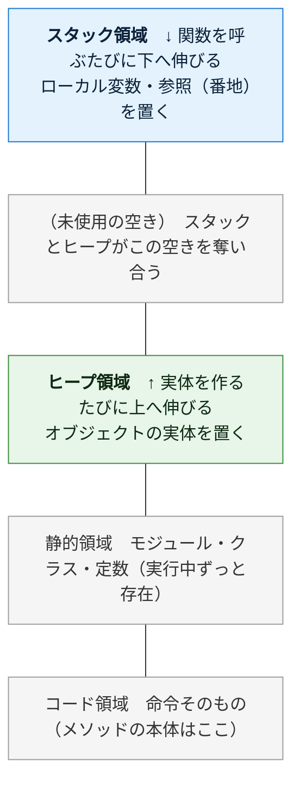
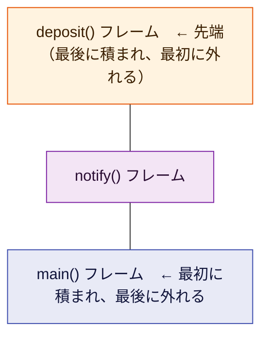
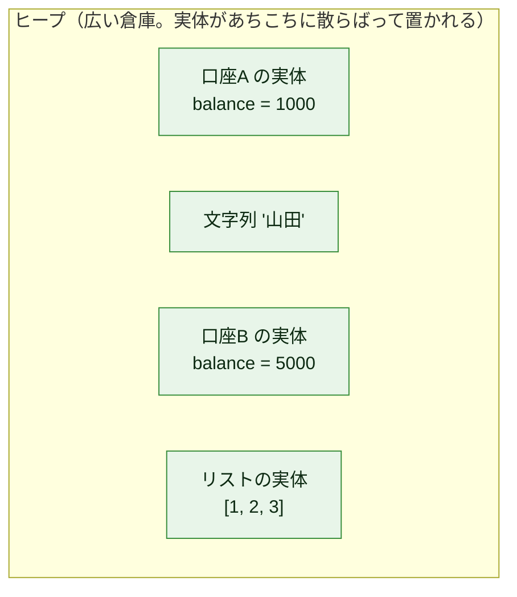
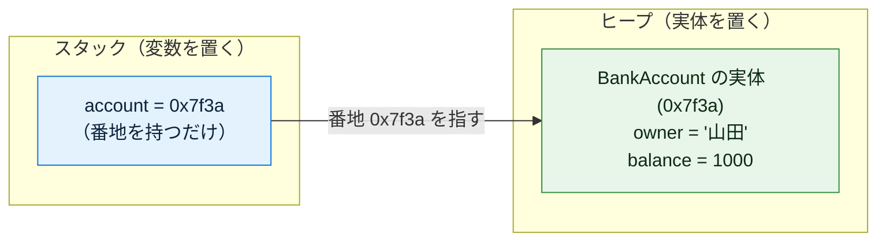
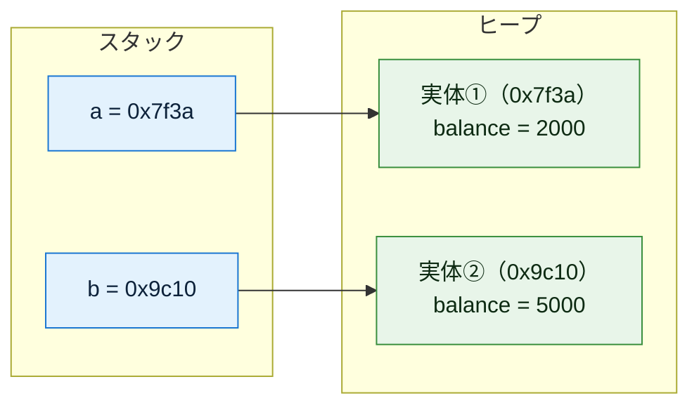
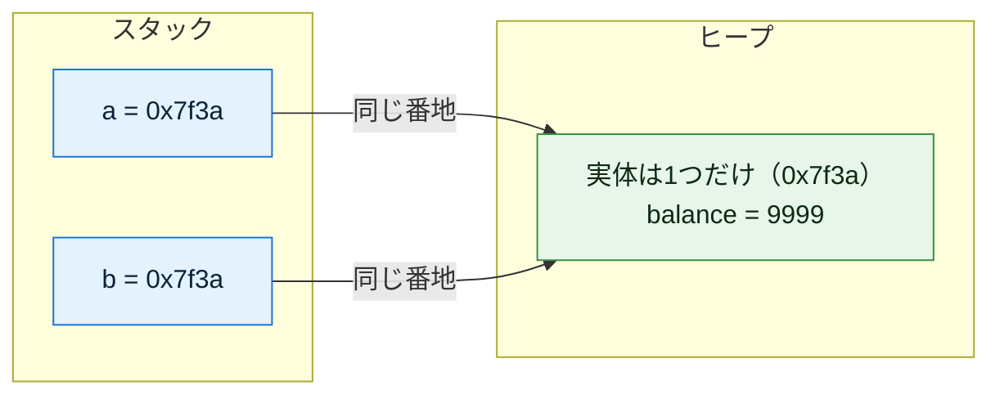
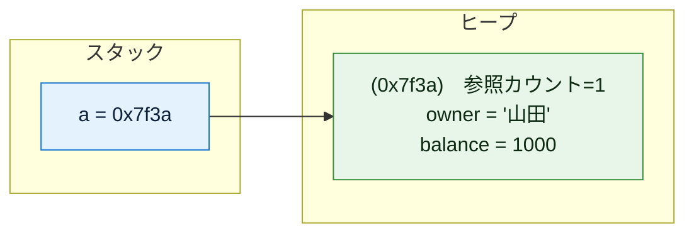
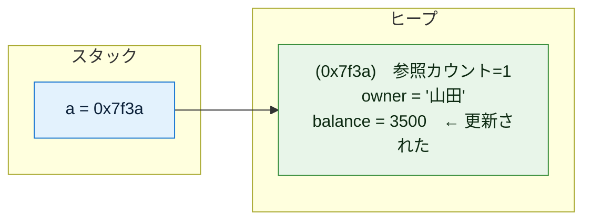
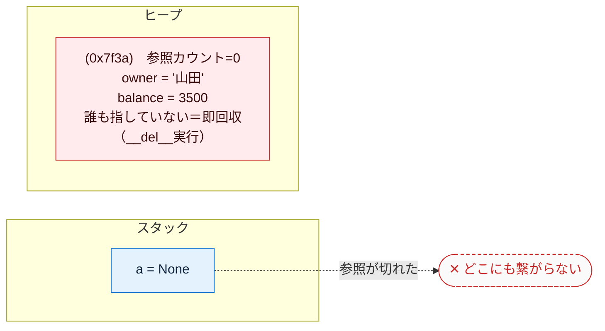

# オブジェクト指向の基礎（Python版）— メモリの視点から徹底解説（初心者向け）

対象言語: **Python**

この文書は「クラス」「インスタンス」「コンストラクタ」「デストラクタ」「ライフサイクル」を、**実際にメモリで何が起きているか**に沿って、初心者がつまずくポイントを一つずつ潰しながら解説する。丸暗記ではなく「なぜそうなるか」で理解することを目指す。コード例はコメントを多めにして、1行ずつ何が起きているか追えるようにしている。

---

## もくじ

0. [そもそもオブジェクトとは何か](#0)
1. [前提: スタックとヒープ（ここが全ての土台）](#1)
2. [クラス — メモリレイアウトの設計図](#2)
3. [インスタンス — 設計図から実体を作る](#3)
4. [コンストラクタ徹底解説（引数・メソッド・種類）](#4)
5. [デストラクタ — 解放時の後始末](#5)
6. [ライフサイクル — 確保から解放までの全経路](#6)
7. [完全な実例: 宣言 → インスタンス化 → 実行 → 終了](#7)
8. [Python 早見表](#8)
9. [応用: コンストラクタインジェクション](#9)

---

<a id="0"></a>
## 0. そもそもオブジェクトとは何か

プログラムは突き詰めると「**データ**」と「そのデータを**操作する処理**」の2つでできている。

昔ながらの書き方（手続き型）では、この2つがバラバラに置かれていた。

```python
# データ:  name="山田", balance=1000
# 処理:    deposit(name, balance, 500)   # データを毎回引数で渡す
```

オブジェクト指向は、この**関連するデータと処理を1つの箱にまとめる**という考え方。その「箱」がオブジェクトだ。

```
口座オブジェクト
├─ データ:  name="山田", balance=1000
└─ 処理:    deposit(500)   ← 自分の中のデータを直接触れる
```

こうまとめると「口座に対して deposit する」という現実の考え方そのままにコードが書け、データと処理の対応関係が崩れにくくなる。これがオブジェクト指向の出発点。

そして、この「箱」を**どう作り（クラス）、いつメモリに現れ（インスタンス化）、どう初期化され（コンストラクタ）、いつ消えるか（デストラクタ／ライフサイクル）** ——これらは全て**メモリ上の出来事**として説明できる。だから次章のメモリの話から始める。

---

<a id="1"></a>
## 1. 前提: スタックとヒープ（ここが全ての土台）

オブジェクトの挙動は、メモリが役割の違う領域に分かれていることを知らないと絶対に理解できない。逆に、ここさえ押さえれば後は全部つながる。この章はいちばん丁寧に説明する。

### 1-0. そもそもメモリとは

メモリ（RAM）は、プログラム実行中にデータを一時的に置いておく作業台のようなもの。中身は**巨大な1列の「マス目」**で、各マスには **アドレス（番地）** という通し番号が振られている。

| アドレス（番地） | 0x1000 | 0x1001 | 0x1002 | 0x1003 | … |
|---|---|---|---|---|---|
| 中身（1マス＝1バイト） | 72 | 84 | 00 | 00 | … |

「変数」とは、このどこかのマスに付けた名前にすぎない。`x = 5` は「あるアドレスのマスに 5 を書く」こと。この“番地の集まり”を、OSとプログラムは役割ごとに区画分けして使う。その代表が **スタック** と **ヒープ** だ。

### 1-1. プログラムのメモリ全体図

プログラムが動くとき、メモリはおおまかに次のように区画されている。



（上ほど高位アドレス。オブジェクト指向で重要なのは上2つ＝**スタック**と**ヒープ**）

このうち、オブジェクト指向を理解するのに重要なのが上の2つ、**スタック**と**ヒープ**。まず両者を一覧で比べ、その後1つずつ深掘りする。

| | **スタック** | **ヒープ** |
|---|---|---|
| 何を置く | ローカル変数、関数呼び出しの記録、番地(参照)そのもの | **オブジェクトの実体**、大きいデータ、寿命の長いデータ |
| 確保・解放 | **自動**（関数の出入りに連動） | GC（後述）が管理 |
| 速度 | **速い**（番地を動かすだけ） | 遅い（空き場所を探す必要） |
| サイズ | 小さい（数MB程度） | 大きい（メモリの許す限り） |
| 寿命 | その関数の実行中だけ | 参照され続ける限りずっと |
| 並び方 | きっちり積み重なる（LIFO） | あちこちに散らばる |

> Python では、整数・文字列・リスト・自作クラスのインスタンスなど**ほぼすべてがヒープ上のオブジェクト**で、変数（ローカル変数）はスタック上でその「番地」を持つだけ、と考えるとメモリの動きがつかみやすい。

### 1-2. スタック — 関数の出入りに連動する「積み重ね」

スタックは名前のとおり「積み重ね」。**関数を1つ呼ぶと、その関数専用の箱が1つ積まれる**。この箱を **スタックフレーム（stack frame）** と呼ぶ。

フレームの中には、その関数が使う次のものが入る：

| `deposit()` フレームの中身 | 例 | 説明 |
|---|---|---|
| 引数 | `amount = 500` | 呼び出し時に渡された値 |
| ローカル変数 | `temp = ...` | 関数の中で宣言した変数 |
| 戻り先アドレス | `0x4a2c` | 終わったら「どこへ戻るか」の記録 |

そして**関数を呼ぶと上に積まれ、関数が終わると上から外れる**。この「後に積んだものから先に外す」順序を **LIFO（Last In, First Out）** という。下は `main()` が `notify()` を呼び、さらに `notify()` が `deposit()` を呼んだ、いちばん深い瞬間のスタック：



`deposit()` が終わると先端の箱だけ外れて `notify()` に戻り、`notify()` が終わるとまた外れて `main()` に戻る——というように、**上から順に1つずつ消えていく**。

**スタックの片付けが「自動でタダ同然」なのはなぜか。** スタックには「今どこまで積んだか」を指す**スタックポインタ**という目印が1つある。関数が終わるときは、この目印を**フレーム1個分だけ下に戻す**だけ。中身を消して回るのではなく、ポインタを動かすだけなので一瞬で終わる。だからスタックは速い。

> ⚠️ **スタックオーバーフロー**: スタックは容量が小さい。関数が関数を呼び…と積みすぎると（例: 止まらない再帰）、スタックが天井に達して `RecursionError` で落ちる。Python は暴走を防ぐため、既定で再帰の深さに上限（`sys.getrecursionlimit()`、標準はおおよそ1000）を設けている。これがスタックが有限であることの証拠。

### 1-3. ヒープ — 自由に確保する「広い倉庫」

スタックは「関数が終わったら消える」ものしか置けない。だが実際には、**関数が終わっても生き残ってほしいデータ**や、**実行するまで大きさが分からないデータ**がある。それを置くのがヒープ。

**オブジェクト（インスタンス）の実体は、原則すべてこのヒープに置かれる。** 理由は「いつまで使われるか・どれだけの大きさか」が作る時点で決まらないから。スタックのようにきっちり積むのではなく、**空いている場所を探して確保する**ため、置き場所はバラバラに散らばる。



ヒープの弱点は2つ。**① 確保が遅い**（毎回「どこが空いてるか」を探す必要がある）。**② 自動では片付かない**。スタックのように「関数が終わったら消える」という自然な合図がないので、片付ける係を決めないと、使い終わったゴミがずっと残り続ける＝**メモリリーク**になる。

この「ヒープの片付け」を、**Python は GC（ガベージコレクション）という仕組みが自動でやってくれる**（詳しくは5章）。「もう誰からも使われていない実体」をPythonが見つけて回収するので、プログラマが手で「解放」を書くことは基本ない。ここがC言語などとの大きな違い。

### 1-4. 2つはこう連携する（最重要ポイント）

ここが初心者の最大の関門。スタックとヒープは**セット**で使われる。典型的にはこうなる：

> **オブジェクトの実体はヒープに置かれ、スタック上の変数はその「番地」だけを持つ。**

```python
account = BankAccount("山田", 1000)   # Python（new は不要。クラス名を呼ぶだけ）
```

この1行の実行後、メモリはこうなっている：



つまり **変数 `account` は口座そのものではなく、「口座がヒープのどこにあるか」を示す番地（`0x7f3a`）を持っているだけ**。この番地を持つ値を **参照（reference）** と呼ぶ。Python の組み込み関数 `id(account)` は、まさにこの実体の番地（に相当する一意な番号）を返す。

なぜこうする？ オブジェクトは大きくなりうるので、変数に実体を丸ごと入れると、代入や引数渡しのたびに全部コピーすることになり重い。**番地（小さな固定サイズの値）だけをやり取りすれば軽い**からだ。

この仕組みを理解すると、後で出てくる **「代入したのに元まで変わる」** という現象（3章）が「番地をコピーしただけで実体は1つだから」とスッと理解できる。まずは次の1点だけ覚えれば十分：


---

<a id="2"></a>
## 2. クラス — メモリレイアウトの設計図

**クラスとは「インスタンス1個がメモリ上でどんな形になるか」を定義したもの**。具体的には「どんなフィールド（データ）を持つか」を決める。

### まずは一番シンプルな例

Python にはフィールドをずらりと並べる「宣言部」がなく、コンストラクタ（`__init__`）の中で `self.○○ = ...` と代入した瞬間にフィールドが生まれる。

```python
# class というキーワードで「BankAccount という設計図」を定義する
class BankAccount:
    # __init__ はコンストラクタ（次章で詳説）。今は「初期化の場所」とだけ思えばよい
    def __init__(self, owner, balance):
        # self.owner への代入で、初めて owner フィールドが実体上に作られる
        self.owner = owner       # フィールド1: 口座名義（文字列オブジェクトへの参照を格納）
        self.balance = balance   # フィールド2: 残高（整数オブジェクトへの参照を格納）
# ↑ここまではあくまで「設計図の宣言」。
#   この時点ではメモリ上に口座は1つも存在しない（実体はまだ0個）。
```

「どんなフィールドを持つか」がコード上のどこにも型として並ばないのは、Python が動的型で、`__init__` の中で `self.` に代入して初めてフィールドを作るためだ。

### クラスは「データ」と「処理」をまとめる

フィールド（データ）だけでなく、処理（メソッド）も一緒に定義できる。これがオブジェクトの本質。

```python
class BankAccount:
    def __init__(self, owner, balance):
        self.owner = owner
        self.balance = balance

    # メソッド（処理）: この口座にお金を入れる。
    # 第1引数 self は「このメソッドが呼ばれた口座自身」を指す（4章で詳説）
    def deposit(self, amount):
        self.balance += amount    # 自分の balance に amount を足す
```

ここで重要な事実：

> **メソッドはインスタンスごとに複製されない。** メモリ上にはメソッドの本体が1つだけ存在し（クラスに属する）、全インスタンスがそれを共有する。インスタンスが個別に持つのは**フィールドのデータだけ**。

口座を1000個作っても `deposit` の処理本体は1つ。各口座が個別に持つのは owner と balance の値だけ。

### 覚え方

- **クラス = 設計図**。書いてもまだメモリに実体はできない。
- クラスが決めるのは「どんなフィールドを持つか」＝ **1インスタンス分のメモリの形**。
- メソッドは全インスタンスで共有、フィールドはインスタンスごとに個別。
- Python はフィールドを `__init__` の中で `self.` に代入して作る（宣言部を書かない）。

---

<a id="3"></a>
## 3. インスタンス — 設計図から実体を作る

**インスタンス化とは、クラス（設計図）に従って実際にメモリを確保し、実体を1つ作ること**。この瞬間に初めて、口座がメモリ上に姿を現す。

```python
# クラス名を関数のように呼ぶとインスタンス化される（new は不要）
a = BankAccount("山田", 1000)
# a には、作られた実体の「番地」が入る（実体そのものではない）
```

クラス名の呼び出し（`BankAccount(...)`）が行うことを分解すると：

1. **ヒープに、BankAccount 1個分のメモリを確保**する（owner と balance が入る領域）
2. その領域を初期化する（次章のコンストラクタ＝`__init__` が走る）
3. **確保した領域の番地を返す**。それが変数 `a` に入る

### 1つのクラスから複数のインスタンス

設計図は1枚でも、そこから作る実体は何個でも作れる。各インスタンスは**独立したメモリ領域**を持つ。

```python
a = BankAccount("山田", 1000)   # ヒープ上に実体① を作る（番地 0x7f3a とする）
b = BankAccount("田中", 5000)   # ヒープ上に実体② を作る（番地 0x9c10、①とは別物）

a.balance = 2000   # 実体① の balance を書き換え
b.balance = 5000   # 実体② の balance を書き換え（① には一切影響しない。別メモリだから）
```



### 「代入」は実体をコピーしない（超重要な落とし穴）

初心者が必ず引っかかる点。Python では、変数の代入は**番地のコピー**であって**実体のコピーではない**。`id()` で番地を確認できる。

```python
a = BankAccount("山田", 1000)   # 実体を1つ作る（番地 0x7f3a とする）
a.balance = 1000

b = a                           # ← a が持つ「番地(0x7f3a)」だけがコピーされる。
                                #   新しい実体は作られない。a と b は同じ実体を指す

print(id(a) == id(b))   # True  ← id() は実体の番地。同じ実体を指している証拠

b.balance = 9999        # b 経由で実体の balance を書き換える
print(a.balance)        # 9999！ a と b は同じ実体を指しているので、
                        #        b で変えた値が a からも見える
```



> **もし本当に「中身をコピーした別物」が欲しいなら**、`copy.copy()`（浅いコピー）や `copy.deepcopy()`（深いコピー）を使う。ただの `=` は番地のコピーにすぎず、`a` と `b` は同じ1つの実体を指すエイリアス（別名）になるだけ、と覚える。

```python
import copy

a = BankAccount("山田", 1000)
b = copy.copy(a)         # 中身を複製した別の実体を作る
print(id(a) == id(b))    # False ← 番地が違う＝別物

b.balance = 9999         # b を書き換えても
print(a.balance)         # 1000  ← a は影響を受けない（別の実体だから）
```

---

<a id="4"></a>
## 4. コンストラクタ徹底解説（引数・メソッド・種類）

ここが今回の中心。コンストラクタは初心者がモヤっとしやすいので、用語を1つずつ分解する。

### 4-1. コンストラクタとは何か

**コンストラクタ = インスタンスが生成された「直後」に自動的に呼ばれる、初期化専用の処理**。Python では `__init__` がこれにあたる。

なぜ必要か？ 確保したばかりのメモリは**中身が未定（フィールドがまだ1つも無い）**の状態。これを「使える正しい状態」に整えるのがコンストラクタの仕事。

```
BankAccount("山田", 1000) の内部で起きること:

  ① ヒープに領域確保 →  owner=(未設定) balance=(未設定)   （まだフィールドが無い空の実体）
  ② __init__ 実行     →  owner="山田"  balance=1000       （正しい初期状態にする）
  ③ 番地を返す
```

コンストラクタを書かなければ、口座名義や残高というフィールドが1つも無い中途半端なインスタンスができてしまう。それを防ぐ「初期化の入口」がコンストラクタ。

### 4-2. コンストラクタメソッドという呼び方について

「コンストラクタメソッド」という言葉を聞くことがあるが、これは**コンストラクタが実質的にメソッド（処理のかたまり）の一種**だから。実際 Python の `__init__` は `def` で定義する、れっきとしたメソッドだ。ただし普通のメソッドと違う特別なルールがある：

| 項目 | 普通のメソッド | コンストラクタ（`__init__`） |
|------|--------------|--------------|
| 呼び出しタイミング | 好きな時に何度でも | 生成時に自動で1回だけ |
| 呼び出し方 | `a.deposit(500)` と自分で呼ぶ | 自分で呼ばない（クラス名呼び出しが自動で呼ぶ） |
| 戻り値 | ある（`return` で返す） | `None` を返す（`return` で値を返してはいけない） |
| 名前 | 自由に付けられる | **`__init__`** という決まった名前 |

Python の `__init__` は「**init**ialize（初期化）」の略。前後のアンダースコア2つは「特別な意味を持つメソッド」の目印（ダンダーメソッド＝double underscore と呼ぶ）。

> 厳密には、Python は生成を「領域を作る `__new__`」と「初期化する `__init__`」の2段に分けているが、初心者のうちは **`__init__` がコンストラクタ**と捉えて問題ない。

### 4-3. コンストラクタ引数とは

**コンストラクタ引数 = インスタンスを作るときに「外から渡す初期値」**。

口座を作るなら「誰の口座か」「最初いくら入れるか」を外から指定したい。それを受け取る窓口がコンストラクタ引数。

```python
class BankAccount:
    # self の後ろに書く owner, balance がコンストラクタ引数
    def __init__(self, owner, balance):
        # 受け取った引数を、この実体(self)のフィールドに保存する
        self.owner = owner       # self.owner(フィールド) ← owner(引数)
        self.balance = balance   # self.balance(フィールド) ← balance(引数)

# --- 使う側: 生成時に引数を渡す（self は自動で渡るので書かない）---
a = BankAccount("山田", 1000)   # owner="山田", balance=1000 で初期化
b = BankAccount("田中", 5000)   # 別の初期値 → 中身の違う別の実体になる
```

引数がなぜ便利かというと、**同じクラスから中身の違うインスタンスを作れる**から。引数がなければ全部同じ初期値の口座しか作れない。

### 4-4. self — 「自分自身」を指す

コンストラクタやメソッドの中に出てくる `self` は、

> **今まさに操作している、その実体自身**

を指す。「どの口座の balance か」を区別するために必要。

```python
def __init__(self, owner, balance):
    # 第1引数の self が「自分自身（この実体）」。
    # Python では self を明示的に第1引数として書くのが決まり。
    # （呼び出す側は BankAccount("山田", 1000) のように self を書かない。自動で渡る）
    self.owner = owner       # self(この実体) の owner フィールドに、引数 owner を入れる
    #    ↑         ↑
    #    │         └─ 引数として受け取った値
    #    └─ 「この実体の」owner フィールド
    #
    # self.owner(フィールド) と owner(引数) は名前が同じでも別物。
    # self. を付けることで「引数ではなくフィールドの方」だと明示している。
    self.balance = balance
```

`self` は予約語ではなく単なる慣習名（第1引数の名前）だが、**必ず `self` と書く**のが Python 全体の約束。別名にすると読み手が混乱するので変えてはいけない。

### 4-5. コンストラクタを省略したときの挙動

Python では `__init__` は必須ではない。1つも書かなければ、Python が「引数を受け取らず、何も初期化しない」既定の初期化が使われる。

```python
class Dog:
    pass            # __init__ を1つも書いていない

d = Dog()           # それでもインスタンス化できる（引数なしなら成功）
                    # このとき owner や name といったフィールドはまだ1つも無い

d.name = "ポチ"      # ← 後から代入すれば、その瞬間にフィールドが作られる
print(d.name)       # ポチ
```

注意点は2つ。

- `__init__` を**自分で定義すると、その引数仕様が唯一の作り方になる**。引数を要求する `__init__` を書いたのに `Dog()` と引数なしで呼ぶと `TypeError` になる。
- `__init__` が無い（＝引数を受け取らない）状態で `Dog("ポチ")` と引数を渡すと、これも `TypeError`。

```python
class Dog:
    def __init__(self, name):   # 引数ありコンストラクタを自分で定義した
        self.name = name

d1 = Dog("ポチ")     # OK（自分で定義した引数あり版）
d2 = Dog()           # ← TypeError！ name を渡していない
```

### 4-6. コンストラクタ引数のバリエーション

同じクラスでも「作り方」を複数用意したいことがある。**Python にはコンストラクタのオーバーロード（同名で引数違いを複数定義）が無い**ので、次の2つの手段で代用する。

**(a) デフォルト引数** — 引数に既定値を持たせて「省略できる引数」を作る

```python
class BankAccount:
    # balance=0 と書くと「balance を省略したら 0 を使う」という意味になる
    def __init__(self, owner, balance=0):
        self.owner = owner
        self.balance = balance

a = BankAccount("山田")          # balance を省略 → 0 になる
b = BankAccount("田中", 5000)    # balance を指定 → 5000 になる
```

> ⚠️ デフォルト引数の落とし穴: `def __init__(self, items=[])` のように**可変オブジェクト（リストや辞書）を既定値にしてはいけない**。既定値は関数定義時に1個だけ作られ全インスタンスで共有されてしまうため、`items=None` にして中で `if items is None: items = []` とするのが定石。

**(b) 名前付きの作り方（`@classmethod`）** — 用途別に別名の生成入口を追加できる

```python
class BankAccount:
    def __init__(self, owner, balance):
        self.owner = owner
        self.balance = balance

    # @classmethod で「別名のコンストラクタ」を追加できる。
    # 第1引数 cls はクラス自身を指し、cls(...) は __init__ を呼んで新しい実体を作る
    @classmethod
    def new_empty(cls, owner):
        return cls(owner, 0)      # 残高0の口座を作って返す専用の入口

a = BankAccount("山田", 1000)     # 通常の作り方
b = BankAccount.new_empty("田中") # 名前付きの作り方（残高0）
```

`self`（インスタンス）ではなく `cls`（クラス）を第1引数に取るのがポイント。`cls(...)` はそのクラスの `__init__` を呼ぶので、これを使って「別名のコンストラクタ」を何種類でも用意できる。

### 4-7. コンストラクタに書ける処理（代入だけではない）

ここまでの例はコンストラクタで「引数をフィールドに代入するだけ」だったが、**コンストラクタは普通のメソッドと同じで、中に自由に処理を書ける**。代表的なパターンを挙げる。

**① バリデーション（引数チェック）** — 不正な値でインスタンスが作られるのを、生成の入口で防ぐ。

```python
def __init__(self, owner, balance):
    # 生成のこの瞬間におかしな値を弾く（＝壊れた口座をそもそも存在させない）
    if not owner:                       # 空文字や None を弾く
        raise ValueError("名義は必須です")   # 例外を投げると生成は失敗し、実体は残らない
    if balance < 0:
        raise ValueError("残高をマイナスで開設できません")
    # チェックを通ったときだけフィールドに保存する
    self.owner = owner
    self.balance = balance
```

バリデーションをコンストラクタでやる利点は、**「存在するインスタンスは必ず正しい状態」だと保証できる**こと。あとで使うたびにチェックする必要がなくなる。

**② 引数から計算して別のフィールドを埋める** — 渡された値をそのまま入れるだけでなく、加工結果を持たせる。

```python
def __init__(self, width, height):
    self.width = width
    self.height = height
    self.area = width * height     # 引数から計算した面積を、初期化時に確定させておく
```

**③ 引数に無い値を自動生成する** — IDや作成日時など、外から渡さず内部で作るもの。

```python
import uuid
from datetime import datetime

def __init__(self, owner):
    self.owner = owner
    self.id = str(uuid.uuid4())        # 口座番号を自動発番（引数では受け取らない）
    self.created_at = datetime.now()   # 開設日時を記録
    self.balance = 0                   # 残高は0スタート
```

**④ 他のメソッド呼び出し・副作用のある処理** — ログ出力・接続・登録など。

```python
def __init__(self, path):
    self.path = path
    self.file = open(path)          # 生成と同時にファイルを開く（＝副作用）
    print(f"{path} を開きました")    # ログ出力
```

#### ⚠️ ただし「何でも書いていい」わけではない

処理を書けるからといって詰め込みすぎると問題になる。実務では次が定石。

| 種類 | 例 | 方針 |
|------|-----|------|
| ✅ 推奨 | バリデーション、フィールドの計算、ID・日時の自動生成 | **「使える正しい状態を作る」ための処理**なので積極的に書く |
| ⚠️ 慎重に | ファイルを開く、DB接続、外部APIを叩く、重い計算 | **副作用の強い処理**。コンストラクタに詰めると下記の問題が出る |

副作用の強い処理をコンストラクタに入れると:

- **テストしにくい** — インスタンスを作るだけで本物の接続や通信が走ってしまう。
- **中途半端な実体が残りやすい** — 生成の途中（一部のフィールドだけ埋めた状態）で例外が出ると、壊れかけのオブジェクトが生じうる。
- **生成コストが重くなる** — 「ただ作っただけ」で重い処理が走る。

この対策が、次章で厚く扱う **コンストラクタインジェクション**（依存は自分で作らず外から受け取る）や、④の資源は `with` 文で閉じる、という設計につながる。

### 4-8. コンストラクタのまとめ

- **コンストラクタ（`__init__`）** = 生成直後に自動で1回走る初期化処理。中身の空な実体を正しい初期状態にする。
- **コンストラクタ引数** = 生成時に外から渡す初期値の窓口。中身の違うインスタンスを作れる。
- **self** = 操作中の実体自身。第1引数に明示し、フィールドと引数を区別するのに使う。
- `__init__` を書かなければ「引数なし・初期化なし」で作れる。引数ありの `__init__` を書くと、それが唯一の作り方になる。
- 作り方を複数持たせるには、**デフォルト引数**や **`@classmethod`** を使う（Python にオーバーロードは無い）。
- コンストラクタには代入以外の**処理（バリデーション・計算・自動生成）も書ける**。ただし副作用の強い処理は詰め込みすぎない。

---

<a id="5"></a>
## 5. デストラクタ — 解放時の後始末

インスタンスが不要になり**破棄される瞬間に走る処理**。役割は「使っていたヒープや、ファイル・接続などの資源を返す」こと。コンストラクタの逆。

Python は **GC（ガベージコレクション）** でメモリを自動回収するため、C++ のような「手動で解放を書く」処理は基本不要。Python のメモリ管理は2段構えになっている。

### Python: 参照カウント（0になった瞬間に即回収）

```
・各オブジェクトは「自分を指している参照の数」を常にカウントしている（参照カウント）。
・そのカウントが 0 になった瞬間に、即座にメモリが解放される（回収タイミングが確定的）。
・解放の直前に __del__ という破棄メソッドが呼ばれる（デストラクタ相当）。
```

```python
a = BankAccount("山田", 1000)   # 実体を作る（参照カウント=1）
b = a                           # 同じ実体をもう1つの変数が指す（参照カウント=2）

b = None   # b が指すのをやめる（参照カウント=1）→ まだ a が指しているので解放されない
a = None   # a も指すのをやめる（参照カウント=0）→ この瞬間にメモリ解放＆__del__実行
```

### Python: 循環参照とサイクルGC

参照カウントだけでは片付けられないケースが1つある。**循環参照**だ。

```
・a→b→a のように互いに指し合うと、外から誰も使っていなくても
  参照カウントが 0 にならず、参照カウントだけでは解放できない。
・そこで Python は補助として「サイクルGC」を別途動かし、
  こうした循環したゴミをまとめて見つけて回収する。
・ただしサイクルGCで回収されるオブジェクトの __del__ は
  呼ばれる順序が不定なので、重要な後始末を __del__ に頼るのは避けるべき。
```

```python
class Node:
    def __init__(self):
        self.partner = None

x = Node()
y = Node()
x.partner = y     # x → y
y.partner = x     # y → x （互いに指し合う＝循環）

x = None
y = None          # 変数からは切れたが、x_obj と y_obj は互いに指し合っているため
                  # 参照カウントは 0 にならない → サイクルGC が後で回収する
```

つまり `__del__` は「参照カウントが素直に0になる普通のケース」では即座に走るが、循環参照が絡むと**いつ・どの順で走るか保証されない**。だからファイルのクローズなど重要な後始末には使わない。

### GC言語共通の落とし穴: メモリ以外の資源

GC はメモリは片付けてくれるが、**ファイルハンドル・ソケット・DB接続・ロック**などメモリ以外の資源は「いつ解放されるか（`__del__` がいつ走るか）」に頼ると枯渇して困ることがある。そこで「使い終わったら確実に閉じる」専用構文を使う。

```python
# with 文 — 開いた資源は、ブロックを抜けるときに必ず後始末(__exit__)が呼ばれる
with open("a.txt") as f:
    data = f.read()   # ここでファイルを使う
# ← インデントが終わった瞬間、f.close() が自動で呼ばれる（例外が出ても必ず閉じる）
```

`with` は `__del__` と違い、**ブロックを抜けた瞬間という確定したタイミング**で必ず後始末が走る。しかも途中で例外が発生しても閉じてくれる。資源の解放は `__del__` ではなく `with` を使う、と覚える。

### デストラクタのまとめ

| 項目 | Python |
|------|--------|
| メモリ解放方式 | 参照カウント（＋循環用サイクルGC） |
| 解放タイミング | 参照カウントが0になった瞬間（比較的確定的。循環時はサイクルGC任せで不定） |
| 破棄時メソッド | `__del__`（循環時は順序が不確実。重要処理に使わない） |
| 資源の確実な後始末 | `with` 文 |

要点：**メモリはGC任せでよい。ファイルや接続などの資源は、`__del__` に頼らず `with` で確実に閉じる。**

---

<a id="6"></a>
## 6. ライフサイクル — 確保から解放までの全経路

インスタンスの一生は、メモリの観点では次の4段階。

```
①割り当て          ②初期化              ③使用               ④解放
メモリ確保     →    コンストラクタ    →   メソッド呼び出し   →   参照が0になりGCが回収
(ヒープ)            (__init__)                                (参照0で即時／循環時はサイクルGC)
```

| 段階 | Python |
|------|--------|
| ①割り当て | `BankAccount(...)` でヒープに確保 |
| ②初期化 | `__init__`（生成直後に自動で1回） |
| ③使用 | 参照経由でメソッドを呼ぶ |
| ④解放 | 参照カウントが0 → その瞬間に回収（循環時はサイクルGCが後で回収） |
| 資源の解放 | `with` 文 |

### 「いつ消えるか」の確定性

- **Python の普通のケース**: 参照カウントが0になった**その瞬間**に回収される。`a = None` や関数を抜けてローカル変数が消えた瞬間など、消えるタイミングがコードから読める。
- **循環参照のケース**: 参照カウントだけでは0にならないため、補助のサイクルGCが後でまとめて回収する。この場合の回収タイミングは不定。
- いずれにせよ、メモリ以外の資源（ファイル・接続など）は回収タイミングに頼らず、必ず `with` で閉じるのが安全。

---

<a id="7"></a>
## 7. 完全な実例: 宣言 → インスタンス化 → 実行 → 終了

ここまでの全概念を、1本のプログラムの流れとして通しで見る。銀行口座クラスの一生をメモリの動きとともに追う。

```python
# ============================================================
# ① クラス宣言（設計図を定義。この時点ではまだ実体は0個）
# ============================================================
class BankAccount:
    # --- コンストラクタ（生成直後の初期化。引数で初期値を受け取る）---
    def __init__(self, owner, balance):
        self.owner = owner        # 引数 owner を、この実体(self)のフィールドに保存
        self.balance = balance    # 引数 balance を保存
        print(f"{owner}の口座を開設。残高{balance}")

    # --- デストラクタ（破棄の瞬間に呼ばれる。参照カウントが0になったとき）---
    def __del__(self):
        print(f"{self.owner}の口座を閉鎖")

    # --- メソッド（処理）: 入金する ---
    def deposit(self, amount):
        self.balance += amount    # 自分の残高に amount を加算
        print(f"{amount}円入金 → 残高{self.balance}")

# ============================================================
# ② インスタンス化（ヒープに実体を作り、__init__ が走る）
# ============================================================
a = BankAccount("山田", 1000)
# この行で:
#   1. ヒープに BankAccount 1個分の領域を確保
#   2. __init__ が走り owner="山田", balance=1000 に初期化
#   3. 実体の番地が a に入る（参照カウント=1）

# ============================================================
# ③ 実行（メソッドを呼んで使う）
# ============================================================
a.deposit(500)     # 残高 1000 → 1500
a.deposit(2000)    # 残高 1500 → 3500

# ============================================================
# ④ ライフサイクル終了
# ============================================================
a = None   # a が指すのをやめる → 参照カウントが0になる
           # → その瞬間に __del__ が呼ばれ、メモリが即座に解放される
print("口座はもう存在しない")
```

**メモリの動きを段階ごとに追う:**

**② `BankAccount("山田", 1000)` の直後** — ヒープに実体ができ、`a` がその番地を指す（参照カウント=1）



**③ `a.deposit(500)` → `a.deposit(2000)` の後** — 同じ実体の `balance` が更新される（新しい実体は作られない）



**④ `a = None` の後** — 参照が切れて参照カウントが0になり、**その瞬間に**実体が回収され `__del__` が走る



Python では ④ の「実際に回収される瞬間」が、参照カウントが0になった**まさにその瞬間**に確定する（循環参照が無い普通のケース）。だから `a = None` の直後に `__del__` が走り、その後の `print` より前に「口座を閉鎖」が出力される。

**実行結果（Python は終了タイミングが読める）:**

```
山田の口座を開設。残高1000
500円入金 → 残高1500
2000円入金 → 残高3500
山田の口座を閉鎖          ← a = None で参照カウントが0になった瞬間に __del__ が走った
口座はもう存在しない
```

「口座を閉鎖」が `a = None` の直後・`print("口座はもう存在しない")` の**前**に出ている点に注目。参照カウント方式では、参照が0になったその瞬間に後始末が走るので、消えるタイミングがコードから読める。

---

<a id="8"></a>
## 8. Python 早見表

| 項目 | Python |
|------|--------|
| クラス定義 | `class BankAccount:` |
| フィールドの作成 | `__init__` 内で `self.x = ...`（宣言部は無い） |
| インスタンス化 | `BankAccount(...)`（`new` 不要） |
| 実体の置き場所 | 常にヒープ |
| 変数が持つもの | 参照（番地）。`id()` で確認できる |
| 代入 `b = a` | 番地のコピー＝エイリアス（`id(a)==id(b)`、片方の変更が両方に見える） |
| 中身の複製 | `copy.copy()` / `copy.deepcopy()` |
| コンストラクタ | `__init__`（第1引数 `self`） |
| コンストラクタ引数 | あり（既定値を持てる） |
| 「作り方」を複数用意 | デフォルト引数 / `@classmethod`（`cls`）。オーバーロードは無い |
| 自分自身 | `self`（第1引数に明示。呼び出し側は書かない） |
| メモリ解放方式 | 参照カウント（＋循環用サイクルGC） |
| 解放タイミング | 参照カウントが0になった瞬間（循環時はサイクルGC任せで不定） |
| 破棄時メソッド | `__del__`（循環時は順序が不確実。重要処理に使わない） |
| 資源の確実な後始末 | `with` 文 |

---

<a id="9"></a>
## 9. 応用: コンストラクタインジェクション

コンストラクタ引数の実践的な使い方の代表例が **コンストラクタインジェクション（依存性の注入 / DI）**。

**考え方: あるクラスが別のオブジェクトを必要とするとき、それをクラス内部で生成せず、コンストラクタ引数として外から受け取る。**

まず「依存」という言葉を整理する。あるクラス A が、処理のために別のクラス B のインスタンスを使うとき、「**A は B に依存している**」という。例えば「通知サービスがメール送信機を使う」なら、通知サービスはメール送信機に依存している。この**依存する相手を、誰が・どこで生成するか**が今回のテーマ。

### なぜ内部で生成するとダメか（問題点を厚く）

まず「やってしまいがちな悪い例」を見る。依存する `EmailSender` を、クラスの内部で自分で生成している。

```python
# ===== 悪い例（内部で生成）=====
class NotificationService:
    def __init__(self):
        self.sender = EmailSender()   # ← 内部で直接生成してしまっている

    def notify(self, m):
        self.sender.send(m)
```

一見動くが、次の問題を抱えている。

**問題① テストが著しく困難になる**
`NotificationService` を作るだけで、内部で本物の `EmailSender` が生成される。テストのたびに**本物のメールが飛ぶ**、あるいはメールサーバへの接続が必要になる。テスト用に「送ったフリだけする偽物」に差し替える手段がない。

**問題② 実装を差し替えられない（密結合）**
`EmailSender` という**具体的なクラス名がコードに直接埋め込まれている**。後から「SMSでも送りたい」「開発中はコンソールに出したい」となっても、`NotificationService` の中身を書き換えるしかない。利用側の都合で送信方法を選べない。

**問題③ 依存が外から見えない（隠れた依存）**
`NotificationService()` という呼び出しだけを見ても、「このクラスが裏で `EmailSender` を必要としている」ことが分からない。依存がコンストラクタのシグネチャに現れず、クラスの内部に隠れてしまう。使う側は中を読まないと依存関係を把握できない。

**問題④ 生成の責任とタイミングを制御できない**
`EmailSender` の生成コスト（接続確立や設定読み込みなど）が、`NotificationService` を作った瞬間に**強制的に**発生する。1つだけ作って使い回したい（シングルトンにしたい）と思っても、`NotificationService` ごとに新しい `EmailSender` が作られてしまい、共有できない。

**問題⑤ 設定済みのオブジェクトを渡せない**
実際の `EmailSender` は「送信元アドレス」「認証情報」などを設定して使うことが多い。内部で `EmailSender()` すると、**設定する隙がない**。設定済みのインスタンスを外から渡したくてもできない。

これらはすべて「**依存する相手を自分で生成・所有してしまっている**」ことが根本原因。メモリの観点で言えば、`NotificationService` が `EmailSender` の**生成・寿命・設定のすべてを抱え込んでいる**状態。

### コンストラクタで注入する

依存を「外から渡してもらう」形にする。**生成の責任を呼び出し側に移す**のがポイント。

```python
# ===== 良い例（コンストラクタ注入）=====
# Python は動的型なのでインターフェース宣言すら不要。
# 「send() を持つオブジェクト」でありさえすれば何でも渡せる（ダックタイピング）
class NotificationService:
    def __init__(self, sender):    # ← コンストラクタ引数で依存を受け取る（注入）
        self.sender = sender       # 保存するだけ。自分では生成しない

    def notify(self, m):
        self.sender.send(m)        # 中身が何であれ send() を呼ぶだけ

# --- 呼び出し側が「どの実装を使うか」を決めて渡す ---
svc  = NotificationService(EmailSender())   # 本番: メール送信を注入
test = NotificationService(MockSender())    # テスト: 偽物を注入（メールは飛ばない）
```

### ダックタイピング — Python では「型」を宣言しなくてよい

Python は **ダックタイピング**（「アヒルのように鳴くならアヒルとみなす」）を採る。つまり、共通の親クラスや型の約束事をあらかじめ宣言しておく必要はなく、**`send(m)` というメソッドを持ってさえいれば、どんなクラスのインスタンスでも渡せる**。「その振る舞いができるか」だけが問われる。

```python
# どちらも「send() を持つ」だけ。共通の親クラスも宣言も不要
class EmailSender:
    def send(self, m):
        print(f"メール送信: {m}")      # 本番用（実際はメールを飛ばす）

class MockSender:
    def __init__(self):
        self.sent = []
    def send(self, m):
        self.sent.append(m)            # テスト用: 送った内容を記録するだけ（副作用なし）

# NotificationService は「send() が呼べれば何でもよい」ので、両方そのまま受け取れる
NotificationService(EmailSender()).notify("こんにちは")   # メール送信: こんにちは
mock = MockSender()
NotificationService(mock).notify("テスト")               # 何も飛ばない
print(mock.sent)                                         # ['テスト'] ← 送信内容を検証できる
```

### 先ほどの問題がどう解決されるか

内部生成の問題①〜⑤が、コンストラクタ注入でそれぞれ解消される。

| 内部生成の問題 | コンストラクタ注入での解決 |
|----------------|--------------------------|
| ① テストが困難 | テスト時は `NotificationService(MockSender())` で偽物を渡せる。本物のメールは飛ばない |
| ② 差し替え不可（密結合） | 具体クラス名がコードから消え、「send() を持つ何か」にだけ依存。実装は外から自由に選べる |
| ③ 依存が隠れる | 依存が**コンストラクタ引数として表に出る**。シグネチャを見れば必要なものが一目で分かる |
| ④ 生成タイミング不制御 | 生成は呼び出し側の責任になり、1つを使い回す（共有）ことも自由 |
| ⑤ 設定済みを渡せない | 呼び出し側で設定した `EmailSender` をそのまま渡せる |

### 利点（まとめ）

| 利点 | 中身 |
|------|------|
| 差し替え可能 | 本番=メール / 開発=コンソール出力 / テスト=モック を、渡す実装を変えるだけで切替 |
| テスト容易 | 副作用のある依存をモック（偽物）に置換でき、外部I/Oなしで検証できる |
| 疎結合 | 具体実装でなく「振る舞い（send を持つこと）」に依存するので、実装を変えても利用側を書き換えずに済む |
| 依存が可視化 | コンストラクタ引数を見れば「このクラスが何を必要とするか」が一目で分かる |
| 生成・寿命を外で管理 | 依存の生成タイミングや使い回し（共有）を呼び出し側で制御できる |

### 「じゃあ生成は誰が書くの？」

依存を注入する形にすると、「結局どこかで `EmailSender()` するのでは？」という疑問が出る。答えは **「アプリの一番外側（エントリポイント）でまとめて生成し、必要なクラスに配って回る」**。この「組み立て場所」を **Composition Root（合成の根）** と呼ぶ。

```python
# ===== アプリ起動時（一番外側）でまとめて組み立てる =====
def main():
    # 依存の生成は、この一番外側の1か所に集約する
    sender = EmailSender("smtp.example.com")          # ここで設定込みで生成
    service = NotificationService(sender)             # 生成した依存を注入

    service.notify("こんにちは")

if __name__ == "__main__":
    main()
```

こうすると「何をどう組み立てるか」がアプリの入口1か所に集まり、各クラスは自分の仕事だけに集中できる。テスト時はこの組み立て部分だけ別に書けばよい。

### DIコンテナへの橋渡し

FastAPI の `Depends` や各種DIライブラリ（`injector`、`dependency-injector` など）といった **DIコンテナ**は、この「どの実装をどのコンストラクタに渡すか」という組み立て作業を、設定や型ヒントに基づき**自動でやってくれる**仕組み。

```python
# ===== DIコンテナのイメージ（概念）=====
# コンテナに「NotificationService が要る sender には EmailSender を使え」と登録しておくと、
# service = container.resolve(NotificationService)
# のように、依存を自動でたどって組み立て・注入してくれる。
# （やっていることは Composition Root の自動化にすぎない）
```

つまりDIコンテナは「Composition Root を自動化する道具」にすぎない。**まず手動注入（生成責任を外に出し、コンストラクタで受け取る）の形を理解すれば、フレームワークが裏で何をやっているかもそのまま読める。**

---

作成: 2026-07-22 / Python
