# オブジェクト指向の基礎（Rust版）— メモリの視点から徹底解説

対象言語: **Rust**

この文書は「クラス（に相当するもの）」「インスタンス」「コンストラクタ（に相当するもの）」「デストラクタ（に相当するもの）」「ライフサイクル」を、**実際にメモリで何が起きているか**に沿って、初心者がつまずくポイントを一つずつ潰しながら解説する。丸暗記ではなく「なぜそうなるか」で理解することを目指す。コード例はコメントを多めにして、1行ずつ何が起きているか追えるようにしている。

Rust には Java や Python のような `class` キーワードは無く、**データを `struct` で、処理を `impl` ブロックで**表す。そして Rust 最大の特徴は、メモリを **GC（ガベージコレクション）ではなく「所有権（ownership）」というルールでコンパイル時に管理する**ことだ。この所有権こそが、Rust のインスタンスの一生を理解する鍵になる。GC 前提の言語（Java / Python）とはメモリの考え方が根本的に違うので、そのつもりで読み進めてほしい。

---

## もくじ

0. [そもそもオブジェクトとは何か](#0)
1. [前提: スタックとヒープ（ここが全ての土台）](#1)
2. [struct + impl — メモリレイアウトの設計図](#2)
3. [インスタンス — 設計図から実体を作る（ムーブと借用）](#3)
4. [コンストラクタ相当（`fn new`）徹底解説](#4)
5. [デストラクタ相当 — `Drop` トレイトによる確定的な後始末](#5)
6. [ライフサイクル — 確保から解放までの全経路](#6)
7. [完全な実例: 宣言 → インスタンス化 → 実行 → 終了](#7)
8. [Rust 早見表](#8)
9. [応用: コンストラクタインジェクション](#9)

---

<a id="0"></a>
## 0. そもそもオブジェクトとは何か

プログラムは突き詰めると「**データ**」と「そのデータを**操作する処理**」の2つでできている。

昔ながらの書き方（手続き型）では、この2つがバラバラに置かれていた。

```
データ:  name="山田", balance=1000
処理:    deposit(name, balance, 500)   // データを毎回引数で渡す
```

オブジェクト指向は、この**関連するデータと処理を1つの箱にまとめる**という考え方。その「箱」がオブジェクトだ。

```
口座オブジェクト
├─ データ:  owner="山田", balance=1000
└─ 処理:    deposit(500)   ← 自分の中のデータを直接触れる
```

Rust には `class` という1つのキーワードは無い。代わりに、**データのかたまりを `struct`（構造体）で定義し、その `struct` に対する処理を `impl` ブロックで定義する**。この2つがセットで「オブジェクト（の箱）」の役割を果たす。

```rust
// ===== Rust: データは struct、処理は impl =====
// struct で「どんなデータを持つ箱か」を定義する
struct BankAccount {
    owner: String,   // データ: 口座名義
    balance: i64,    // データ: 残高（64ビット整数）
}

// impl ブロックで「その箱に対する処理」を定義する
impl BankAccount {
    // メソッド: 自分の中の balance に amount を足す
    fn deposit(&mut self, amount: i64) {
        self.balance += amount;   // self は「この口座自身」（2章・4章で詳説）
    }
}
```

こうまとめると「口座に対して deposit する」という現実の考え方そのままにコードが書け、データと処理の対応関係が崩れにくくなる。これがオブジェクト指向の出発点。

そして、この「箱」を**どう作り（struct + impl）、いつメモリに現れ（インスタンス化）、どう初期化され（`fn new`）、いつ消えるか（`Drop`／ライフサイクル）** ——これらは全て**メモリ上の出来事**として説明できる。しかも Rust では、この「いつ消えるか」が**所有権によってコンパイル時に決まる**。だから次章のメモリの話がとりわけ重要になる。

---

<a id="1"></a>
## 1. 前提: スタックとヒープ（ここが全ての土台）

オブジェクトの挙動は、メモリが役割の違う領域に分かれていることを知らないと絶対に理解できない。逆に、ここさえ押さえれば後は全部つながる。Rust は特に、この2領域を**プログラマが意識して使い分ける**言語なので、この章はいちばん丁寧に説明する。

### 1-0. そもそもメモリとは

メモリ（RAM）は、プログラム実行中にデータを一時的に置いておく作業台のようなもの。中身は**巨大な1列の「マス目」**で、各マスには **アドレス（番地）** という通し番号が振られている。

| アドレス（番地） | 0x1000 | 0x1001 | 0x1002 | 0x1003 | … |
|---|---|---|---|---|---|
| 中身（1マス＝1バイト） | 72 | 84 | 00 | 00 | … |

「変数」とは、このどこかのマスに付けた名前にすぎない。`let x = 5;` は「あるアドレスのマスに 5 を書く」こと。この“番地の集まり”を、OSとプログラムは役割ごとに区画分けして使う。その代表が **スタック** と **ヒープ** だ。

### 1-1. プログラムのメモリ全体図

プログラムが動くとき、メモリはおおまかに次のように区画されている。

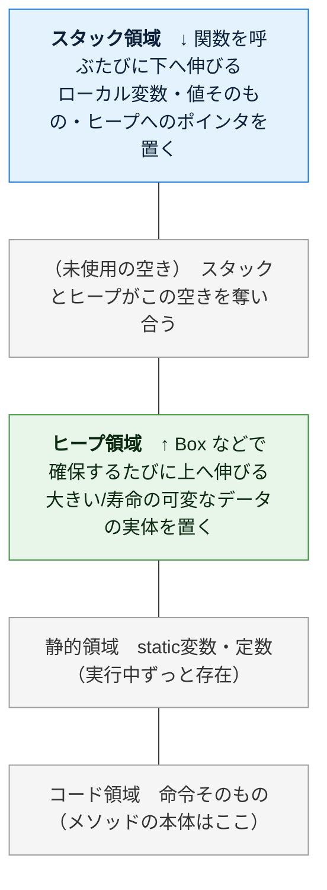

（上ほど高位アドレス。オブジェクト指向で重要なのは上2つ＝**スタック**と**ヒープ**）

まず両者を一覧で比べ、その後1つずつ深掘りする。**Java / Python と決定的に違うのは「確保・解放」の行**だ。Rust はここを GC ではなく**所有権でコンパイル時に決める**。

| | **スタック** | **ヒープ** |
|---|---|---|
| 何を置く | ローカル変数、値そのもの、ヒープへのポインタ | 大きいデータ、コンパイル時にサイズが決まらないデータ、`Box<T>` の中身 |
| 確保・解放 | **自動**（スコープの出入りに連動） | **所有権に基づきコンパイル時に決定**（GCではない・5章） |
| 速度 | **速い**（ポインタを動かすだけ） | やや遅い（空き場所を探す必要） |
| サイズ | 小さい（数MB程度） | 大きい（メモリの許す限り） |
| 寿命 | そのスコープの実行中だけ | 所有者が生きている間だけ |
| 並び方 | きっちり積み重なる（LIFO） | あちこちに散らばる |

> ⚠️ **ここが Rust 独自の最重要ポイント**: Java / Python では「オブジェクトの実体は必ずヒープ、変数は番地を持つだけ」だった。**Rust は違う。`struct` の実体は既定でスタックに直接置かれる**。ヒープに置きたいときだけ、プログラマが明示的に `Box<T>` などで包む。この違いが、後のムーブ／借用の話に直結する。

### 1-2. スタック — スコープの出入りに連動する「積み重ね」

スタックは名前のとおり「積み重ね」。**関数を1つ呼ぶと、その関数専用の箱が1つ積まれる**。この箱を **スタックフレーム（stack frame）** と呼ぶ。

フレームの中には、その関数が使う次のものが入る：

| `deposit()` フレームの中身 | 例 | 説明 |
|---|---|---|
| 引数 | `amount = 500` | 呼び出し時に渡された値 |
| ローカル変数 | `let temp = ...` | 関数の中で宣言した変数 |
| 戻り先アドレス | `0x4a2c` | 終わったら「どこへ戻るか」の記録 |

そして**関数を呼ぶと上に積まれ、関数が終わると上から外れる**。この「後に積んだものから先に外す」順序を **LIFO（Last In, First Out）** という。下は `main()` が `notify()` を呼び、さらに `notify()` が `deposit()` を呼んだ、いちばん深い瞬間のスタック：

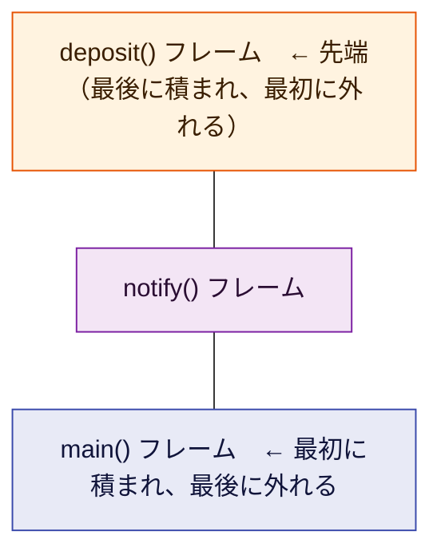

`deposit()` が終わると先端の箱だけ外れて `notify()` に戻り、`notify()` が終わるとまた外れて `main()` に戻る——というように、**上から順に1つずつ消えていく**。

**スタックの片付けが「自動でタダ同然」なのはなぜか。** スタックには「今どこまで積んだか」を指す**スタックポインタ**という目印が1つある。関数が終わるときは、この目印を**フレーム1個分だけ戻す**だけ。中身を消して回るのではなく、ポインタを動かすだけなので一瞬で終わる。だからスタックは速い。

> ⚠️ **スタックオーバーフロー**: スタックは容量が小さい。関数が関数を呼び…と積みすぎると（例: 止まらない再帰）、スタックが天井に達して Rust では `thread 'main' has overflowed its stack` というエラーでプロセスが強制終了する。これがスタックが有限であることの証拠。

### 1-3. ヒープ — 自由に確保する「広い倉庫」と `Box<T>`

スタックは「スコープが終わったら消える」ものしか置けず、しかも**サイズがコンパイル時に確定している**ものしか直接は置けない。だが実際には、**関数が終わっても生き残ってほしいデータ**や、**実行するまで大きさが分からないデータ**、**再帰的にネストするデータ**がある。それを置くのがヒープ。

Rust では、ヒープに置きたいとき **`Box<T>`** で明示的に包む。`Box<T>` は「ヒープ上に確保した `T` の実体を指すポインタ」で、**ポインタ自体はスタックに、中身の実体はヒープに**置かれる。

```rust
// ===== Rust =====
let n = 5;                 // 整数 5 はそのままスタックに置かれる
let boxed = Box::new(5);   // 5 をヒープに置き、それを指すポインタ boxed をスタックに持つ
```

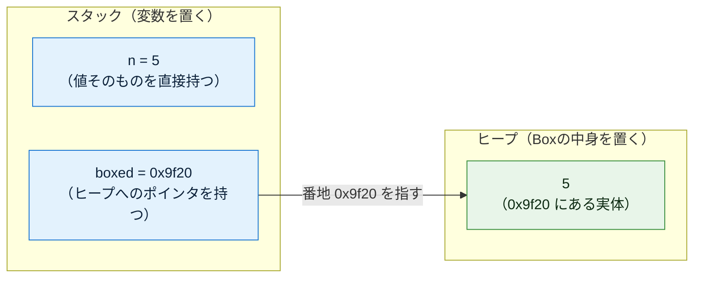

置き場所を探して確保するため、ヒープの実体はスタックのようにきっちり積まれず、あちこちに散らばる。

ヒープの弱点は2つ。**① 確保がやや遅い**（毎回「どこが空いてるか」を探す必要がある）。**② 片付けの合図が自然には無い**。スタックのように「関数が終わったら消える」という自然な合図がないので、片付ける仕組みが無いと、使い終わったゴミがずっと残り続ける＝**メモリリーク**になる。

ここで **Java / Python は GC（ガベージコレクション）で自動回収**していた。**Rust は GC を使わない。** 代わりに「**所有権**」というルールで、**「その実体を誰が所有しているか」をコンパイラが追跡し、所有者がスコープを抜ける瞬間に解放コードを自動で挿入する**（詳しくは5章）。つまり**解放のタイミングがコンパイル時に確定する**。GC のように「いつ回収されるか不定」ということが無いのが Rust の大きな特徴だ。

### 1-4. スタックとヒープと「所有権」（最重要ポイント）

ここが Rust 理解の最大の関門。Rust には次の絶対ルールがある。

> **1つの値には、所有者（owner）がちょうど1人だけ存在する。所有者がスコープを抜けると、その値は解放される。**

`String`（文字列）を例にとる。`String` は「長さが実行時に変わりうる」ため、**文字の中身はヒープに、それを管理する情報（ポインタ・長さ・容量）はスタックに**置かれる、という二層構造になっている。

```rust
// ===== Rust =====
let s = String::from("山田");   // 文字データはヒープ、s（ポインタ等）はスタック
```

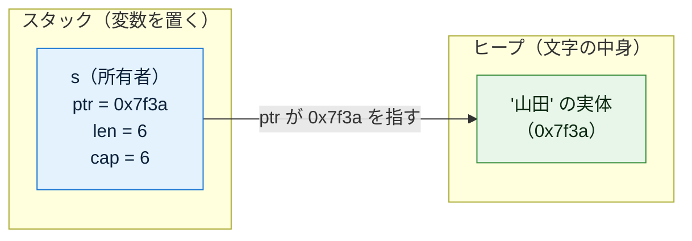

変数 `s` は「文字データそのもの」ではなく、それを**所有している**という関係を持つ。`s` がスコープを抜けると、Rust は自動的にヒープの文字データを解放する。**誰が所有者かをコンパイラが1人に保つからこそ、二重解放もリークも起きない。**

この「所有者は常に1人」というルールが、次章以降で出てくる **「代入したら元の変数が使えなくなる（＝ムーブ）」** という Java / Python では起きない現象の正体だ。まずは次の1点を強く覚えてほしい：


---

<a id="2"></a>
## 2. struct + impl — メモリレイアウトの設計図

**`struct` とは「インスタンス1個がメモリ上でどんな形になるか」を定義したもの**。具体的には「どんなフィールド（データ）を持つか」を決める。そして**その struct に対する処理（メソッド）は、別の `impl` ブロックに書く**。ここが Java / Python の `class`（データも処理も1つの `{}` にまとめる）との書き方の違いだ。

### まずは一番シンプルな例

```rust
// ===== Rust =====
// struct というキーワードで「BankAccount という設計図」を定義する
struct BankAccount {
    owner: String,   // フィールド1: 口座名義（String＝ヒープに文字を持つ所有者）
    balance: i64,    // フィールド2: 残高（8バイトの整数をそのまま持つ）
}
// ↑ここまではあくまで「設計図の宣言」。
//   この時点ではメモリ上に口座は1つも存在しない（実体はまだ0個）。
```

Rust では、Java のように**フィールドを型付きで宣言部に並べる**。Python のように「`__init__` の中で初めてフィールドが生まれる」ということはなく、**struct に書いたフィールドが全て**。あとから勝手にフィールドが増えることはない。

### struct（データ）に impl（処理）を結びつける

フィールド（データ）だけでなく、処理（メソッド）も定義できる。ただし Rust では **struct の外の `impl` ブロック**に書く。

```rust
// ===== Rust =====
// データの形（struct）
struct BankAccount {
    owner: String,   // データ
    balance: i64,    // データ
}

// その struct に対する処理（impl）
impl BankAccount {
    // メソッド（処理）: この口座にお金を入れる
    // 第1引数の &mut self が「このメソッドが呼ばれた口座自身」を指す（4章で詳説）
    // &mut は「自分自身を書き換える（可変で借りる）」という意味
    fn deposit(&mut self, amount: i64) {
        self.balance += amount;   // 自分の balance に amount を足す
    }
}
```

Java の `this`、Python の `self` に相当するのが Rust の `self` だが、Rust では**その self を「どう借りるか」まで書く**のが特徴だ（`&self` は読むだけ、`&mut self` は書き換える、`self` は所有権ごと受け取る。4-4 で詳説）。

ここで重要な事実：

> **メソッドはインスタンスごとに複製されない。** メモリ上（コード領域）にはメソッドの本体が1つだけ存在し、全インスタンスがそれを共有する。インスタンスが個別に持つのは**フィールドのデータだけ**。

口座を1000個作っても `deposit` の処理本体は1つ。各口座が個別に持つのは `owner` と `balance` の値だけ。これは Java / Python とまったく同じ。

### 覚え方

- **struct = データの設計図**。書いてもまだメモリに実体はできない。
- **impl = その設計図に対する処理**。struct とは別のブロックに書く。
- struct が決めるのは「どんなフィールドを持つか」＝ **1インスタンス分のメモリの形**。
- メソッドは全インスタンスで共有、フィールドはインスタンスごとに個別。
- `self` は「どう借りるか」（`&self` / `&mut self` / `self`）まで明示する。

---

<a id="3"></a>
## 3. インスタンス — 設計図から実体を作る（ムーブと借用）

**インスタンス化とは、struct（設計図）に従って実際にメモリを確保し、実体を1つ作ること**。この瞬間に初めて、口座がメモリ上に姿を現す。

```rust
// ===== Rust: struct リテラルでインスタンス化 =====
// 「フィールド名: 値」を { } の中に並べて実体を1つ作る
let a = BankAccount {
    owner: String::from("山田"),
    balance: 1000,
};
// a が、作られた実体の「所有者」になる。
// 既定では、この実体は a のスタックフレーム上に直接置かれる
//（Java/Python のように必ずヒープ、ではない点に注意）
```

インスタンス化が行うことを分解すると：

1. **BankAccount 1個分のメモリを確保**する（`owner` と `balance` が入る領域。既定ではスタック上）
2. 各フィールドを指定した値で初期化する
3. その実体の**所有権を変数 `a` に与える**

実務では、この生成を直書きせず `BankAccount::new(...)` のような関連関数（次章）にまとめるのが慣習だが、仕組みとしてはこの struct リテラルが土台になる。

### 1つの struct から複数のインスタンス

設計図は1枚でも、そこから作る実体は何個でも作れる。各インスタンスは**独立したメモリ領域**を持つ。

```rust
// ===== Rust =====
let mut a = BankAccount { owner: String::from("山田"), balance: 1000 }; // 実体①
let mut b = BankAccount { owner: String::from("田中"), balance: 5000 }; // 実体②（①とは別物）

a.balance = 2000;   // 実体① の balance を書き換え
b.balance = 8000;   // 実体② の balance を書き換え（① には一切影響しない。別メモリだから）
// ※ 書き換えるフィールドを持つ変数には mut を付ける必要がある（Rust は既定で不変）
```

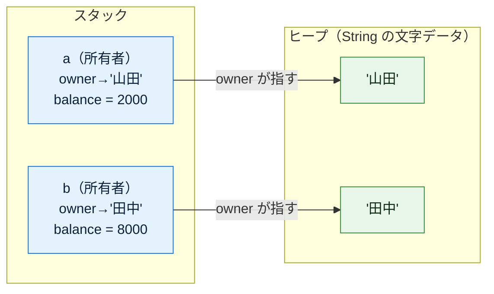

### 【最重要】代入は「ムーブ」— Java / Python のエイリアスとは全く違う

ここが Rust で初心者が必ず衝撃を受ける点であり、**この文書で最も重要な節**だ。Java / Python では「`b = a` は番地のコピーで、a と b が同じ実体を指すエイリアスになる」だった。**Rust はまったく違う。**

Rust では、`String` や `BankAccount` のような（`Copy` でない）型を `let b = a;` すると、**所有権が a から b へ「ムーブ（move）」する**。ムーブした後、**元の `a` はもう使えなくなる**（使おうとするとコンパイルエラーになる）。所有者は常に1人、というルールを守るためだ。

```rust
// ===== Rust: 代入はムーブ =====
let a = BankAccount { owner: String::from("山田"), balance: 1000 };  // a が所有者

let b = a;   // ← 所有権が a から b へ「ムーブ」した。
             //   実体は増えていない。所有者が a → b に移っただけ。

// println!("{}", a.owner);  // ← コンパイルエラー！
                             //   value borrowed here after move
                             //   a はもう所有権を失っているので使えない
println!("{}", b.owner);     // OK: 今の所有者は b
```

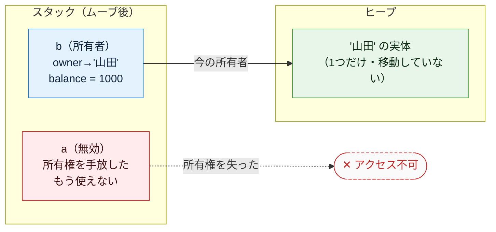

> **なぜこうなる？** 所有者が2人いると、スコープ終端で**同じ実体を2回解放してしまう（二重解放）**危険がある。Rust は「所有者は常に1人」を強制することで、これをコンパイル時に根絶する。だから `let b = a;` は「a を無効化して b に所有権を渡す」という動作になる。**関数に値を渡すときも同じくムーブ**する（`f(a)` の後、a は使えない）。

### 共有したいときは「借用（borrow）」する

「でも元の a も使い続けたい」——そのときは**所有権を渡さず、参照だけを貸す**。これを**借用（borrowing）**と呼び、`&` を付ける。借用は所有権を奪わないので、**元の変数はそのまま生き続ける**。

```rust
// ===== Rust: 不変借用（&）=====
let a = BankAccount { owner: String::from("山田"), balance: 1000 };

let b = &a;   // ← a を「不変で借用」する。所有権はムーブしない。
              //   b は「a を指す参照」であって、a はまだ所有者のまま

println!("{}", a.owner);   // OK: a はまだ有効
println!("{}", b.owner);   // OK: b 経由でも同じ実体を読める（読むだけ）
```

書き換えもしたいなら **可変借用 `&mut`** を使う（ただし可変借用は同時に1つだけ、という別ルールがある）。

```rust
// ===== Rust: 可変借用（&mut）=====
let mut a = BankAccount { owner: String::from("山田"), balance: 1000 };

let b = &mut a;      // a を「可変で借用」する（書き換え可能な参照）
b.balance += 500;    // b 経由で実体を書き換え
                     // （この間、a を直接使うことはできない＝可変借用は排他的）

println!("{}", a.balance);   // 1500  ← 借用が終われば a をまた直接使える
```

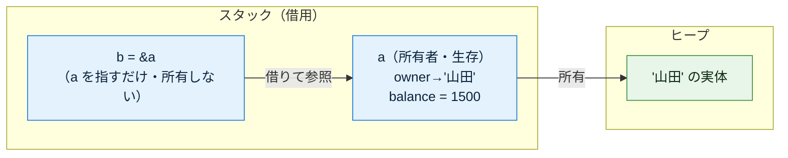

**ムーブと借用の対比（この節の核心）:**

| | **ムーブ `let b = a;`** | **借用 `let b = &a;`** |
|---|---|---|
| 所有権 | a → b へ移る | 移らない（a が持ったまま） |
| 元の a | **無効になる（使うとコンパイルエラー）** | **有効なまま使える** |
| 実体の数 | 1つ（移動しただけ・コピーではない） | 1つ（貸しているだけ） |
| Java/Python でいうと | 該当なし（Rust 独自） | エイリアス（参照の共有）に近い |

Java / Python の `b = a` は「借用（参照の共有）」に近く、**ムーブという概念自体が存在しない**。Rust ではまず所有権がムーブし、共有したいときだけ明示的に借用する——この順序が真逆であることを強く意識してほしい。

### 補足: `Copy` 型はムーブせず「コピー」される

整数（`i64` など）や `bool`、`char` のような**小さくて単純な型**は `Copy` トレイトを持ち、`let y = x;` で**ムーブではなくコピー**される（元の `x` もそのまま使える）。「所有権を移すまでもない軽い値」だからだ。`String` や自作 struct は既定で `Copy` ではないのでムーブする、と区別して覚える。

```rust
let x = 5;
let y = x;   // i64 は Copy 型 → コピーされる
println!("{} {}", x, y);   // 5 5  ← x もそのまま使える（ムーブではない）
```

### 補足: `Box<T>` でヒープに置く

既定では struct の実体はスタックだが、`Box::new(...)` で包むと**実体をヒープに置き、`Box` というポインタで所有する**。ムーブのルールは同じ（`Box` の所有権が移る）。

```rust
// ===== Rust: Box でヒープに置く =====
let boxed = Box::new(BankAccount {
    owner: String::from("山田"),
    balance: 1000,
});   // BankAccount の実体はヒープ、boxed（ポインタ）はスタック
```

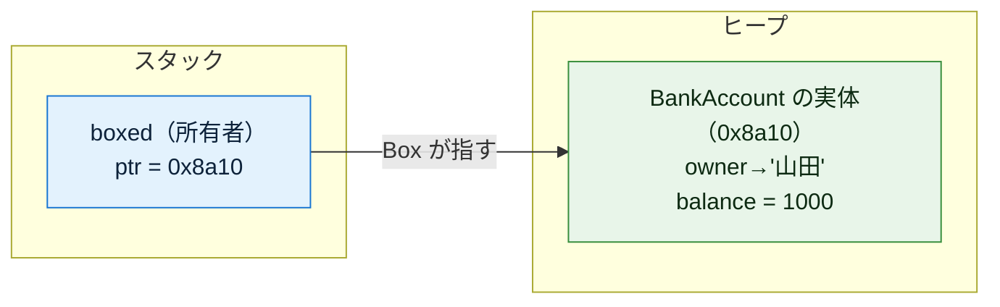

---

<a id="4"></a>
## 4. コンストラクタ相当（`fn new`）徹底解説

ここが今回の中心。Rust には Java / Python のような**言語機能としてのコンストラクタは存在しない**。その事実を踏まえたうえで、用語を1つずつ分解していく。

### 4-1. コンストラクタ（相当のもの）とは何か

**「生成されたインスタンスを、使える正しい初期状態に整える処理」**——これがコンストラクタの役割だ。

なぜ必要か？ 確保したばかりのメモリを「正しい状態」に整え、生成の手続きを1か所にまとめておくと、呼ぶ側が中身の詳細を知らなくても安全に口座を作れる。

```
BankAccount::new("山田", 1000) の内部で起きること:

  ① フィールドに入れる値を用意（バリデーション等もここで）
  ② struct リテラルで実体を1つ組み立てる（owner="山田", balance=1000）
  ③ 組み立てた実体（の所有権）を呼び出し側に返す
```

### 4-2. Rust に「言語機能のコンストラクタ」は無い —— 慣習の `fn new`

ここが Java / Python と根本的に違う点。

- Java: **クラス名と同じ名前の特別なメソッド**が言語機能として用意されている。
- Python: **`__init__`** という決まった名前のメソッドが自動で呼ばれる。
- **Rust: そういう特別な機構は無い。** 代わりに、**「`Self` を返すただの関連関数」を慣習的に `new` という名前で書く**だけ。言語が強制するものではなく、あくまでコミュニティの約束事だ。

「関連関数（associated function）」とは、**`impl` ブロックの中に書く、`self` を引数に取らない関数**のこと。`型名::関数名(...)` の形で呼ぶ（`BankAccount::new(...)`）。`Self`（大文字）は「この impl の対象の型」＝ここでは `BankAccount` を指す。

```rust
// ===== Rust: 慣習的な new =====
struct BankAccount {
    owner: String,
    balance: i64,
}

impl BankAccount {
    // self を取らない関連関数。戻り値は Self（＝BankAccount）。
    // これが「コンストラクタ相当」。名前が new なのは慣習にすぎない
    fn new(owner: String, balance: i64) -> Self {
        // struct リテラルで実体を組み立てて、それを返す
        BankAccount { owner, balance }
        //           ↑ フィールド名と変数名が同じなら「owner: owner」を省略して書ける
    }
}

// --- 使う側: 型名::new(...) で呼ぶ（new キーワードは無い）---
let a = BankAccount::new(String::from("山田"), 1000);
```

**`Default` トレイト** にも触れておく。「引数なしの既定値で作る」を標準化した仕組みが `Default` で、`T::default()` で呼べる。フィールドが全て `Default` を持つなら `#[derive(Default)]` で自動生成もできる。

```rust
// ===== Rust: Default トレイト =====
#[derive(Default)]   // 各フィールドの既定値（String→空文字, i64→0）で default() を自動生成
struct BankAccount {
    owner: String,
    balance: i64,
}

let a = BankAccount::default();   // owner="", balance=0 の口座ができる
```

### 4-3. 引数とは

**引数 = インスタンスを作るときに「外から渡す初期値」**。口座を作るなら「誰の口座か」「最初いくら入れるか」を外から指定したい。それを受け取る窓口が `new` の引数だ。

```rust
// ===== Rust =====
impl BankAccount {
    // ( ) の中が引数。owner と balance を外から受け取る
    fn new(owner: String, balance: i64) -> Self {
        BankAccount { owner, balance }   // 受け取った引数で実体を組み立てる
    }
}

let a = BankAccount::new(String::from("山田"), 1000);  // owner="山田", balance=1000
let b = BankAccount::new(String::from("田中"), 5000);  // 別の初期値 → 中身の違う別の実体
```

引数がなぜ便利かというと、**同じ struct から中身の違うインスタンスを作れる**から。引数がなければ全部同じ初期値の口座しか作れない。

> ⚠️ **ムーブに注意**: 上の `String::from("山田")` を `new` に渡すと、その `String` の**所有権が `new` の引数 `owner` にムーブ**する。さらに `BankAccount { owner, .. }` でフィールドへムーブされ、最終的に返り値 `a` が所有者になる。所有権が「呼び出し側 → new の引数 → フィールド → 返り値の受け手」へと流れていくイメージだ。

### 4-4. self —— `&self` / `&mut self` / `self` の違い

`impl` の中で「自分自身（その実体）」を指すのが `self`。ただし Rust は **self を「どう受け取るか」を3通りから選んで明示する**。ここが Java の `this`・Python の `self`（1種類だけ）と違う。

| 書き方 | 意味 | 使う場面 | 呼んだ後、元の変数は |
|---|---|---|---|
| `&self` | 不変で借用（読むだけ） | フィールドを読むメソッド | そのまま使える |
| `&mut self` | 可変で借用（書き換える） | フィールドを変更するメソッド | そのまま使える |
| `self` | 所有権ごと受け取る（消費する） | 自分を作り変える/破棄するメソッド | **ムーブされて使えなくなる** |

```rust
// ===== Rust =====
impl BankAccount {
    // &self: 残高を「読むだけ」。呼んでも a は生き続ける
    fn balance(&self) -> i64 {
        self.balance
    }

    // &mut self: 残高を「書き換える」。呼んでも a は生き続ける
    fn deposit(&mut self, amount: i64) {
        self.balance += amount;
    }

    // self: 自分を消費する。呼ぶと元の変数はムーブされて使えなくなる
    fn close(self) -> String {
        // 例えば口座を閉じて名義だけ返す、のような「作り変え/破棄」系
        self.owner
    }
}
```

コンストラクタ相当の `new` は、まだ実体が無いところから作るので **`self` を取らない**（関連関数）。一方 `deposit` のような通常メソッドは `self` を取る（メソッド）。この違いも Rust では明確だ。

### 4-5. `new` が無い場合 —— struct リテラルで直接生成

`new` はあくまで慣習なので、**書かなくてもよい**。その場合は 3 章で見た **struct リテラルで直接組み立てる**ことになる（同じモジュール内など、フィールドが見える範囲であれば）。

```rust
// ===== Rust: new を用意せず直接組み立てる =====
struct BankAccount {
    owner: String,
    balance: i64,
}
// impl に new を書いていない

let a = BankAccount {          // struct リテラルで直接生成
    owner: String::from("山田"),
    balance: 1000,
};
```

Java の「デフォルトコンストラクタ（何も書かないと自動で用意される引数なし版）」に相当するものは Rust には無い。**何も書かなければ生成手段は struct リテラルだけ**、必要なら `new` や `Default` を自分で用意する、という考え方だ。

### 4-6. 「作り方」を複数持たせる —— オーバーロード不可

同じ struct でも「作り方」を複数用意したいことがある。ここで重要な制約：

> **Rust には関数のオーバーロード（同名で引数違いの関数を複数定義）が無い。** `fn new(...)` を2つ定義することはできない。

代わりに **(a) 別名の関連関数を複数用意する**か、**(b) ビルダーパターン**を使う。

**(a) 別名の関連関数** — 用途ごとに違う名前を付ける（`new`, `with_balance` など）。

```rust
// ===== Rust =====
impl BankAccount {
    // 名義だけ指定（残高は0スタート）
    fn new(owner: String) -> Self {
        BankAccount { owner, balance: 0 }
    }

    // 名義と初期残高を指定（別名にする）
    fn with_balance(owner: String, balance: i64) -> Self {
        BankAccount { owner, balance }
    }
}

let a = BankAccount::new(String::from("山田"));               // 残高0
let b = BankAccount::with_balance(String::from("田中"), 5000); // 残高5000
```

**(b) ビルダーパターン** — 「少しずつ設定して最後に build する」形。オプションが多いときに使う。

```rust
// ===== Rust =====
struct BankAccountBuilder {
    owner: String,
    balance: i64,
}

impl BankAccountBuilder {
    fn new(owner: String) -> Self {
        BankAccountBuilder { owner, balance: 0 }   // まず既定値で始める
    }

    // 設定メソッド: self を受け取り、書き換えて self を返す（メソッドチェーン用）
    fn balance(mut self, balance: i64) -> Self {
        self.balance = balance;
        self   // 所有権を返すことで .balance(..).build() と繋げられる
    }

    // 最後に本物の BankAccount を組み立てて返す
    fn build(self) -> BankAccount {
        BankAccount { owner: self.owner, balance: self.balance }
    }
}

let a = BankAccountBuilder::new(String::from("山田"))
    .balance(1000)   // 必要な項目だけ設定
    .build();        // 最後に組み立て
```

### 4-7. `new` に書ける処理（組み立てだけではない）

`new` はただの関数なので、**中に自由に処理を書ける**。代表的なパターンを挙げる。

**① バリデーション（引数チェック）** — 不正な値でインスタンスが作られるのを防ぐ。Rust では例外（throw）の代わりに **`Result<T, E>` で「成功か失敗か」を返す**のが定石。失敗しうる生成には `new` ではなく `try_new` のような名前を使うこともある。

```rust
// ===== Rust: Result で成否を返すバリデーション =====
impl BankAccount {
    // 成功なら Ok(口座)、失敗なら Err(理由) を返す
    fn new(owner: String, balance: i64) -> Result<Self, String> {
        if owner.is_empty() {
            return Err("名義は必須です".to_string());   // 失敗を返す（実体は作られない）
        }
        if balance < 0 {
            return Err("残高をマイナスで開設できません".to_string());
        }
        // チェックを通ったときだけ実体を組み立てて Ok で返す
        Ok(BankAccount { owner, balance })
    }
}

// 使う側は Ok / Err を受け取って処理する
match BankAccount::new(String::from("山田"), 1000) {
    Ok(account) => println!("開設成功: {}", account.owner),
    Err(msg)    => println!("開設失敗: {}", msg),
}
```

バリデーションを生成の入口でやる利点は、**「存在するインスタンスは必ず正しい状態」だと保証できる**こと。あとで使うたびにチェックする必要がなくなる。

**② 引数から計算して別のフィールドを埋める**

```rust
// ===== Rust =====
impl Rectangle {
    fn new(width: i64, height: i64) -> Self {
        Rectangle {
            width,
            height,
            area: width * height,   // 引数から計算した面積を初期化時に確定させる
        }
    }
}
```

**③ 引数に無い値を自動生成する** — ID や作成日時など、外から渡さず内部で作るもの。

```rust
// ===== Rust（概念コード）=====
impl BankAccount {
    fn new(owner: String) -> Self {
        BankAccount {
            owner,
            id: generate_id(),          // 口座番号を自動発番（引数では受け取らない）
            created_at: now(),          // 開設日時を記録
            balance: 0,                 // 残高は0スタート
        }
    }
}
```

**④ 副作用のある処理（ファイルを開く・接続する等）** — 書けるが、次の注意がある。

#### ⚠️ ただし「何でも書いていい」わけではない

| 種類 | 例 | 方針 |
|------|-----|------|
| ✅ 推奨 | バリデーション、フィールドの計算、ID・日時の自動生成 | **「使える正しい状態を作る」ための処理**なので積極的に書く |
| ⚠️ 慎重に | ファイルを開く、DB接続、外部APIを叩く、重い計算 | **副作用の強い処理**。`new` に詰めると下記の問題が出る |

副作用の強い処理を `new` に入れると:

- **テストしにくい** — インスタンスを作るだけで本物の接続や通信が走ってしまう。
- **生成が失敗しうる** — 失敗を表現するために戻り値が `Result` になり、呼ぶ側が常にエラー処理を強いられる。
- **生成コストが重くなる** — 「ただ作っただけ」で重い処理が走る。

この対策が、次章で厚く扱う **コンストラクタインジェクション**（依存は自分で作らず外から受け取る）につながる。資源（ファイル等）は Rust では所有者がスコープを抜けるときに `Drop` で自動的に閉じられる（5章）ので、そこも設計の助けになる。

### 4-8. コンストラクタ相当のまとめ

- Rust に**言語機能のコンストラクタは無い**。慣習で **`fn new() -> Self`** という関連関数を書く。
- 引数付き `new` で、中身の違うインスタンスを作れる。所有権は「引数→フィールド→返り値」へ流れる。
- `self` の受け取り方は **`&self`（読む）/ `&mut self`（書く）/ `self`（消費）** の3通りを明示する。
- `new` を書かなくてもよい。その場合は **struct リテラルで直接生成**する（Java のデフォルトコンストラクタ相当は無い）。
- **オーバーロード不可**。作り方を複数持たせるなら**別名の関連関数**（`new` / `with_balance`）や**ビルダー**を使う。
- `new` には代入以外の**処理（バリデーション・計算・自動生成）も書ける**。失敗しうるなら **`Result` で返す**。副作用の強い処理は詰め込みすぎない。

---

<a id="5"></a>
## 5. デストラクタ相当 —— `Drop` トレイトによる確定的な後始末

インスタンスが不要になり**破棄される瞬間に走る処理**。役割は「使っていたヒープや、ファイル・接続などの資源を返す」こと。コンストラクタの逆。**ここが Java / Python（GC）と Rust の最大の違い**だ。

### Rust には GC が無い —— 所有権による「確定的な破棄」

Java も Python も **GC** でメモリを回収するため、「いつ解放されるか」はある程度 GC 任せだった（特に Java は不定）。**Rust には GC が存在しない。** 代わりに：

```
・各値には「所有者が1人」いる（3章）。
・その所有者がスコープ（{ } ）の終端に達すると、値の寿命が尽きる。
・その瞬間に、コンパイラが「解放するコード」を自動でその場所に挿入している。
  → だから「いつ解放されるか」がコンパイル時に確定する（＝確定的 / deterministic）。
・解放の直前に、Drop トレイトの drop() が呼ばれる（デストラクタ相当）。
・リーク（解放し忘れ）や二重解放は、所有権ルールによってコンパイル時に排除される。
```

つまり Rust は「参照が切れたらいつか GC が来る」のではなく、**「所有者のスコープが終わった、まさにその行で必ず片付ける」**。この確定性が Rust の安全性と速さの源だ。

### `Drop` トレイトを実装する

破棄時に独自の処理を走らせたいときは、**`Drop` トレイト**の `drop(&mut self)` を実装する。

```rust
// ===== Rust: Drop の実装 =====
struct BankAccount {
    owner: String,
    balance: i64,
}

impl Drop for BankAccount {
    // このインスタンスが破棄される瞬間に、コンパイラが自動で呼ぶ
    fn drop(&mut self) {
        println!("{}の口座を閉鎖", self.owner);
    }
}

fn main() {
    let a = BankAccount { owner: String::from("山田"), balance: 1000 };
    println!("口座を使用中");
    // ← main の { } を抜ける瞬間、a の寿命が尽きる。
    //   その瞬間に a.drop() が自動で呼ばれ、"山田の口座を閉鎖" が出力される
}
```

**実行結果:**

```
口座を使用中
山田の口座を閉鎖      ← main の閉じ括弧に達した瞬間、確定的に drop が呼ばれた
```

**注意すべきは、`drop()` を自分で呼び出さない**こと。所有権がスコープ終端で尽きたときに**コンパイラが自動で呼ぶ**。ヒープの解放（`String` の中身など）も、この一連の後始末の一部として自動で行われる。プログラマは「解放を書く」必要がない。

### スコープでさらに細かく制御する

`{ }` ブロックを作れば、そのブロックを抜けた瞬間に drop が走る。「ここで確実に閉じたい」を**スコープの形で表現できる**。

```rust
// ===== Rust =====
fn main() {
    println!("ブロックに入る前");
    {
        let a = BankAccount { owner: String::from("山田"), balance: 1000 };
        println!("ブロックの中: {}", a.owner);
    }   // ← ここで a の寿命が尽き、drop が呼ばれる（"山田の口座を閉鎖"）
    println!("ブロックを抜けた後");   // a はもう存在しない
}
```

```
ブロックに入る前
ブロックの中: 山田
山田の口座を閉鎖        ← 内側の } に達した瞬間
ブロックを抜けた後
```

### 手動で早期に破棄する —— `std::mem::drop`

「スコープ終端より前に、今すぐ破棄したい」ときは、標準関数 **`std::mem::drop`** に値を渡す。これは `self`（所有権ごと）を受け取って中で捨てるだけの関数で、渡した瞬間にその値の `Drop` が走り、以後その変数は使えなくなる（ムーブされたため）。

```rust
// ===== Rust: 早期破棄 =====
fn main() {
    let a = BankAccount { owner: String::from("山田"), balance: 1000 };
    println!("まだ使える: {}", a.owner);

    drop(a);   // ← std::mem::drop。ここで即座に a.drop() が走る（"山田の口座を閉鎖"）
               //   a の所有権は drop 関数にムーブされたので、以後 a は使えない

    // println!("{}", a.owner);  // ← コンパイルエラー（a はムーブ済み）
    println!("drop 済み。ここでは a は無い");
}
```

```
まだ使える: 山田
山田の口座を閉鎖        ← drop(a) を書いた行で即座に
drop 済み。ここでは a は無い
```

なお、**自分で `a.drop()` とメソッド呼びすることはできない**（二重解放を防ぐためコンパイラが禁止している）。早期破棄は必ず `drop(a)` を使う。

### デストラクタ相当のまとめ

| 項目 | Rust |
|------|------|
| メモリ解放方式 | **所有権ベース・コンパイル時に決定（GCは無い）** |
| 解放タイミング | **確定的**（所有者がスコープ終端に達した、その瞬間） |
| 破棄時メソッド | **`Drop` トレイトの `drop(&mut self)`**（自動で呼ばれる／手動呼び出し禁止） |
| 手動での早期破棄 | `std::mem::drop(値)` |
| リーク・二重解放 | 所有権ルールによりコンパイル時に排除 |
| 資源（ファイル等）の後始末 | 所有者の drop で自動的に閉じられる（RAII） |

要点：**Rust はメモリも資源も「所有者がスコープを抜けるとき」に確定的に片付ける。GC は無い。`Drop` を書けば破棄時処理を差し込めるが、呼ぶのはコンパイラ。手動早期破棄は `std::mem::drop`。**

---

<a id="6"></a>
## 6. ライフサイクル — 確保から解放までの全経路

インスタンスの一生は、メモリの観点では次の4段階。

```
①割り当て          ②初期化              ③使用               ④解放
メモリ確保     →    new / リテラルで   →   メソッド呼び出し   →   所有者がスコープ終端に
(スタック          フィールド設定          （&self/&mut self）     達し drop が確定的に走る
 または Box)                                                      （GCではない・即時）
```

| 段階 | Rust |
|------|------|
| ①割り当て | `BankAccount { .. }` / `BankAccount::new(..)`（既定はスタック、`Box::new` でヒープ） |
| ②初期化 | `fn new`（慣習）または struct リテラルでフィールドを埋める |
| ③使用 | 所有者を通じてメソッドを呼ぶ（読むなら `&self`、書くなら `&mut self`）。共有は借用 `&` |
| ④解放 | 所有者がスコープ終端に達する → `Drop::drop` が**確定的に**走り、メモリも解放 |
| 早期破棄 | `std::mem::drop(値)` |

### 「いつ消えるか」の確定性 —— GC言語との対比

- **Java**: 参照を切っても、実際に回収されるのは**不定のタイミング**（GC次第）。
- **Python**: 参照カウントが0になった瞬間に回収（比較的確定的だが、循環参照は別途 GC）。
- **Rust**: **所有者がスコープ終端に達した、まさにその行**で確定的に drop。GC も参照カウントの不確実さも無い。**「どこで解放されるか」がソースコードを見れば分かる**のが Rust の特徴。

所有権が寿命を決める、という一点を押さえれば、Rust のライフサイクルは全て説明がつく。

---

<a id="7"></a>
## 7. 完全な実例: 宣言 → インスタンス化 → 実行 → 終了

ここまでの全概念を、1本のプログラムの流れとして通しで見る。銀行口座の一生をメモリの動きとともに追う。`new` で「開設」を出力し、`Drop` で「閉鎖」を出力し、**`{ }` ブロックを抜けた瞬間に `drop` が確定的に呼ばれる**様子を実行結果付きで確認する。

```rust
// ============================================================
// ① struct 宣言（データの設計図。この時点ではまだ実体は0個）
// ============================================================
struct BankAccount {
    owner: String,    // フィールド: 口座名義
    balance: i64,     // フィールド: 残高
}

// ============================================================
//   impl 宣言（この struct に対する処理をまとめる）
// ============================================================
impl BankAccount {
    // --- コンストラクタ相当（生成して初期化。慣習の new）---
    fn new(owner: String, balance: i64) -> Self {
        // 開設のログを出す（副作用の軽い例）
        println!("{}の口座を開設。残高{}", owner, balance);
        BankAccount { owner, balance }   // 実体を組み立てて所有権を返す
    }

    // --- メソッド（処理）: 入金する。書き換えるので &mut self ---
    fn deposit(&mut self, amount: i64) {
        self.balance += amount;   // 自分の残高に amount を加算
        println!("{}円入金 → 残高{}", amount, self.balance);
    }
}

// --- デストラクタ相当（破棄の瞬間に自動で呼ばれる）---
impl Drop for BankAccount {
    fn drop(&mut self) {
        println!("{}の口座を閉鎖", self.owner);
    }
}

fn main() {
    println!("--- ブロックに入る ---");
    {
        // ========================================================
        // ② インスタンス化（実体を作り、new が走る。a が所有者になる）
        // ========================================================
        let mut a = BankAccount::new(String::from("山田"), 1000);
        // この行で:
        //   1. BankAccount 1個分の領域を確保（既定でスタック上）
        //   2. new が走り owner="山田", balance=1000 に初期化＆開設ログ
        //   3. 実体の所有権が a に渡る

        // ========================================================
        // ③ 実行（メソッドを呼んで使う。&mut self で借用して書き換え）
        // ========================================================
        a.deposit(500);    // 残高 1000 → 1500
        a.deposit(2000);   // 残高 1500 → 3500

        // ========================================================
        // ④ ライフサイクル終了は「このブロックを抜ける瞬間」に確定的に起きる
        // ========================================================
    }   // ← ここで a の寿命が尽きる。その瞬間に a.drop() が確定的に呼ばれ
        //   "山田の口座を閉鎖" が出力される（GC 待ちではない）
    println!("--- ブロックを抜けた（口座はもう存在しない）---");
}
```

**実行結果（drop のタイミングがソース上で確定している）:**

```
--- ブロックに入る ---
山田の口座を開設。残高1000
500円入金 → 残高1500
2000円入金 → 残高3500
山田の口座を閉鎖              ← 内側の } に達した“その瞬間”に drop が確定的に走った
--- ブロックを抜けた（口座はもう存在しない）---
```

Java だと「口座を閉鎖」に相当する処理がいつ走るか分からない（GC次第）。Python は参照カウントが0になった瞬間。**Rust は「所有者 a のスコープ（内側の `{ }`）を抜けた、まさにその行」で必ず走る**——ここが Rust のメモリ管理の性格だ。

**メモリの動きを段階ごとに追う:**

**② `BankAccount::new(...)` の直後** — 実体ができ、`a` がそれを所有する

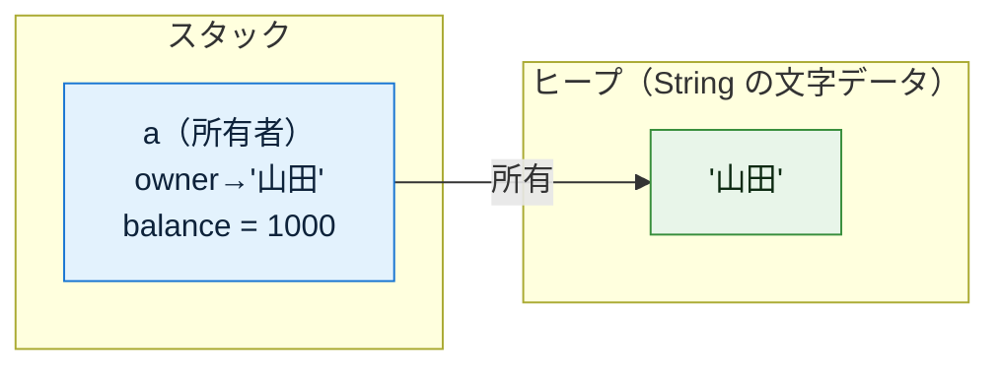

**③ `a.deposit(500)` → `a.deposit(2000)` の後** — 同じ実体の `balance` が `&mut self` 経由で更新される

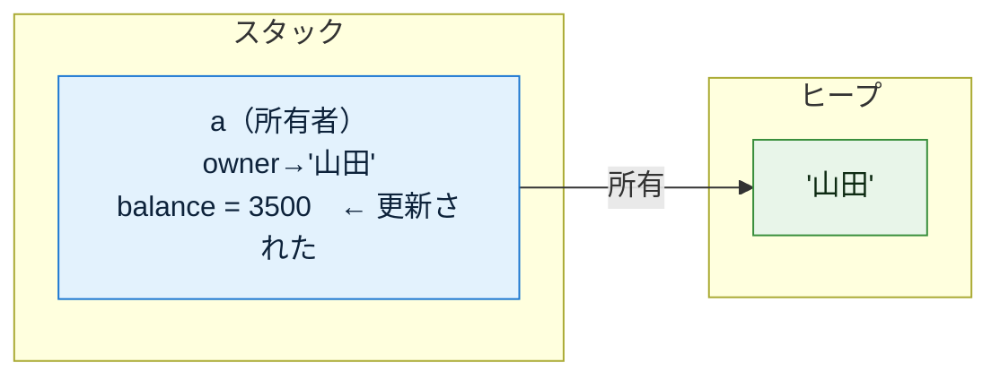

**④ 内側の `}` に達した瞬間** — 所有者 `a` の寿命が尽き、`drop` が確定的に走ってメモリも解放される

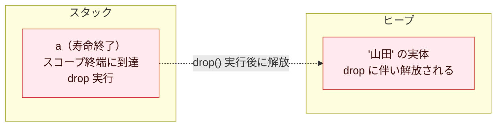

所有→スコープ終端で drop、という流れをまとめると：

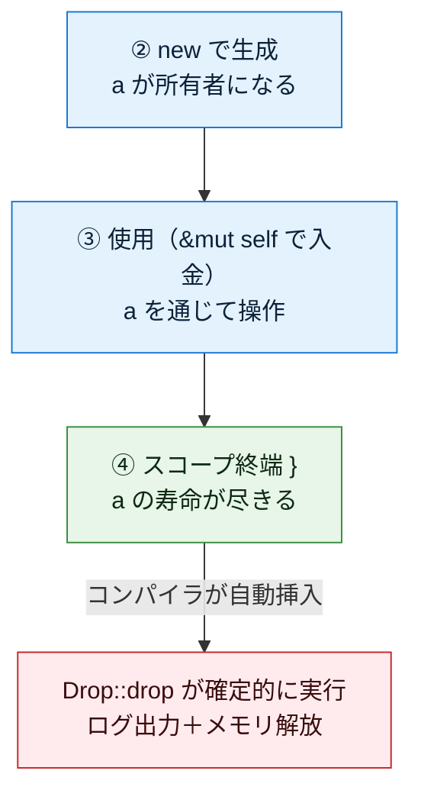

---

<a id="8"></a>
## 8. Rust 早見表

| 項目 | Rust |
|------|------|
| データの定義 | `struct BankAccount { .. }` |
| 処理（メソッド）の定義 | `impl BankAccount { .. }`（struct とは別ブロック） |
| フィールドの宣言 | struct 内に型付きで宣言（後から増えない） |
| インスタンス化 | `BankAccount { .. }` / 慣習の `BankAccount::new(..)`（`new` キーワードは無い） |
| 実体の置き場所 | **既定でスタック**。ヒープに置きたいときだけ `Box<T>` |
| 変数が持つもの | **値そのもの（所有権）**。参照が欲しければ借用 `&` |
| 代入 `let b = a;` | **ムーブ**（所有権が移り、元の a は無効化）。`Copy` 型のみコピー |
| 共有したいとき | **借用** `&a`（不変）/ `&mut a`（可変・排他的） |
| コンストラクタ | **言語機能は無い**。慣習の関連関数 `fn new() -> Self` / `Default` |
| 引数 | あり（所有権は引数→フィールド→返り値へ流れる） |
| 「作り方」を複数用意 | **オーバーロード不可** → 別名関連関数（`new`/`with_balance`）やビルダー |
| 自分自身 | `&self`（読む）/ `&mut self`（書く）/ `self`（消費）を明示 |
| 失敗しうる生成 | `Result<Self, E>` を返す |
| メモリ解放方式 | **所有権ベース・コンパイル時決定（GCは無い）** |
| 解放タイミング | **確定的**（所有者がスコープ終端に達した瞬間） |
| 破棄時メソッド | **`Drop` トレイトの `drop`**（自動呼び出し／手動呼び出し禁止） |
| 手動での早期破棄 | `std::mem::drop(値)` |
| リーク・二重解放 | 所有権ルールでコンパイル時に排除 |

---

<a id="9"></a>
## 9. 応用: コンストラクタインジェクション

引数の実践的な使い方の代表例が **コンストラクタインジェクション（依存性の注入 / DI）**。

**考え方: ある struct が別のオブジェクトを必要とするとき、それを内部で生成せず、`new` の引数として外から受け取る。**

まず「依存」という言葉を整理する。ある型 A が、処理のために別の型 B のインスタンスを使うとき、「**A は B に依存している**」という。例えば「通知サービスがメール送信機を使う」なら、通知サービスはメール送信機に依存している。この**依存する相手を、誰が・どこで生成し、誰が所有するか**が今回のテーマ。Rust では所有権があるぶん、この「誰が所有するか」がとりわけ明快になる。

### なぜ内部で生成するとダメか（問題点を厚く）

まず「やってしまいがちな悪い例」を見る。依存する `EmailSender` を、`new` の内部で自分で生成し、所有してしまっている。

```rust
// ===== Rust: 悪い例（内部で生成）=====
struct EmailSender;
impl EmailSender {
    fn new() -> Self { EmailSender }
    fn send(&self, m: &str) { println!("メール送信: {}", m); }
}

struct NotificationService {
    sender: EmailSender,   // 具体型 EmailSender を直に所有してしまっている
}

impl NotificationService {
    fn new() -> Self {
        // ↓ 内部で直接生成して、EmailSender を自分で作り・所有してしまう
        NotificationService { sender: EmailSender::new() }
    }

    fn notify(&self, m: &str) {
        self.sender.send(m);
    }
}
```

一見動くが、次の問題を抱えている。

**問題① テストが著しく困難になる**
`NotificationService::new()` を呼ぶだけで、内部で本物の `EmailSender` が生成される。テストのたびに**本物のメールが飛ぶ**、あるいはメールサーバへの接続が必要になる。テスト用に「送ったフリだけする偽物」に差し替える手段がない。

**問題② 実装を差し替えられない（密結合）**
`EmailSender` という**具体的な型名がコードに直接埋め込まれている**。後から「SMSでも送りたい」「開発中はコンソールに出したい」となっても、`NotificationService` の中身を書き換えるしかない。

**問題③ 依存が外から見えない（隠れた依存）**
`NotificationService::new()` というシグネチャだけを見ても、「このサービスが裏で `EmailSender` を必要としている」ことが分からない。依存が引数に現れず、内部に隠れてしまう。

**問題④ 生成の責任と所有・寿命を制御できない**
`EmailSender` の生成コスト（接続確立や設定読み込みなど）が、`NotificationService` を作った瞬間に**強制的に**発生する。1つの送信機を複数サービスで**共有**したくても、`NotificationService` ごとに新しい `EmailSender` が内部生成・所有されてしまい、共有できない。

**問題⑤ 設定済みのオブジェクトを渡せない**
実際の `EmailSender` は「送信元アドレス」「認証情報」などを設定して使うことが多い。内部で `EmailSender::new()` すると、**設定する隙がない**。

これらはすべて「**依存する相手を自分で生成・所有してしまっている**」ことが根本原因。Rust の所有権の観点で言えば、`NotificationService` が `EmailSender` の**生成・所有・設定のすべてを抱え込んでいる**状態だ。

### コンストラクタで注入する —— トレイト＋ジェネリクス

依存を「抽象（トレイト）」として受け取り、実体は外から渡す。**生成と所有の責任を呼び出し側に移す**のがポイント。Rust では抽象を **トレイト（trait）** で表す。

まず「送れる」という振る舞いをトレイトで定義する。

```rust
// ===== Rust: 抽象をトレイトで定義 =====
// 「メッセージを送れる」という振る舞いだけを定義（具体的な送り方は決めない）
trait MessageSender {
    fn send(&self, m: &str);
}

// 実装その1: 本番用のメール送信
struct EmailSender;
impl MessageSender for EmailSender {
    fn send(&self, m: &str) { println!("メール送信: {}", m); }
}

// 実装その2: テスト用の偽物（実際には送らない）
struct MockSender;
impl MessageSender for MockSender {
    fn send(&self, m: &str) { println!("[mock] 送ったフリ: {}", m); }
}
```

注入の書き方は Rust では主に2通りある。

**(a) ジェネリクス＋トレイト境界 `<S: MessageSender>`** — コンパイル時に型が確定し、実行時コストが無い（静的ディスパッチ）。

```rust
// ===== Rust: ジェネリクスで注入 =====
// <S: MessageSender> は「MessageSender を実装した何らかの型 S」を意味する
struct NotificationService<S: MessageSender> {
    sender: S,   // 具体型ではなく「型パラメータ S」を所有する
}

impl<S: MessageSender> NotificationService<S> {
    // ↓ new の引数で、外から実装を受け取る（＝注入）。所有権もここで受け取る
    fn new(sender: S) -> Self {
        NotificationService { sender }   // 受け取った依存を持つだけ。自分では生成しない
    }

    fn notify(&self, m: &str) {
        self.sender.send(m);   // 中身が何であれ send() を呼ぶだけ
    }
}

fn main() {
    // 呼び出し側が「どの実装を使うか」を決めて、生成し、所有権を渡す
    let svc = NotificationService::new(EmailSender);   // 本番: メール送信を注入
    svc.notify("こんにちは");

    let test = NotificationService::new(MockSender);   // テスト: 偽物を注入（メールは飛ばない）
    test.notify("テスト");
}
```

**(b) `Box<dyn MessageSender>`** — 実行時に実装を差し替えたい／複数種類を1つの型で扱いたいとき（動的ディスパッチ）。トレイトオブジェクトをヒープに置いて所有する。

```rust
// ===== Rust: トレイトオブジェクトで注入 =====
struct NotificationService {
    // dyn MessageSender は「MessageSender を実装した“何か”」。
    // サイズが定まらないので Box でヒープに置いて所有する
    sender: Box<dyn MessageSender>,
}

impl NotificationService {
    // 外から Box に入った実装を受け取る（所有権ごと注入）
    fn new(sender: Box<dyn MessageSender>) -> Self {
        NotificationService { sender }
    }

    fn notify(&self, m: &str) {
        self.sender.send(m);
    }
}

fn main() {
    // 実行時に条件で実装を選ぶ、といったことができる
    let svc = NotificationService::new(Box::new(EmailSender));  // 本番
    svc.notify("こんにちは");

    let test = NotificationService::new(Box::new(MockSender));  // テスト
    test.notify("テスト");
}
```

### 先ほどの問題がどう解決されるか

| 内部生成の問題 | コンストラクタ注入での解決 |
|----------------|--------------------------|
| ① テストが困難 | テスト時は `NotificationService::new(MockSender)` で偽物を渡せる。本物のメールは飛ばない |
| ② 差し替え不可（密結合） | 具体型がコードから消え、`MessageSender`（トレイト）にだけ依存。実装は外から自由に選べる |
| ③ 依存が隠れる | 依存が **`new` の引数として表に出る**。シグネチャを見れば必要なものが一目で分かる |
| ④ 生成・所有を制御不能 | 生成と所有権の管理が呼び出し側に移る。所有権の流れがコードから明確に読める |
| ⑤ 設定済みを渡せない | 呼び出し側で設定した `EmailSender` をそのまま渡せる |

### 利点（まとめ）

| 利点 | 中身 |
|------|------|
| 差し替え可能 | 本番=メール / 開発=コンソール出力 / テスト=モック を、渡す実装を変えるだけで切替 |
| テスト容易 | 副作用のある依存をモック（偽物）に置換でき、外部I/Oなしで検証できる |
| 疎結合 | 具体実装でなくトレイト（抽象）に依存するので、実装を変えても利用側を書き換えずに済む |
| 依存が可視化 | `new` の引数を見れば「このサービスが何を必要とするか」が一目で分かる |
| 所有権が明確になる | 「誰が依存を生成し、誰が所有するか」が呼び出し側に集約され、Rust の所有権モデルと自然に噛み合う |

### 「じゃあ生成は誰が書くの？」—— Composition Root

依存を注入する形にすると、「結局どこかで `EmailSender` を生成するのでは？」という疑問が出る。答えは **「アプリの一番外側（エントリポイント）でまとめて生成し、必要な型に配って回る」**。この「組み立て場所」を **Composition Root（コンポジションルート）** と呼ぶ。

```rust
// ===== Rust: アプリ起動時（一番外側）でまとめて組み立てる =====
fn main() {
    // 依存の生成と所有は、この一番外側の1か所に集約する
    let sender = EmailSender;                            // ここで（必要なら設定込みで）生成
    let service = NotificationService::new(sender);      // 生成した依存を注入（所有権を渡す）

    service.notify("こんにちは");
    // service（と、それが所有する sender）は main の終端で確定的に drop される
}
```

こうすると「何をどう組み立てるか」がアプリの入口1か所に集まり、各型は自分の仕事だけに集中できる。**所有権の起点も Composition Root に集まる**ので、「誰が何を持ち、いつ解放されるか」がアプリ全体で追いやすくなる。テスト時はこの組み立て部分だけ別に書けばよい（`MockSender` を注入する）。

Rust には Spring（Java）のような重量級 DI コンテナ文化は薄く、**この手動注入（`new` の引数で受け取り、Composition Root で組み立てる）が基本形**だ。トレイト＋ジェネリクス／`Box<dyn Trait>` という言語機能だけで、密結合を避けつつ所有権を明確に保てる——ここに Rust らしさがよく表れている。

---

作成: 2026-07-23 / Rust
```
