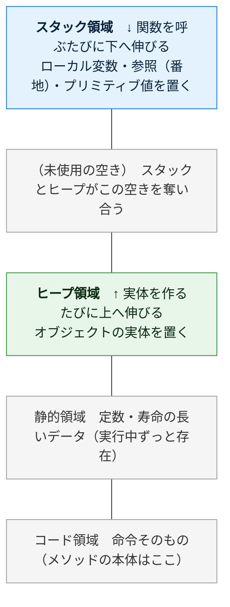
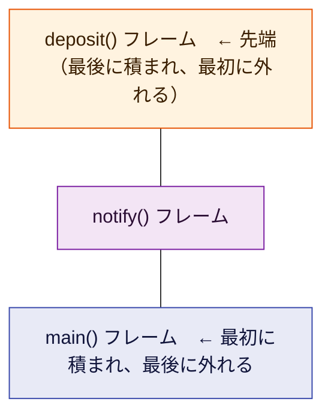
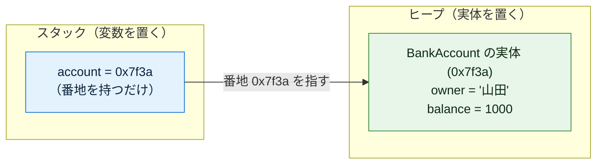
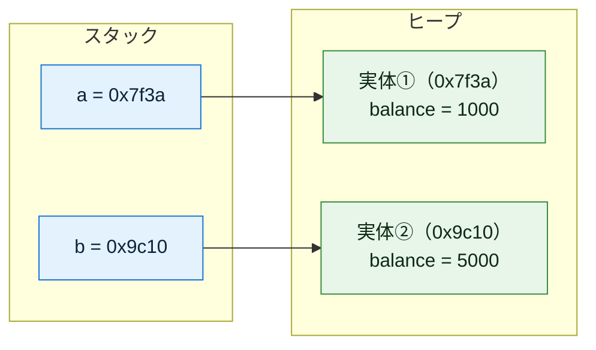
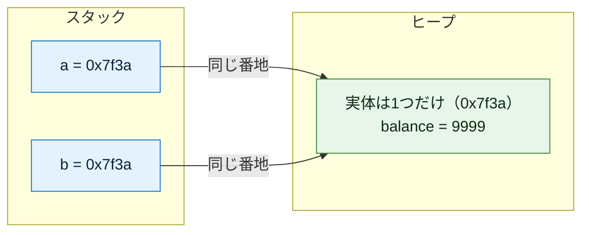
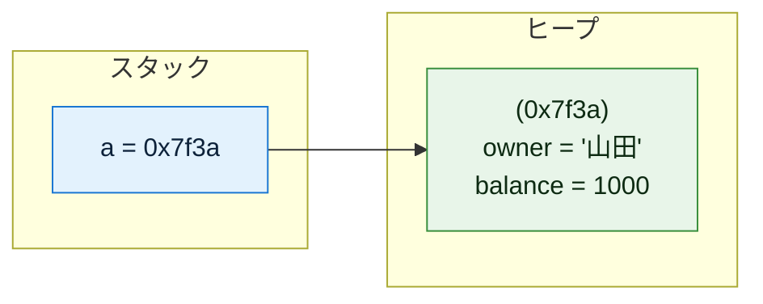
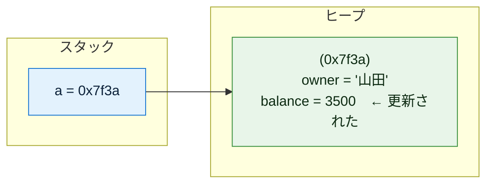
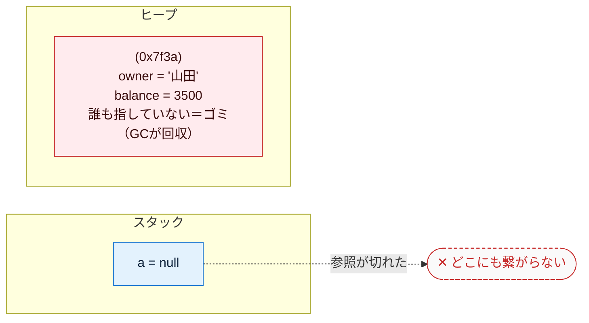

# オブジェクト指向の基礎（TypeScript版）— メモリの視点から徹底解説（初心者向け）

対象言語: **TypeScript**

この文書は「クラス」「インスタンス」「コンストラクタ」「デストラクタ」「ライフサイクル」を、**実際にメモリで何が起きているか**に沿って、初心者がつまずくポイントを一つずつ潰しながら解説する。丸暗記ではなく「なぜそうなるか」で理解することを目指す。コード例はコメントを多めにして、1行ずつ何が起きているか追えるようにしている。

---

## もくじ

0. [そもそもオブジェクトとは何か](#0)
1. [前提: スタックとヒープ（ここが全ての土台）](#1)
2. [クラス — メモリレイアウトの設計図](#2)
3. [インスタンス — 設計図から実体を作る](#3)
4. [コンストラクタ徹底解説（引数・メソッド・種類）](#4)
5. [デストラクタ — 解放時の後始末](#5)
6. [ライフサイクル — 確保から解放までの全経路](#6)
7. [完全な実例: 宣言 → インスタンス化 → 実行 → 終了](#7)
8. [TypeScript 早見表](#8)
9. [応用: コンストラクタインジェクション](#9)

---

<a id="0"></a>
## 0. そもそもオブジェクトとは何か

プログラムは突き詰めると「**データ**」と「そのデータを**操作する処理**」の2つでできている。

昔ながらの書き方（手続き型）では、この2つがバラバラに置かれていた。

```
データ:  name="山田", balance=1000
処理:    deposit(name, balance, 500)   // データを毎回引数で渡す
```

オブジェクト指向は、この**関連するデータと処理を1つの箱にまとめる**という考え方。その「箱」がオブジェクトだ。

```
口座オブジェクト
├─ データ:  name="山田", balance=1000
└─ 処理:    deposit(500)   ← 自分の中のデータを直接触れる
```

こうまとめると「口座に対して deposit する」という現実の考え方そのままにコードが書け、データと処理の対応関係が崩れにくくなる。これがオブジェクト指向の出発点。

そして、この「箱」を**どう作り（クラス）、いつメモリに現れ（インスタンス化）、どう初期化され（コンストラクタ）、いつ消えるか（デストラクタ／ライフサイクル）** ——これらは全て**メモリ上の出来事**として説明できる。だから次章のメモリの話から始める。

> 補足: TypeScript はブラウザや Node.js の JavaScript エンジン（V8 など）の上で動く。だからここで言う「メモリ」とは、実行時に JavaScript エンジンが管理するメモリのことだ。TypeScript の型注釈はコンパイル時に消え、実行時にはただの JavaScript として動く。

---

<a id="1"></a>
## 1. 前提: スタックとヒープ（ここが全ての土台）

オブジェクトの挙動は、メモリが役割の違う領域に分かれていることを知らないと絶対に理解できない。逆に、ここさえ押さえれば後は全部つながる。この章はいちばん丁寧に説明する。

### 1-0. そもそもメモリとは

メモリ（RAM）は、プログラム実行中にデータを一時的に置いておく作業台のようなもの。中身は**巨大な1列の「マス目」**で、各マスには **アドレス（番地）** という通し番号が振られている。

| アドレス（番地） | 0x1000 | 0x1001 | 0x1002 | 0x1003 | … |
|---|---|---|---|---|---|
| 中身（1マス＝1バイト） | 72 | 84 | 00 | 00 | … |

「変数」とは、このどこかのマスに付けた名前にすぎない。`x = 5` は「あるアドレスのマスに 5 を書く」こと。この“番地の集まり”を、エンジンとプログラムは役割ごとに区画分けして使う。その代表が **スタック** と **ヒープ** だ。

### 1-1. プログラムのメモリ全体図

プログラムが動くとき、メモリはおおまかに次のように区画されている。



（上ほど高位アドレス。オブジェクト指向で重要なのは上2つ＝**スタック**と**ヒープ**）

このうち、オブジェクト指向を理解するのに重要なのが上の2つ、**スタック**と**ヒープ**。まず両者を一覧で比べ、その後1つずつ深掘りする。

| | **スタック** | **ヒープ** |
|---|---|---|
| 何を置く | ローカル変数、関数呼び出しの記録、番地(参照)、プリミティブ値(number等) | **オブジェクトの実体**、大きいデータ、寿命の長いデータ |
| 確保・解放 | **自動**（関数の出入りに連動） | GC（後述）が管理 |
| 速度 | **速い**（番地を動かすだけ） | 遅い（空き場所を探す必要） |
| サイズ | 小さい（数MB程度） | 大きい（メモリの許す限り） |
| 寿命 | その関数の実行中だけ | 参照され続ける限りずっと |
| 並び方 | きっちり積み重なる（LIFO） | あちこちに散らばる |

> TypeScript（JavaScript エンジン）では、`number` `boolean` `string`（短い文字列）などの**プリミティブ値**は「値そのもの」として軽く扱われ、`{ }` や `class` から作った**オブジェクト**はヒープに実体が置かれ、変数はその番地（参照）を持つ。この違いが後の全ての鍵になる。

### 1-2. スタック — 関数の出入りに連動する「積み重ね」

スタックは名前のとおり「積み重ね」。**関数を1つ呼ぶと、その関数専用の箱が1つ積まれる**。この箱を **スタックフレーム（stack frame）** と呼ぶ。

フレームの中には、その関数が使う次のものが入る：

| `deposit()` フレームの中身 | 例 | 説明 |
|---|---|---|
| 引数 | `amount = 500` | 呼び出し時に渡された値 |
| ローカル変数 | `temp = ...` | 関数の中で宣言した変数 |
| 戻り先アドレス | `0x4a2c` | 終わったら「どこへ戻るか」の記録 |

そして**関数を呼ぶと上に積まれ、関数が終わると上から外れる**。この「後に積んだものから先に外す」順序を **LIFO（Last In, First Out）** という。下は `main()` が `notify()` を呼び、さらに `notify()` が `deposit()` を呼んだ、いちばん深い瞬間のスタック：



`deposit()` が終わると先端の箱だけ外れて `notify()` に戻り、`notify()` が終わるとまた外れて `main()` に戻る——というように、**上から順に1つずつ消えていく**。

**スタックの片付けが「自動でタダ同然」なのはなぜか。** スタックには「今どこまで積んだか」を指す**スタックポインタ**という目印が1つある。関数が終わるときは、この目印を**フレーム1個分だけ下に戻す**だけ。中身を消して回るのではなく、ポインタを動かすだけなので一瞬で終わる。だからスタックは速い。

> ⚠️ **スタックオーバーフロー**: スタックは容量が小さい。関数が関数を呼び…と積みすぎると（例: 止まらない再帰）、スタックが天井に達して `RangeError: Maximum call stack size exceeded`（TypeScript／JavaScript）で落ちる。これがスタックが有限であることの証拠。

### 1-3. ヒープ — 自由に確保する「広い倉庫」

スタックは「関数が終わったら消える」ものしか置けない。だが実際には、**関数が終わっても生き残ってほしいデータ**や、**実行するまで大きさが分からないデータ**がある。それを置くのがヒープ。

**オブジェクト（インスタンス）の実体は、原則すべてこのヒープに置かれる。** 理由は「いつまで使われるか・どれだけの大きさか」が作る時点で決まらないから。スタックのようにきっちり積むのではなく、**空いている場所を探して確保する**ため、置き場所はバラバラに散らばる。


ヒープの弱点は2つ。**① 確保が遅い**（毎回「どこが空いてるか」を探す必要がある）。**② 自動では片付かない**。スタックのように「関数が終わったら消える」という自然な合図がないので、片付ける係を決めないと、使い終わったゴミがずっと残り続ける＝**メモリリーク**になる。

この「ヒープの片付け」を、**TypeScript（実行する JavaScript エンジン）は GC（ガベージコレクション）という仕組みが自動でやってくれる**（詳しくは5章）。「もう誰からも使われていない実体」をGCが見つけて回収するので、プログラマが手で「解放」を書くことは基本ない。ここがC言語などとの大きな違い。

### 1-4. 2つはこう連携する（最重要ポイント）

ここが初心者の最大の関門。スタックとヒープは**セット**で使われる。典型的にはこうなる：

> **オブジェクトの実体はヒープに置かれ、スタック上の変数はその「番地」だけを持つ。**

```typescript
const account = new BankAccount("山田", 1000);   // TypeScript
```

この1行の実行後、メモリはこうなっている：



つまり **変数 `account` は口座そのものではなく、「口座がヒープのどこにあるか」を示す番地（`0x7f3a`）を持っているだけ**。この番地を持つ値を **参照（reference）** と呼ぶ。

> 注意: `const account` の `const` は「変数 `account` が持つ**番地**を変えられない」という意味であって、「実体の中身（`balance` など）を変えられない」という意味ではない。番地は固定でも、その番地の先にあるヒープ上の `balance` は書き換えられる。ここは初心者が混同しやすい。

なぜこうする？ オブジェクトは大きくなりうるので、変数に実体を丸ごと入れると、代入や引数渡しのたびに全部コピーすることになり重い。**番地（小さな固定サイズの値）だけをやり取りすれば軽い**からだ。

一方、`number` や `boolean` などの**プリミティブ値は番地ではなく値そのもの**として扱われる。だから `let x = 5; let y = x;` は値の複製で、`y` を変えても `x` は変わらない。オブジェクトとプリミティブでこの点が決定的に違う。

この仕組みを理解すると、後で出てくる **「代入したのに元まで変わる」** という現象（3章）が「番地をコピーしただけで実体は1つだから」とスッと理解できる。まずは次の1点だけ覚えれば十分：


---

<a id="2"></a>
## 2. クラス — メモリレイアウトの設計図

**クラスとは「インスタンス1個がメモリ上でどんな形になるか」を定義したもの**。具体的には「どんなフィールド（データ）を持つか」を決める。

### まずは一番シンプルな例

```typescript
// class というキーワードで「BankAccount という設計図」を定義する
class BankAccount {
    owner: string;    // フィールド1: 口座名義（文字列への参照を格納）。TypeScript は型を明記する
    balance: number;  // フィールド2: 残高（数値）。TypeScript の数値は number 型ひとつ
}
// ↑ここまではあくまで「設計図の宣言」。
//   この時点ではメモリ上に口座は1つも存在しない（実体はまだ0個）。
```

TypeScript は Java のように**フィールドを型付きでクラス直下に宣言する**。この点が「宣言部を持たない Python」とは違い、Java に近い。宣言した型（`string` / `number`）はコンパイル時のチェックに使われ、実行時には消える。

> なお `strictPropertyInitialization`（`strict` に含まれる）を有効にしていると、上のように宣言だけして初期化しないフィールドはコンパイルエラーになる。実際にはコンストラクタ（次章）で初期値を入れる。ここでは「フィールドを宣言する形」だけ先に見せている。

### クラスは「データ」と「処理」をまとめる

フィールド（データ）だけでなく、処理（メソッド）も一緒に定義できる。これがオブジェクトの本質。

```typescript
class BankAccount {
    owner: string;    // データ
    balance: number;  // データ

    constructor(owner: string, balance: number) {
        this.owner = owner;       // this は「このメソッドが呼ばれた口座自身」（4章で詳説）
        this.balance = balance;
    }

    // メソッド（処理）: この口座にお金を入れる
    deposit(amount: number): void {
        // this は「このメソッドが呼ばれた口座自身」を指す（4章で詳説）
        this.balance += amount;   // 自分の balance に amount を足す
    }
}
```

ここで重要な事実：

> **メソッドはインスタンスごとに複製されない。** メモリ上にはメソッドの本体が1つだけ存在し、全インスタンスがそれを共有する。インスタンスが個別に持つのは**フィールドのデータだけ**。

TypeScript（JavaScript）では、クラスのメソッドは **プロトタイプ（prototype）** という共有の置き場に1つだけ置かれ、全インスタンスがそこを参照して使う。口座を1000個作っても `deposit` の処理本体は1つ。各口座が個別に持つのは owner と balance の値だけ。

### アクセス修飾子 — 外から触れる範囲を決める

TypeScript は Java のように `public` / `private` などのアクセス修飾子を書ける（これは TypeScript が型検査時にチェックする）。

```typescript
class BankAccount {
    public owner: string;    // public: どこからでも読み書きできる（付けないと既定で public）
    private balance: number; // private: このクラスの中からしか触れない（外部の直接書き換えを防ぐ）

    constructor(owner: string, balance: number) {
        this.owner = owner;
        this.balance = balance;
    }

    deposit(amount: number): void {
        this.balance += amount;  // クラス内部なので private な balance に触れる
    }
}

const a = new BankAccount("山田", 1000);
console.log(a.owner);   // OK（public）
// a.balance = 9999;    // ← コンパイルエラー（private なので外から直接は書けない）
```

`private` にすると「残高は入金・出金メソッド経由でしか変えられない」といったルールを設計として強制でき、壊れた状態になりにくい。これを**カプセル化**という。

> 補足: TypeScript の `private` はコンパイル時のチェックであり、実行時（生の JavaScript）では強制されない。実行時レベルでも隠したいときは JavaScript ネイティブの `#field`（ハードプライベート）を使う手もあるが、本稿では入門として `private` を用いる。

### 覚え方

- **クラス = 設計図**。書いてもまだメモリに実体はできない。
- クラスが決めるのは「どんなフィールドを持つか」＝ **1インスタンス分のメモリの形**。
- メソッドは全インスタンスで共有（プロトタイプに1つ）、フィールドはインスタンスごとに個別。
- TypeScript はフィールドを**型付きで宣言**し、`public` / `private` で公開範囲を決められる。

---

<a id="3"></a>
## 3. インスタンス — 設計図から実体を作る

**インスタンス化とは、クラス（設計図）に従って実際にメモリを確保し、実体を1つ作ること**。この瞬間に初めて、口座がメモリ上に姿を現す。

```typescript
// new でインスタンス化
const a = new BankAccount("山田", 1000);
//        ↑ new が「ヒープに実体を1つ作る」命令
// a には、作られた実体の「番地」が入る（実体そのものではない）
```

`new` が行うことを分解すると：

1. **ヒープに、BankAccount 1個分のメモリを確保**する（owner と balance が入る領域）
2. その領域を初期化する（次章のコンストラクタが走る）
3. **確保した領域の番地を返す**。それが変数 `a` に入る

### 1つのクラスから複数のインスタンス

設計図は1枚でも、そこから作る実体は何個でも作れる。各インスタンスは**独立したメモリ領域**を持つ。

```typescript
const a = new BankAccount("山田", 1000);  // ヒープ上に実体① を作る（番地 0x7f3a とする）
const b = new BankAccount("田中", 5000);  // ヒープ上に実体② を作る（番地 0x9c10、①とは別物）

// deposit で balance を書き換える（balance は private なのでメソッド経由）
a.deposit(0);   // 実体① を操作（① の balance のみ変わる）
b.deposit(0);   // 実体② を操作（① には一切影響しない。別メモリだから）
```



### 「代入」は実体をコピーしない（超重要な落とし穴）

初心者が必ず引っかかる点。オブジェクトは参照型なので、変数の代入は**番地のコピー**であって**実体のコピーではない**。TypeScript も Java や Python と同じく、`b = a` は**エイリアス（別名）**を作るだけで、片方を変えるともう片方も変わる。

```typescript
const a = new BankAccount("山田", 1000);  // 実体を1つ作る（番地 0x7f3a）

const b = a;    // ← a が持つ「番地(0x7f3a)」だけがコピーされる。
                //   新しい実体は作られない。a と b は同じ実体を指す（エイリアス）

b.deposit(8999);   // b 経由で実体の balance を書き換える（1000 → 9999）

console.log(a.getBalance());   // → 9999！
// a と b は同じ実体を指しているので、b で変えた値が a からも見える
```



対照的に、**プリミティブ値（number など）は代入で値そのものが複製される**ので、この落とし穴は起きない。

```typescript
let x = 1000;    // プリミティブ（number）
let y = x;       // 値そのものが複製される（番地ではない）
y = 9999;        // y を変えても…
console.log(x);  // 1000  ← x は影響を受けない（別の値だから）
```

> **もし本当に「中身をコピーした別物」が欲しいなら**、新しく `new` し直すか、`{ ...a }`（スプレッド）や `structuredClone(a)` などで複製する。ただの `=` は（オブジェクトなら）番地のコピーにすぎない、と覚える。

---

<a id="4"></a>
## 4. コンストラクタ徹底解説（引数・メソッド・種類）

ここが今回の中心。コンストラクタは初心者がモヤっとしやすいので、用語を1つずつ分解する。

### 4-1. コンストラクタとは何か

**コンストラクタ = インスタンスが生成された「直後」に自動的に呼ばれる、初期化専用の処理**。

なぜ必要か？ 確保したばかりのメモリは**中身が未定（未設定）**の状態。これを「使える正しい状態」に整えるのがコンストラクタの仕事。

```
new BankAccount("山田", 1000) の内部で起きること:

  ① ヒープに領域確保 →  owner=(未設定) balance=(未設定)   （まだ中身が空）
  ② コンストラクタ実行 →  owner="山田"  balance=1000       （正しい初期状態に上書き）
  ③ 番地を返す
```

コンストラクタを書かなければ、口座名義が空、残高が未設定のまま、といった中途半端なインスタンスができてしまう。それを防ぐ「初期化の入口」がコンストラクタ。

### 4-2. コンストラクタメソッドという呼び方について

「コンストラクタメソッド」という言葉を聞くことがあるが、これは**コンストラクタが実質的にメソッド（処理のかたまり）の一種**だから。ただし普通のメソッドと違う特別なルールがある：

| 項目 | 普通のメソッド | コンストラクタ |
|------|--------------|--------------|
| 呼び出しタイミング | 好きな時に何度でも | 生成時に自動で1回だけ |
| 呼び出し方 | `a.deposit(500)` と自分で呼ぶ | 自分で呼ばない（`new` が自動で呼ぶ） |
| 戻り値 | ある（`void` 含む） | なし（インスタンスを用意するのが仕事） |
| 名前 | 自由に付けられる | **`constructor` 固定**（下記） |

TypeScript のコンストラクタの名前は **`constructor` という決まった名前**で書く。Java（クラス名と同名）や Python（`__init__`）とは書き方が違うが、役割は同じ。

```typescript
class BankAccount {
    owner: string;
    balance: number;

    // ↓ constructor という固定の名前で書くのがコンストラクタ
    constructor(owner: string, balance: number) {
        this.owner = owner;
        this.balance = balance;
    }
}
```

### 4-3. コンストラクタ引数とは

**コンストラクタ引数 = インスタンスを作るときに「外から渡す初期値」**。

口座を作るなら「誰の口座か」「最初いくら入れるか」を外から指定したい。それを受け取る窓口がコンストラクタ引数。

```typescript
class BankAccount {
    owner: string;
    balance: number;

    // ↓ ( ) の中がコンストラクタ引数。owner と balance を外から受け取る
    constructor(owner: string, balance: number) {
        // 受け取った引数を、この実体のフィールドに保存する
        this.owner = owner;       // this.owner(フィールド) ← owner(引数)
        this.balance = balance;   // this.balance(フィールド) ← balance(引数)
    }
}

// --- 使う側: 生成時に引数を渡す ---
const a = new BankAccount("山田", 1000);  // owner="山田", balance=1000 で初期化
const b = new BankAccount("田中", 5000);  // 別の初期値 → 中身の違う別の実体になる
```

引数がなぜ便利かというと、**同じクラスから中身の違うインスタンスを作れる**から。引数がなければ全部同じ初期値の口座しか作れない。TypeScript では引数にも `owner: string` のように**型注釈**を付け、間違った型を渡すとコンパイル時に弾ける。

### 4-4. this — 「自分自身」を指す

コンストラクタやメソッドの中に出てくる `this` は、

> **今まさに操作している、その実体自身**

を指す。「どの口座の balance か」を区別するために必要。

```typescript
constructor(owner: string) {
    this.owner = owner;
    // ↑             ↑
    // │             └─ 引数として受け取った値
    // └─ 「この実体の」owner フィールド
    //
    // this.owner(フィールド) と owner(引数) は名前が同じでも別物。
    // this. を付けることで「引数ではなくフィールドの方」だと明示している。
}
```

> ⚠️ TypeScript／JavaScript の `this` の注意点: `this` が「何を指すか」は**呼び出し方**で決まる。メソッドを変数に取り出して単独で呼ぶ（例: `const f = a.deposit; f(500)`）と `this` が期待した実体を指さなくなることがある。これを避けるにはアロー関数でメソッドを定義するか、`a.deposit(500)` のように「オブジェクト.メソッド()」の形で呼ぶのが基本。入門段階では「メソッドはドット付きで呼ぶ」と覚えておけばよい。

### 4-5. コンストラクタを省略したら

TypeScript ではコンストラクタを1つも書かないと、**引数なしの空のコンストラクタが暗黙で用意される**（Java のデフォルトコンストラクタに近い）。

```typescript
class Dog {
    name: string = "";   // 宣言時に初期値を与えておく（strict 対策）
    // コンストラクタを1つも書いていない
}

const d = new Dog();   // それでも new できる（暗黙の引数なしコンストラクタが用意される）
```

ただし、自分でコンストラクタを1つ定義してそこに引数を要求すると、`new Dog()` のように引数なしでは作れなくなる（引数が必須になる）。オプショナル引数やデフォルト引数（次項）を使えば「引数なしでも作れる」形も選べる。

### 4-6. コンストラクタ引数のバリエーション

同じクラスでも「作り方」を複数用意したいことがある。ここで TypeScript 特有の重要ポイントが2つある。

**(a) オーバーロードは（実装としては）持てない → オプショナル引数・デフォルト引数で代用する**

Java は「引数の型・数が違う同名コンストラクタ」を複数**実装**できるが、TypeScript の `constructor` は**実装を1つしか持てない**。代わりに、引数を**オプショナル（`?`）**や**デフォルト値**にして「渡しても渡さなくてもよい」形にする。

```typescript
class BankAccount {
    owner: string;
    balance: number;

    // balance? の ? は「省略可能（オプショナル）」の意味。
    // = 0 と書けば「省略したら 0 を使う」というデフォルト引数になる。
    constructor(owner: string, balance: number = 0) {
        this.owner = owner;
        this.balance = balance;   // 省略時は 0 が入る
    }
}

const a = new BankAccount("山田");        // balance を省略 → 0 になる
const b = new BankAccount("田中", 5000);  // balance を指定 → 5000 になる
```

オプショナル引数（`?`）だけを使う書き方も可能：

```typescript
class BankAccount {
    owner: string;
    balance: number;

    // balance?: number は「渡されないかもしれない（number | undefined）」の意味
    constructor(owner: string, balance?: number) {
        this.owner = owner;
        // 省略されると balance は undefined。?? で「未指定なら 0」を補う
        this.balance = balance ?? 0;
    }
}
```

> 参考: TypeScript には「コンストラクタのオーバーロード**シグネチャ**」を型宣言だけ複数書ける機能もあるが、**実装本体は1つ**という制約は変わらない。入門ではオプショナル／デフォルト引数で十分。

**(b) 引数プロパティ記法 — `constructor(private x: number)` でフィールド宣言と代入を同時に行う（TypeScript 特有）**

TypeScript には、コンストラクタ引数に**アクセス修飾子（`private` / `public` / `readonly` など）を付けると、その引数を自動的に同名フィールドとして宣言し、代入まで済ませてくれる**という便利な記法がある。これを**引数プロパティ（parameter properties）**と呼ぶ。

```typescript
// ===== 引数プロパティ記法（短く書ける）=====
class BankAccount {
    // 引数に private / public を付けるだけで、
    //   ・同名フィールドの宣言
    //   ・this.owner = owner の代入
    // を TypeScript が自動でやってくれる
    constructor(
        public owner: string,      // public フィールド owner を自動生成＆代入
        private balance: number = 0 // private フィールド balance を自動生成＆代入（既定0）
    ) {}   // ← コンストラクタ本体は空でよい

    deposit(amount: number): void {
        this.balance += amount;    // 自動生成された balance に触れる
    }
    getBalance(): number {
        return this.balance;
    }
}

const a = new BankAccount("山田", 1000);
console.log(a.owner);          // "山田"（public なので読める）
```

この1つ上の例は、次の「手書きの冗長な書き方」と**完全に等価**：

```typescript
// ===== 上と同じ意味を、引数プロパティを使わずに書いた場合 =====
class BankAccount {
    public owner: string;         // ← 引数プロパティなら自動
    private balance: number;      // ← 引数プロパティなら自動
    constructor(owner: string, balance: number = 0) {
        this.owner = owner;       // ← 引数プロパティなら自動
        this.balance = balance;   // ← 引数プロパティなら自動
    }
    // ...
}
```

引数プロパティは「フィールド宣言 → コンストラクタ引数 → `this.x = x` の代入」という**3回同じ名前を書く定型作業を1回に圧縮**できるため、TypeScript では非常によく使われる。特に後述の**依存性注入（9章）**で威力を発揮する。

### 4-7. コンストラクタに書ける処理（代入だけではない）

ここまでの例はコンストラクタで「引数をフィールドに代入するだけ」だったが、**コンストラクタは普通のメソッドと同じで、中に自由に処理を書ける**。代表的なパターンを挙げる。

**① バリデーション（引数チェック）** — 不正な値でインスタンスが作られるのを、生成の入口で防ぐ。

```typescript
constructor(owner: string, balance: number) {
    // 生成のこの瞬間におかしな値を弾く（＝壊れた口座をそもそも存在させない）
    if (!owner) {
        throw new Error("名義は必須です");  // 例外を投げると生成は失敗し、実体は使われない
    }
    if (balance < 0) {
        throw new Error("残高をマイナスで開設できません");
    }
    // チェックを通ったときだけフィールドに保存する
    this.owner = owner;
    this.balance = balance;
}
```

バリデーションをコンストラクタでやる利点は、**「存在するインスタンスは必ず正しい状態」だと保証できる**こと。あとで使うたびにチェックする必要がなくなる。

**② 引数から計算して別のフィールドを埋める** — 渡された値をそのまま入れるだけでなく、加工結果を持たせる。

```typescript
class Rectangle {
    area: number;
    constructor(private width: number, private height: number) {
        this.area = width * height;   // 引数から計算した面積を、初期化時に確定させておく
    }
}
```

**③ 引数に無い値を自動生成する** — IDや作成日時など、外から渡さず内部で作るもの。

```typescript
constructor(owner: string) {
    this.owner = owner;
    this.id = crypto.randomUUID();       // 口座番号を自動発番（引数では受け取らない）
    this.createdAt = new Date();         // 開設日時を記録
    this.balance = 0;                    // 残高は0スタート
}
```

**④ 他のメソッド呼び出し・副作用のある処理** — ログ出力・接続・登録など。

```typescript
constructor(owner: string) {
    this.owner = owner;
    this.balance = 0;
    console.log(`${owner} の口座を開設しました`);   // ログ出力（＝副作用）
}
```

#### ⚠️ ただし「何でも書いていい」わけではない

処理を書けるからといって詰め込みすぎると問題になる。実務では次が定石。

| 種類 | 例 | 方針 |
|------|-----|------|
| ✅ 推奨 | バリデーション、フィールドの計算、ID・日時の自動生成 | **「使える正しい状態を作る」ための処理**なので積極的に書く |
| ⚠️ 慎重に | ファイルを開く、DB接続、外部APIを叩く、重い計算 | **副作用の強い処理**。コンストラクタに詰めると下記の問題が出る |

副作用の強い処理をコンストラクタに入れると:

- **テストしにくい** — インスタンスを作るだけで本物の接続や通信が走ってしまう。
- **中途半端な実体が残りやすい** — 生成の途中（一部のフィールドだけ埋めた状態）で例外が出ると、壊れかけのオブジェクトが生じうる。
- **生成コストが重くなる** — 「ただ作っただけ」で重い処理が走る。
- **`await` できない** — コンストラクタは非同期にできない（`async constructor` は書けない）。DB接続など非同期処理は、コンストラクタではなく別の非同期メソッドや静的ファクトリ（`static async create()`）に分けるのが定石。

この対策が、次章で厚く扱う **コンストラクタインジェクション**（依存は自分で作らず外から受け取る）や、④の資源は `using` 宣言で確実に閉じる、という設計につながる。

### 4-8. コンストラクタのまとめ

- **コンストラクタ** = 生成直後に自動で1回走る初期化処理。中身の空なメモリを正しい初期状態にする。名前は **`constructor` 固定**。
- **コンストラクタ引数** = 生成時に外から渡す初期値の窓口。中身の違うインスタンスを作れる。型注釈を付けられる。
- **this** = 操作中の実体自身。フィールドと引数を区別するのに使う。呼び出し方で `this` が変わる点に注意。
- **コンストラクタ省略時** = 暗黙の引数なしコンストラクタが用意される。
- **オーバーロードは実装できない** → **オプショナル引数（`?`）／デフォルト引数**で「作り方」を複数用意する。
- **引数プロパティ記法**（`constructor(private x: number)`）で、フィールド宣言・代入を一気に済ませられる（TypeScript 特有・多用される）。
- コンストラクタには代入以外の**処理（バリデーション・計算・自動生成）も書ける**。ただし副作用の強い処理・非同期処理は詰め込みすぎない。

---

<a id="5"></a>
## 5. デストラクタ — 解放時の後始末

インスタンスが不要になり**破棄される瞬間に走る処理**。役割は「使っていたヒープや、ファイル・接続などの資源を返す」こと。コンストラクタの逆。

### TypeScript にデストラクタは無い（GC が自動回収）

**まず結論: TypeScript（JavaScript）にはデストラクタが存在しない。** Java の `finalize()` や Python の `__del__` に相当する「破棄の瞬間に必ず呼ばれるメソッド」は言語仕様に無い。メモリは **GC（ガベージコレクション）** が完全に自動で回収する。

```
・JavaScript エンジン（V8 など）は mark-sweep 方式の GC を使う。
  「GCルートから辿れる（＝到達可能な）オブジェクト」を生きているとマークし、
  マークされなかったオブジェクトをゴミとして回収する。
・「いつ回収されるか」はGC任せで完全に不定。プログラマは「参照を切る」ことしかできない。
・破棄時に走る処理を書く手段が無いので、後始末を GC に頼ってはいけない。
```

```typescript
let a: BankAccount | null = new BankAccount("山田", 1000);  // 実体を作る
// ... a を使う ...
a = null;   // a が持っていた番地を捨てる → この実体はどこからも辿れなくなる（到達不能）
            // → 「ゴミ」になり、いつか(不定のタイミングで)GCが回収する
            //   ※このとき呼ばれる「破棄メソッド」は存在しない
```

> 参考: `FinalizationRegistry` という「GC後にコールバックを呼ぶ」仕組みはあるが、**呼ばれる保証もタイミングの保証も無い**ため、デストラクタ代わりには使えない。「呼ばれたらラッキー」程度のもので、後始末を任せてはいけない。

### メモリ以外の資源は自分で確実に閉じる

GC はメモリは片付けてくれるが、**ファイルハンドル・ソケット・DB接続・ロック**などメモリ以外の資源は「いつ解放されるか不定」だと枯渇して困る。しかも破棄メソッドが無いので、なおさら**明示的に閉じる**必要がある。

**方法1: `using` 宣言 + `Symbol.dispose`（TypeScript 5.2+ / 推奨）**

TypeScript 5.2 以降では、`using` 宣言で確保した資源を、**スコープ（ブロック）を抜けるときに自動で後始末**してくれる（Java の try-with-resources / Python の with に相当）。

```typescript
// 資源クラスは [Symbol.dispose]() に「後始末」を書いておく
class FileHandle {
    constructor(private path: string) {
        console.log(`${path} を開いた`);
    }
    // using で確保された変数がスコープを抜けるとき、この [Symbol.dispose] が自動で呼ばれる
    [Symbol.dispose](): void {
        console.log(`${this.path} を閉じた`);   // ← 確実な後始末
    }
}

function readConfig(): void {
    // using で宣言すると、この関数ブロックを抜けるとき自動で dispose される
    using file = new FileHandle("config.txt");
    // ここでファイルを使う
}   // ← ブロックを抜けた瞬間、file[Symbol.dispose]() が自動で呼ばれる（例外が出ても必ず）
```

非同期の後始末には `await using` 宣言と `[Symbol.asyncDispose]()` を使う。

```typescript
class DbConnection {
    async [Symbol.asyncDispose](): Promise<void> {
        // 非同期でコネクションを閉じる
    }
}

async function run(): Promise<void> {
    await using conn = new DbConnection();
    // ここで DB を使う
}   // ← ブロックを抜けるとき await conn[Symbol.asyncDispose]() が自動で呼ばれる
```

**方法2: 自前の `dispose()` メソッド + `try / finally`（旧来の書き方）**

`using` が使えない環境では、後始末メソッドを自分で用意し、`finally` で必ず呼ぶ。

```typescript
class FileHandle {
    dispose(): void { /* 後始末 */ }
}

const file = new FileHandle();
try {
    // ここでファイルを使う
} finally {
    file.dispose();   // 例外が出ても、finally で必ず後始末が走る
}
```

### デストラクタのまとめ

| 項目 | TypeScript |
|------|-----------|
| メモリ解放方式 | GC（V8 などの mark-sweep）が完全自動 |
| 解放タイミング | 不定（GC の都合。到達不能になったらいつか回収） |
| 破棄時メソッド（デストラクタ） | **存在しない**（`FinalizationRegistry` は保証が無く代用不可） |
| 資源の確実な後始末 | `using` / `await using` 宣言 + `Symbol.dispose` / `Symbol.asyncDispose`（TS 5.2+）、または自前 `dispose()` + `try/finally` |

要点：**メモリは GC 任せでよい（デストラクタは無い）。ファイルや接続などの資源は、GC に頼らず `using` 宣言や `try/finally` で確実に閉じる。**

---

<a id="6"></a>
## 6. ライフサイクル — 確保から解放までの全経路

インスタンスの一生は、メモリの観点では次の4段階。

```
①割り当て          ②初期化              ③使用               ④解放
メモリ確保     →    コンストラクタ    →   メソッド呼び出し   →   参照が消えGCが回収
(ヒープ)            (フィールド設定)                          (タイミングは不定)
```

| 段階 | TypeScript |
|------|-----------|
| ①割り当て | `new BankAccount(...)` でヒープに確保 |
| ②初期化 | `constructor(...)` が走る |
| ③使用 | 参照経由でメソッドを呼ぶ |
| ④解放 | 参照が切れ到達不能になる → GC が不定タイミングで回収（デストラクタは無い） |
| 資源の解放 | `using` 宣言 / `try...finally`（メモリとは別に明示的に閉じる） |

### 「いつ消えるか」の確定性

- **TypeScript**: 参照を切っても、実際に回収されるのは**不定のタイミング**（GC 次第）。しかも破棄の瞬間に走る処理（デストラクタ）が無いので、「いつ消えたか」をコードで捕まえることはできない。だからメモリ以外の資源は必ず `using` / `try...finally` で明示的に閉じる。
- これは Java の GC（回収タイミングが不定）に近い性格。Python の参照カウント（0 になった瞬間に回収）のような「読めるタイミング」は TypeScript には無い。

---

<a id="7"></a>
## 7. 完全な実例: 宣言 → インスタンス化 → 実行 → 終了

ここまでの全概念を、1本のプログラムの流れとして通しで見る。銀行口座クラスの一生をメモリの動きとともに追う。

```typescript
// ============================================================
// ① クラス宣言（設計図を定義。この時点ではまだ実体は0個）
// ============================================================
class BankAccount {
    // 引数プロパティ記法で、フィールド宣言＋代入を一気に行う
    //   owner  : public（外から読める口座名義）
    //   balance: private（メソッド経由でしか触れない残高）
    constructor(
        public owner: string,
        private balance: number
    ) {
        // 生成直後の初期化。ここではログ出力だけ（引数はプロパティに自動代入済み）
        console.log(`${owner}の口座を開設。残高${balance}`);
    }

    // --- メソッド（処理）: 入金する ---
    deposit(amount: number): void {
        this.balance += amount;   // 自分の残高に amount を加算
        console.log(`${amount}円入金 → 残高${this.balance}`);
    }

    // --- 残高を読むための公開メソッド（private な balance を安全に見せる）---
    getBalance(): number {
        return this.balance;
    }
}

// ========================================================
// ② インスタンス化（ヒープに実体を作り、コンストラクタが走る）
// ========================================================
let a: BankAccount | null = new BankAccount("山田", 1000);
// この行で:
//   1. ヒープに BankAccount 1個分の領域を確保
//   2. コンストラクタが走り owner="山田", balance=1000 に初期化
//   3. 実体の番地が a に入る

// ========================================================
// ③ 実行（メソッドを呼んで使う）
// ========================================================
a.deposit(500);    // 残高 1000 → 1500
a.deposit(2000);   // 残高 1500 → 3500

// ========================================================
// ④ ライフサイクル終了
// ========================================================
a = null;   // a が持っていた番地を捨てる。実体はどこからも辿れなくなる（到達不能）
            // → ゴミになり、いつか(不定のタイミングで)GCが回収する
            //   ※このとき走る「破棄メソッド（デストラクタ）」は存在しない
```

**メモリの動きを段階ごとに追う:**

**② `new BankAccount("山田", 1000)` の直後** — ヒープに実体ができ、`a` がその番地を指す



**③ `a.deposit(500)` → `a.deposit(2000)` の後** — 同じ実体の `balance` が更新される（新しい実体は作られない）



**④ `a = null` の後** — 参照が切れ、実体はどこからも指されない“ゴミ”になり、いずれGCが回収する



TypeScript では ④ の「実際に回収される瞬間」はGC任せで不定。しかも Python のように「破棄の瞬間に走る処理」が無いので、プログラマにできるのは「参照を切る（`null` を入れる、スコープを抜ける）」ところまで。

**実行結果:**

```
山田の口座を開設。残高1000
500円入金 → 残高1500
2000円入金 → 残高3500
```

`a = null` の後に「口座を閉鎖」のような出力が無いことに注目。TypeScript には破棄時に走るデストラクタが無いため、Python の `__del__` のような「消えた瞬間のログ」は原理的に出せない。後始末が必要な資源は、5章の `using` 宣言で明示的に閉じる。

---

<a id="8"></a>
## 8. TypeScript 早見表

| 項目 | TypeScript |
|------|-----------|
| クラス定義 | `class BankAccount { }` |
| フィールドの宣言 | クラス直下に**型付き**で宣言（`owner: string;`） |
| アクセス修飾子 | `public` / `private` / `protected` / `readonly`（コンパイル時チェック） |
| インスタンス化 | `new BankAccount(...)` |
| 実体の置き場所 | 常にヒープ（プリミティブは値扱い） |
| 変数が持つもの | オブジェクトは参照（番地） / プリミティブは値そのもの |
| コンストラクタ | `constructor(...)`（固定名） |
| コンストラクタ引数 | あり（型注釈・オプショナル `?`・デフォルト値を持てる） |
| 「作り方」を複数用意 | **オーバーロード実装不可** → オプショナル引数 / デフォルト引数 |
| フィールドの短縮宣言 | **引数プロパティ** `constructor(private x: number)`（宣言＋代入を自動化） |
| 自分自身 | `this`（呼び出し方で束縛先が変わる点に注意） |
| メモリ解放方式 | GC（V8 などの mark-sweep） |
| 解放タイミング | 不定（到達不能になったらいつか回収） |
| 破棄時メソッド（デストラクタ） | **無い**（`FinalizationRegistry` は保証なし・代用不可） |
| 資源の確実な後始末 | `using` / `await using` + `Symbol.dispose` / `Symbol.asyncDispose`（TS 5.2+）、`try/finally` |

> 補足: TypeScript の型システムは**構造的型付け（structural typing）**を採る。「名前が同じ型か」ではなく「**同じ形（メンバー）を持つか**」で互換性を判断する。たとえば `send(m: string): void` を持つオブジェクトなら、明示的に `implements` していなくてもその形の型として通用する。この考え方は次章の依存性注入で `interface` を使うときにも効いてくる。

---

<a id="9"></a>
## 9. 応用: コンストラクタインジェクション

コンストラクタ引数の実践的な使い方の代表例が **コンストラクタインジェクション（依存性の注入 / DI）**。

**考え方: あるクラスが別のオブジェクトを必要とするとき、それをクラス内部で `new`（生成）せず、コンストラクタ引数として外から受け取る。**

まず「依存」という言葉を整理する。あるクラス A が、処理のために別のクラス B のインスタンスを使うとき、「**A は B に依存している**」という。例えば「通知サービスがメール送信機を使う」なら、通知サービスはメール送信機に依存している。この**依存する相手を、誰が・どこで生成するか**が今回のテーマ。

### なぜ内部で `new` するとダメか（問題点を厚く）

まず「やってしまいがちな悪い例」を見る。依存する `EmailSender` を、クラスの内部で自分で `new` している。

```typescript
// ===== 悪い例（内部で new）=====
class NotificationService {
    // ↓ 内部で直接 new して、EmailSender を自分で生成・所有してしまっている
    private sender = new EmailSender();

    notify(m: string): void {
        this.sender.send(m);
    }
}
```

一見動くが、次の問題を抱えている。

**問題① テストが著しく困難になる**
`NotificationService` を作るだけで、内部で本物の `EmailSender` が生成される。テストのたびに**本物のメールが飛ぶ**、あるいはメールサーバへの接続が必要になる。テスト用に「送ったフリだけする偽物」に差し替える手段がない。

**問題② 実装を差し替えられない（密結合）**
`EmailSender` という**具体的なクラス名がコードに直接埋め込まれている**。後から「SMSでも送りたい」「開発中はコンソールに出したい」となっても、`NotificationService` の中身を書き換えるしかない。利用側の都合で送信方法を選べない。

**問題③ 依存が外から見えない（隠れた依存）**
`new NotificationService()` という呼び出しだけを見ても、「このクラスが裏で `EmailSender` を必要としている」ことが分からない。依存がコンストラクタのシグネチャに現れず、クラスの内部に隠れてしまう。使う側は中を読まないと依存関係を把握できない。

**問題④ 生成の責任とタイミングを制御できない**
`EmailSender` の生成コスト（接続確立や設定読み込みなど）が、`NotificationService` を作った瞬間に**強制的に**発生する。1つだけ作って使い回したい（シングルトンにしたい）と思っても、`NotificationService` ごとに新しい `EmailSender` が作られてしまい、共有できない。

**問題⑤ 設定済みのオブジェクトを渡せない**
実際の `EmailSender` は「送信元アドレス」「認証情報」などを設定して使うことが多い。内部で `new EmailSender()` すると、**設定する隙がない**。設定済みのインスタンスを外から渡したくてもできない。

これらはすべて「**依存する相手を自分で生成・所有してしまっている**」ことが根本原因。メモリの観点で言えば、`NotificationService` が `EmailSender` の**生成・寿命・設定のすべてを抱え込んでいる**状態。

### コンストラクタで注入する

依存を「抽象（`interface`）」として受け取り、実体は外から渡す。**生成の責任を呼び出し側に移す**のがポイント。TypeScript では抽象を `interface` で表現する。

```typescript
// 「メッセージを送れる」という抽象だけを定義（具体的な送り方は決めない）
interface MessageSender {
    send(m: string): void;
}

class NotificationService {
    // 具体実装ではなく「抽象(MessageSender)」への参照だけを持つ
    private sender: MessageSender;

    // ↓ コンストラクタ引数で、外から実装を受け取る（＝注入）
    constructor(sender: MessageSender) {
        this.sender = sender;   // 受け取った実装を保存するだけ。自分では new しない
    }

    notify(m: string): void {
        this.sender.send(m);    // 中身が何であれ send() を呼ぶだけ
    }
}

// 具体実装たち（どちらも MessageSender の「形」を満たす＝構造的型付け）
class EmailSender implements MessageSender {
    send(m: string): void { /* 本物のメール送信 */ }
}
class MockSender implements MessageSender {
    send(m: string): void { /* 何もしない（テスト用の偽物）*/ }
}

// --- 呼び出し側が「どの実装を使うか」を決めて渡す ---
const svc  = new NotificationService(new EmailSender());  // 本番: メール送信を注入
const test = new NotificationService(new MockSender());   // テスト: 偽物を注入（メールは飛ばない）
```

### 引数プロパティ記法でさらに簡潔に

4-6 で紹介した**引数プロパティ記法**を使うと、上の `NotificationService` は「フィールド宣言・代入」を省いて劇的に短く書ける。DI では依存を保存するだけのことが多いので、この記法が特に活きる。

```typescript
class NotificationService {
    // private sender: MessageSender の宣言も、this.sender = sender の代入も、これ1行で完了
    constructor(private sender: MessageSender) {}

    notify(m: string): void {
        this.sender.send(m);   // 自動生成された private フィールド sender に触れる
    }
}
```

依存が2つ3つに増えても、引数を並べるだけでよい：

```typescript
class OrderService {
    // 3つの依存を、宣言も代入もなしでまとめて受け取り＆保存
    constructor(
        private sender: MessageSender,
        private payment: PaymentGateway,
        private repo: OrderRepository
    ) {}
    // ... this.sender / this.payment / this.repo が使える
}
```

### 先ほどの問題がどう解決されるか

内部 `new` の問題①〜⑤が、コンストラクタ注入でそれぞれ解消される。

| 内部 new の問題 | コンストラクタ注入での解決 |
|----------------|--------------------------|
| ① テストが困難 | テスト時は `new NotificationService(new MockSender())` で偽物を渡せる。本物のメールは飛ばない |
| ② 差し替え不可（密結合） | 具体クラス名がコードから消え、`MessageSender`（抽象）にだけ依存。実装は外から自由に選べる |
| ③ 依存が隠れる | 依存が**コンストラクタ引数として表に出る**。シグネチャを見れば必要なものが一目で分かる |
| ④ 生成タイミング不制御 | 生成は呼び出し側の責任になり、1つを使い回す（共有）ことも自由 |
| ⑤ 設定済みを渡せない | 呼び出し側で設定した `EmailSender` をそのまま渡せる |

### 利点（まとめ）

| 利点 | 中身 |
|------|------|
| 差し替え可能 | 本番=メール / 開発=コンソール出力 / テスト=モック を、渡す実装を変えるだけで切替 |
| テスト容易 | 副作用のある依存をモック（偽物）に置換でき、外部I/Oなしで検証できる |
| 疎結合 | 具体実装でなく抽象（`interface`）に依存するので、実装を変えても利用側を書き換えずに済む |
| 依存が可視化 | コンストラクタ引数を見れば「このクラスが何を必要とするか」が一目で分かる |
| 生成・寿命を外で管理 | 依存の生成タイミングや使い回し（共有）を呼び出し側で制御できる |

### 「じゃあ new は誰が書くの？」

依存を注入する形にすると、「結局どこかで `new EmailSender()` するのでは？」という疑問が出る。答えは **「アプリの一番外側（エントリポイント）でまとめて生成し、必要なクラスに配って回る」**。この「組み立て場所」を **Composition Root（合成の根）** と呼ぶ。

```typescript
// ===== アプリ起動時（一番外側）でまとめて組み立てる =====
function main(): void {
    // 依存の生成は、この一番外側の1か所に集約する
    const sender: MessageSender = new EmailSender();          // ここで設定込みで生成
    const service = new NotificationService(sender);          // 生成した依存を注入

    service.notify("こんにちは");
}

main();
```

こうすると「何をどう組み立てるか」がアプリの入口1か所に集まり、各クラスは自分の仕事だけに集中できる。テスト時はこの組み立て部分だけ別に書けばよい。

### DIコンテナ（Angular / NestJS）への橋渡し

**Angular** や **NestJS** といった TypeScript のフレームワークには **DIコンテナ**が組み込まれている。これは「どの実装をどのコンストラクタに渡すか」という組み立て作業を、型やデコレータ（`@Injectable` など）に基づき**自動でやってくれる**仕組み。

```typescript
// ===== NestJS のイメージ =====
@Injectable()
class NotificationService {
    // 引数プロパティ記法で依存を受け取る。
    // NestJS が「MessageSender の実装」を探して、このコンストラクタに自動で注入してくれる
    constructor(private sender: MessageSender) {}

    notify(m: string): void {
        this.sender.send(m);
    }
}
```

ここでも**引数プロパティ記法**（`constructor(private sender: MessageSender)`）がそのまま使われている点に注目。フレームワークはこの「コンストラクタ引数に並んだ依存」を読み取り、対応する実装を差し込む。

つまりDIコンテナは「Composition Root を自動化する道具」にすぎない。**まず手動注入（生成責任を外に出し、コンストラクタで受け取る）の形を理解すれば、Angular／NestJS が裏で何をやっているかもそのまま読める。**

---

作成: 2026-07-22 / TypeScript
```